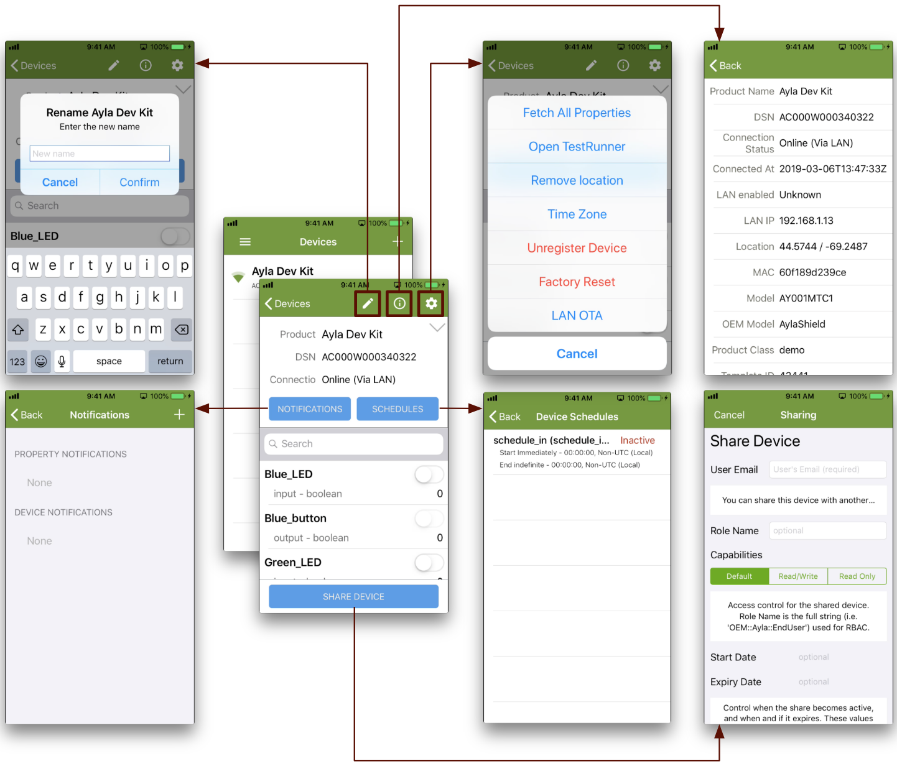

This page provides a site map of the Aura Mobile app.

## Login Screen

The Login screen includes a Sign Up button, a Wi-Fi Setup button, and a gear icon:

The gear icon displays a **Configuration** screen, important when you want to point Aura to an Ayla Customer Account. Note the Default Configurations and Custom Configurations sections. Each Default Configuration represents a region in the Ayla Public account. Tap a region to point Aura to that particular region. See the details for your chosen region at the bottom of the screen. You can also configure Aura to access an Ayla Customer account by creating a Custom Configuration like this:

<ol>
<li>Log into your Ayla Customer Account via the [Ayla Dashboard Portal](/apps/ayla-dashboard-portal/).</li>
<li>Click OEM Profile in the sidebar.</li>
<li>Click Apps in the horizontal menu.</li>
<li>Create an app configuration named Aura.</li>

The configuration will be assigned an Application ID and an Application Secret:

<li>In a text editor, create a file called <code>&lt;mycompany&gt;.auraconfig</code>, and copy & paste the following into the file:
<pre>
{
  "appId": "",
  "appSecret": "",
  "name": "My Company Name",
  "serviceLocation": "USA",
  "serviceType": "Development"
}
</pre>
</li>
<li>Copy & paste your Application ID and Application Secret into the file, customize the other fields, and save.</li>
<li>Email the file as an attachment to yourself.</li>
<li>Open the email on your mobile device.</li>

<li>Tap to Download.</li>
<li>Hard-press the <code>Tab to Download</code> window to reveal share options:</li>

<li>Click <code>Copy to Aura</code>. Aura should indicate success:</li>

<li>Click <code>Save</code> in Aura:</li>

<li>Log into Aura with the email address and password associated with your Ayla Customer account.</li>
</ol>

## Main Menu

Once logged in, tap the hamburger:

The Main Menu appears. The following diagram shows the structure of the Aura Mobile App:

## Device Screen

Tapping a device on the Devices List reveals the Device screen:

