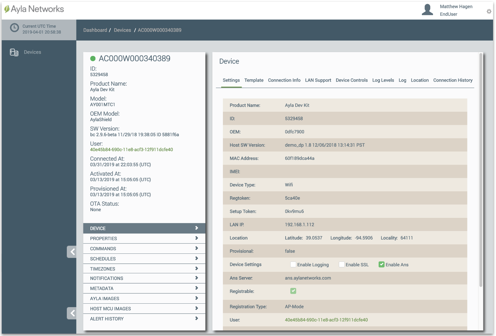

This page provides a brief tour of the Ayla Dashboard Portal.

**Important**: The features and capabilities available in the Ayla Dashboard Portal are governed by the access rights associated with a user account. The sign-up procedure on the [Connect](../connect) page of this guide, for example, yields a user account with very limited (EndUser) access rights. The following diagram provides a quick comparison:

## Devices

Browse to the [Ayla Dashboard Portal](/apps/ayla-dashboard-portal), and log in. The Devices list appears:

Then, click the row with your device. The Device page appears:

