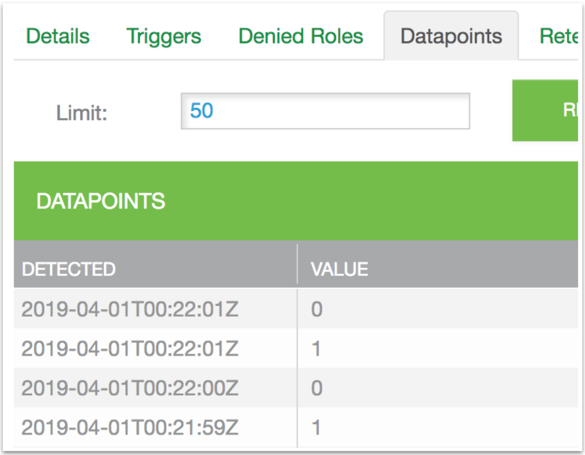
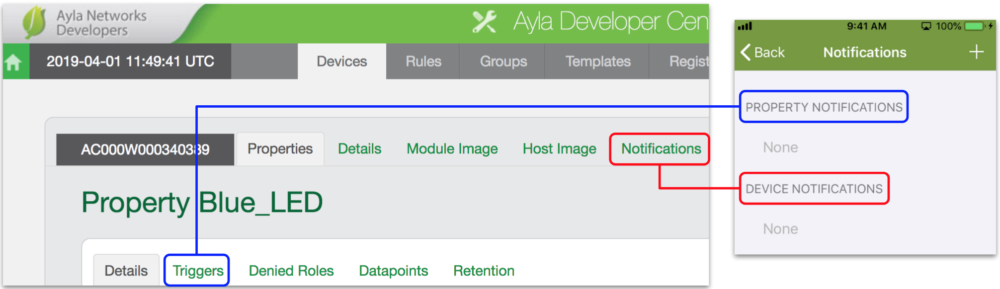
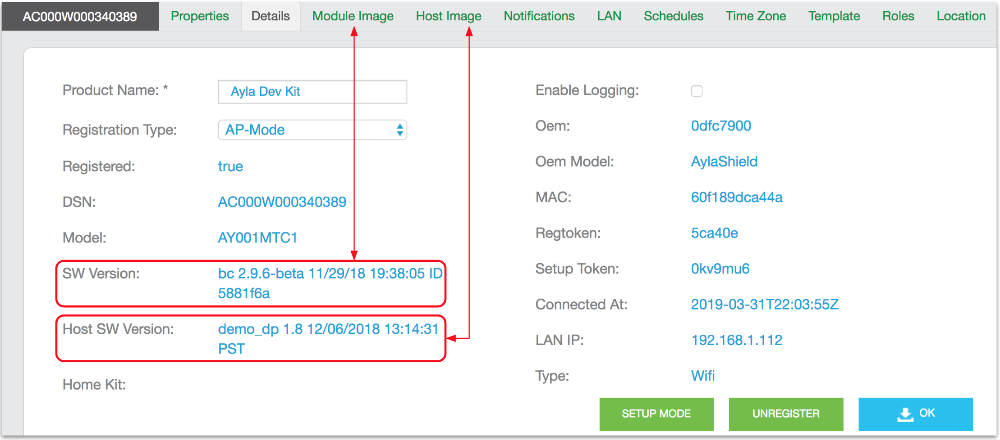

This page provides a brief tour of the Ayla Developer Portal.

## Menus

1. Browse to the [Ayla Developer Portal](/apps/ayla-developer-portal), log in, and click View My Devices. The Main Menu appears with the Devices tab active:

1. Click the Serial Number of your dev kit. The Device Menu appears with the Properties tab active:

You can click on any property's Current Value to change it.
1. Click Blue_LED. The Property Menu appears with the Details tab active:

1. Click the Datapoints tab. A datapoints list appears similar to the Aura screen seen [here](../properties). A datapoint is a time-stamped property value.

1. Note the Notifications and Triggers tabs:

Notifications are synonymous with Aura Device Notifications. Triggers are the same as Aura Property Notifications.
1. Click the Device Details tab:

The SW Version refers to the version of the Ayla Agent software running on the [Ayla Production Module](/devices/ayla-production-modules) on the Ayla Shield of the dev kit. The Host SW Version refers to the version of the host application running on the Nucleo board MCU of the dev kit. 

## File properties

The [Properties](../properties) page of this guide provides directions for exploring all types of device properties except File properties. Directions for exploring File properties are provided here:

1. On the Device Menu, click the Properties tab to display the "stream" properties:

1. Set *stream_up_len* to 5000. The value will (almost immediately) change to zero. Setting *stream_up_len* to 5000 causes the Ayla Cloud to send the value 5000 to the host application on the dev kit. The host application responds by streaming 5000 bytes to the *stream_up* property in the Ayla Cloud. The 5000 bytes conform to a pattern similar to the following:
<pre>
"3D"3E"3F"3G"3H"3I"3J"...
</pre>
1. In the Display Name column, click the *stream_up* property.
1. Click Download, and download the generated file to your computer.
1. Open the file with a text editor to verify the pattern.
1. In the Current Value column of the *stream_down* row, click *click to update*.
1. Click Choose File, select the file you just downloaded, and click OK. The Ayla Cloud streams the file down to the host application on the dev kit. The host application does not store the file. Instead, it counts the number of bytes received, and sets *stream_down_len* to that count. It sets *stream_down_match_len* to the number of bytes that match the pattern originally uploaded. Both should be 5000. This behavior merely demonstrates file properties. You can customize this functionality in your own host application implementation.