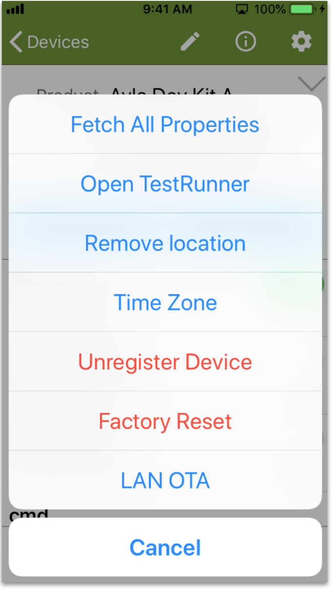
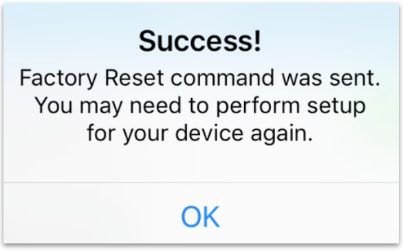
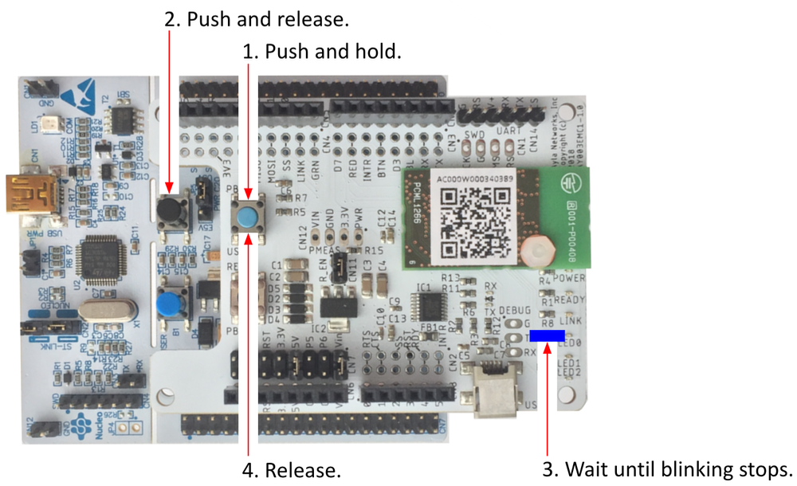

This page shows how to reconfigure your dev kit to connect to the Ayla Cloud from a different LAN.

1. Connect your mobile app to the target LAN.
1. Tap the device name on the Devices screen:

1. Tap the Gear. The Device Actions screen appears:

1. Tap *Factory Reset*. The following message appears. Click OK.

1. Return to the Devices screen.
1. Tap "+" to add a device:

1. Tap Ayla Dev Kit:

1. Enter the same Wi-Fi credentials as those used by your mobile device:

1. Plug in your dev kit to power it on, and reset it:

1. Tap Continue.

1. Tap continue again, and then tap Join:

Aura will find your device, connect it to the network, and register it.
1. Tap Done to see your new device on the Devices list.
