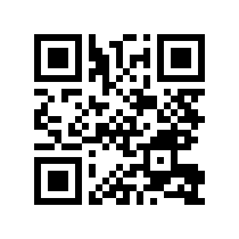
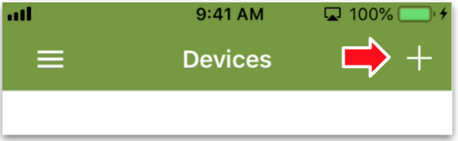
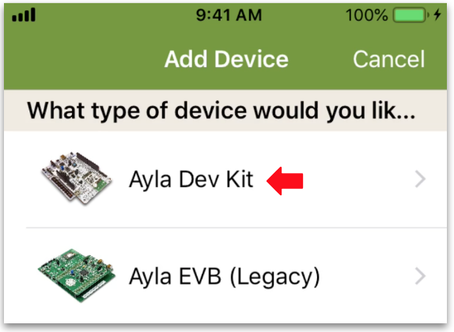
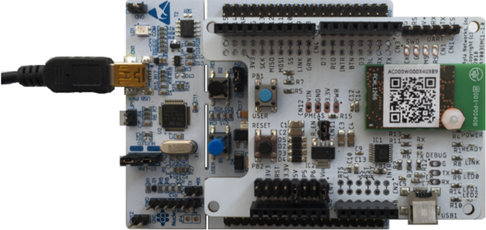
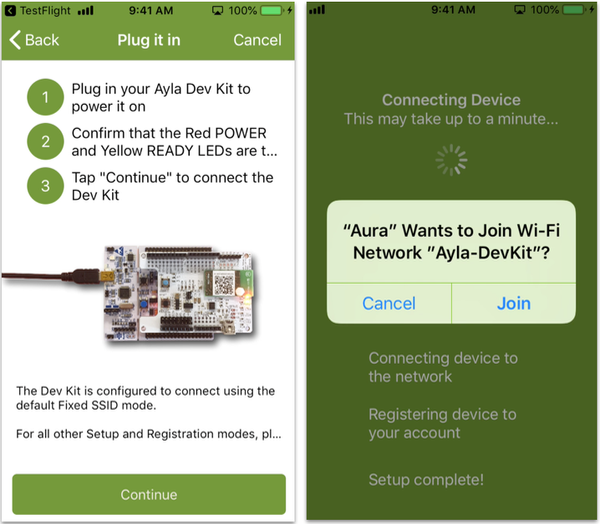
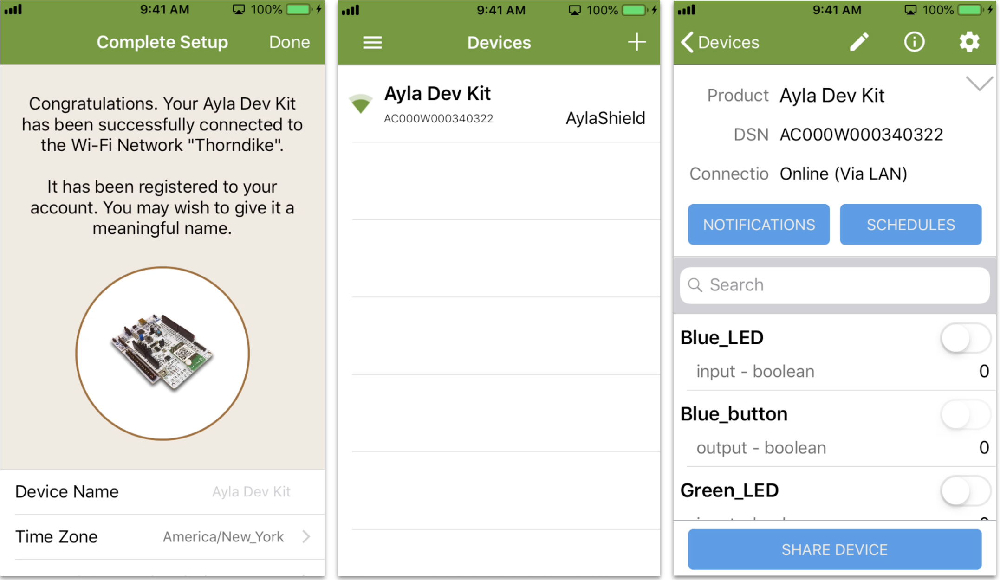

Connecting your dev kit to the Ayla Cloud takes only a few steps:

1. Connect your mobile device to a 2.4GHz Wi-Fi LAN.
1. Download and install the [Aura Mobile App](../aura-mobile-app) from [App Store](https://itunes.apple.com/us/app/ayla-aura/id1104515028?mt=8) or [Google Play](https://play.google.com/store/apps/details?id=com.aylanetworks.aura) onto your mobile device. You can scan this [QR Code](https://en.wikipedia.org/wiki/QR_code):

1. Tap <code>Sign Up</code>, fill in the form, receive the verification email on your mobile device, and confirm:

1. Tap "+" to add a device:

1. Tap Ayla Dev Kit:

1. Enter the same Wi-Fi credentials as those used by your mobile device, and tap Continue:

1. Take your Ayla Dev Kit out of the box.
1. Plug the small end of the cable into the kit:

1. Plug the large end into a USB outlet, tap continue, and then tap Join:

1. Tap Done to see your new device on the Devices screen. Then, tap *Ayla Dev Kit* to see the Details screen:

