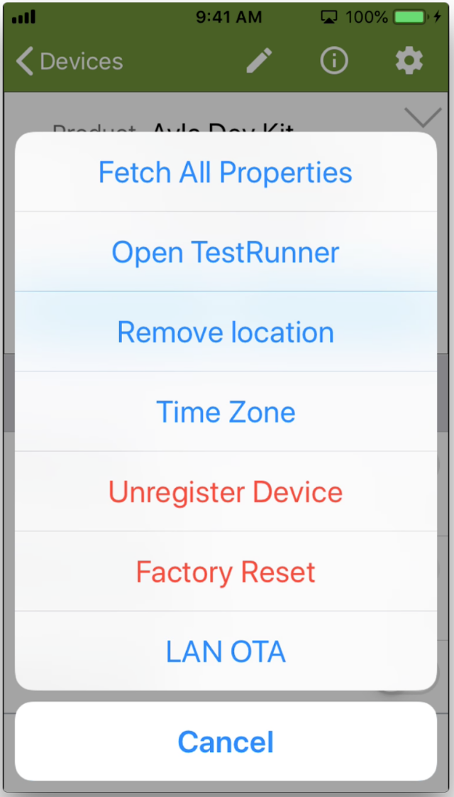

A factory reset of your Ayla Development Kit reinitializes certain configuration parameters (e.g. Wi-Fi and Time Zone) to default values. For details about these configuration parameters, see the [Configuration](../../reference/configuration) page.

Performing a factory reset is one step in the process of moving your dev kit from one LAN to another:

1. Factory reset your Ayla Dev Kit via Aura (see Aura Factory Reset below).
1. Connect your mobile device to the new LAN.
1. Start with Step 4 on the [Connect](../connect) page.

There are several ways to perform a factory reset. Here are two:

### Aura factory reset

Tap your device on the Aura Devices list, tap the gear (top-right), and tap Factory Reset:

### Physical factory reset

