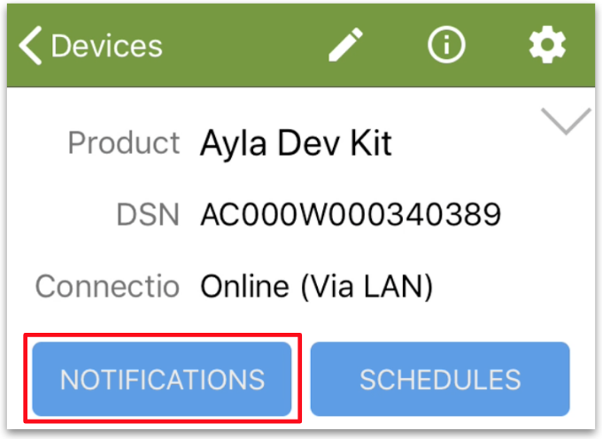

This page introduces you to Ayla notifications. A notification is a user-defined trigger associated with the condition of a device or property, the mode of notification (text, email, push notification), and the message itself. Tap the *Notifications* button to get started:

## Property Notifications

1. Tap "+".
1. Tap "Property notification".
1. Configure the following fields:
<table>
<tr><th>Field</th><th>Value</th></tr>
<tr><td>Notification Name</td><td>Green LED Changed</td></tr>
<tr><td>Notification Message</td><td>The Green LED changed.</td></tr>
<tr><td>Condition</td><td>When Green_LED has Changed.</td></tr>
<tr><td>Send push notification to this device</td><td>&#10003;</td></tr>
</table>
1. Tap *Save Notifications*.
1. Turn on/off Green_LED. See a push notification similar to the following:

1. Uncheck *Send push ...*, and save again.

## Device Notifications

Note: I need to verify this section.

1. Tap "+".
1. Tap "Device notification".
1. Configure the following fields:
<table>
<tr><th>Field</th><th>Value</th></tr>
<tr><td>Notification Name</td><td>Ayla Dev Kit A Lost Connection</td></tr>
<tr><td>Event</td><td>on_connection_lost</td></tr>
<tr><td>Threshhold</td><td>30 (seconds)</td></tr>
<tr><td>Notification Message</td><td>Ayla Dev Kit A Lost Connection</td></tr>
<tr><td>Send push notification to this device</td><td>&#10003;</td></tr>
</table>
1. Tap *Save Notifications*.
1. Disconnect the Ayla Dev Kit, and wait for .... See a push notification similar to the following:
<!--  -->
1. Uncheck *Send push ...*, and save again.
