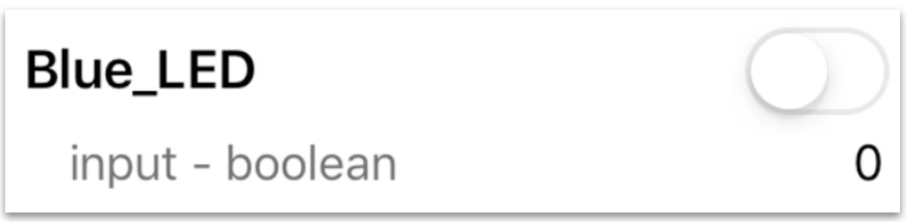
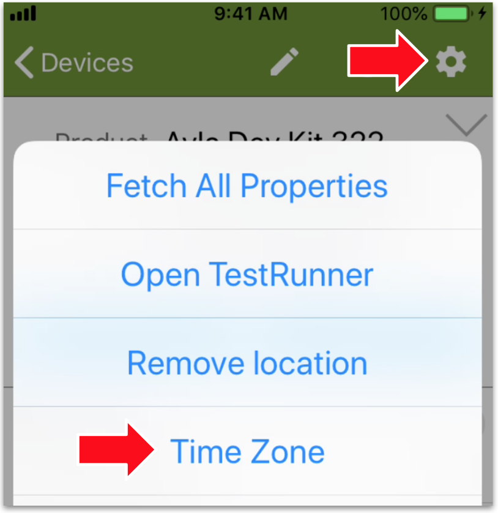
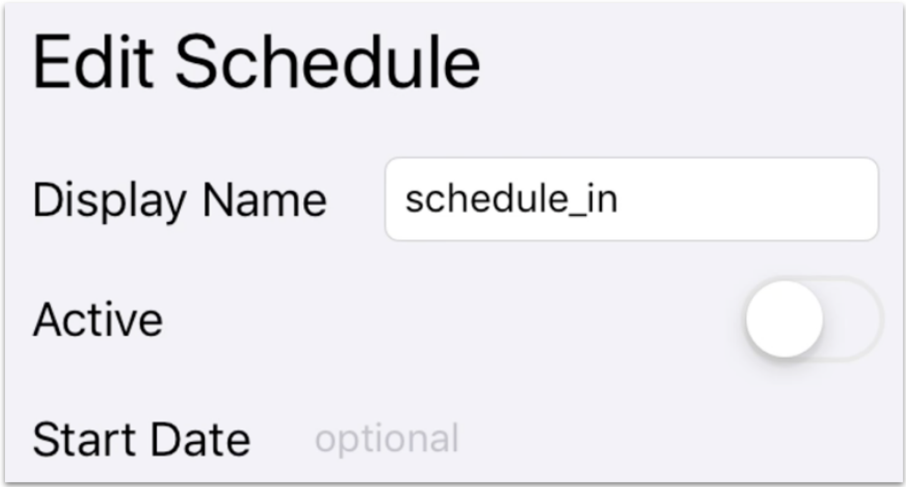
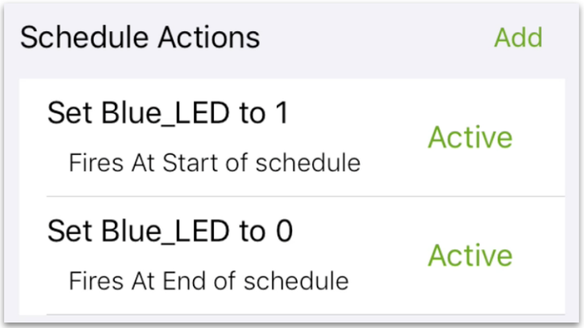
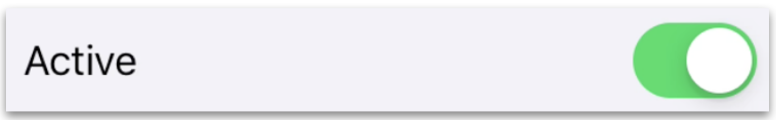

This page introduces you to Ayla schedules. 

1. Ensure that the Blue_LED property is off.

1. Ensure that the time zone on the dev kit is set appropriately by clicking the Gear, and then Time Zone.

1. Tap the Schedules button on the Device screen.

The Schedules screen appears with one pre-made schedule called schedule_in. 

1. Tap schedule_in to display the Edit Schedule screen.

1. Scroll to Schedule Actions:

Note that this schedule sets Blue_LED to 1 at start date/time, and to 0 at end date/time.
1. Scroll to Start Time, and set the time to a few minutes from now.
1. Scroll to End Time, and set the time to a minute after Start Time.

1. Scroll to Active, and activate the schedule:

1. Tap *Save Schedule* at the bottom of the screen.
1. Observe (on the dev kit and in Aura) Blue_LED glow at start time, and dim at end time.
