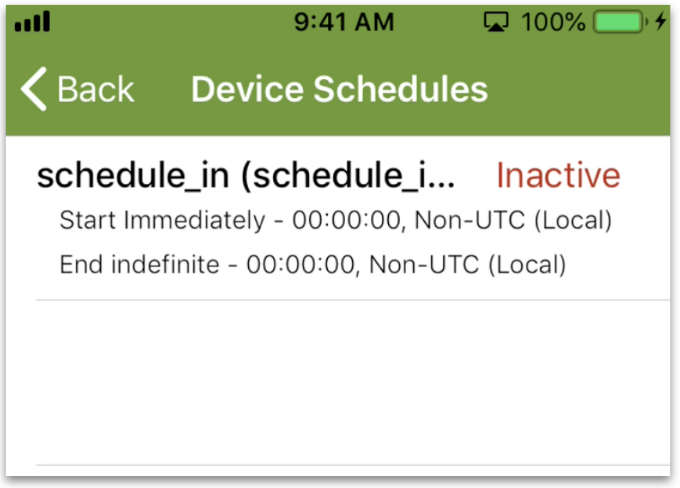

This page introduces you to Ayla schedules.

1. Ensure that the Blue_LED property is off.
1. Tap the Schedules button on the Device screen.

The Schedules screen appears with one pre-made schedule:

1. Tap the pre-made schedule, and configure the following fields:
<table>
<tr><th>Field</th><th>Value</th></tr>
<tr><td>Start Time</td><td>A time within minutes of now.</td></tr>
<tr><td>End Time</td><td>A time one minute after the start time.</td></tr>
</table>
1. Note that the Schedule Actions are already set. 
1. Tap *Save Schedule* at the bottom of the screen
1. Observe the scheduled event between the start and end times.
