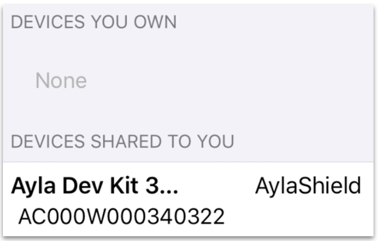
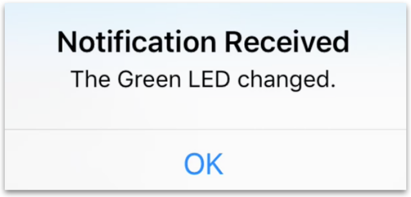

This page shows you how to share a device with another Ayla user account.

### Sharing

1. Tap Share Device at the bottom of the Device screen:

1. Enter the email address for an existing Ayla user account:

1. Choose capabilities:

Note that Default is the same as Read Only.
1. Optionally, choose a start and end date to define an active duration. Initially, leave this blank.
1. Tap Create Share:

You will see the following message:

1. Tap Menu Menu > Shares:

You will see the device under "Devices You Own" on the Shared Devices list:

1. Check your email. You will receive an email from the Ayla Cloud similar to the following:
<table>
<tr><th>Subject:</th><td>Matt Hagen granted access to device with ID: AC000W000123456</td></tr>
<tr><th>Message:</th><td>Hello, Matt Hagen granted read access to the device with ID: AC000W000123456</td></tr>
</table>
Note that each Ayla device has an id and a Device Serial Number (dsn). The value in the email is actually the dsn.

### Recipient

The person with whom the device is shared will see the device on their Aura Devices list:

They will also see the device under "Devices Shared To You" on the Shared Devices list:

With default (read-only) access, most functionality will be disabled:

They will, however, receive notifications:
