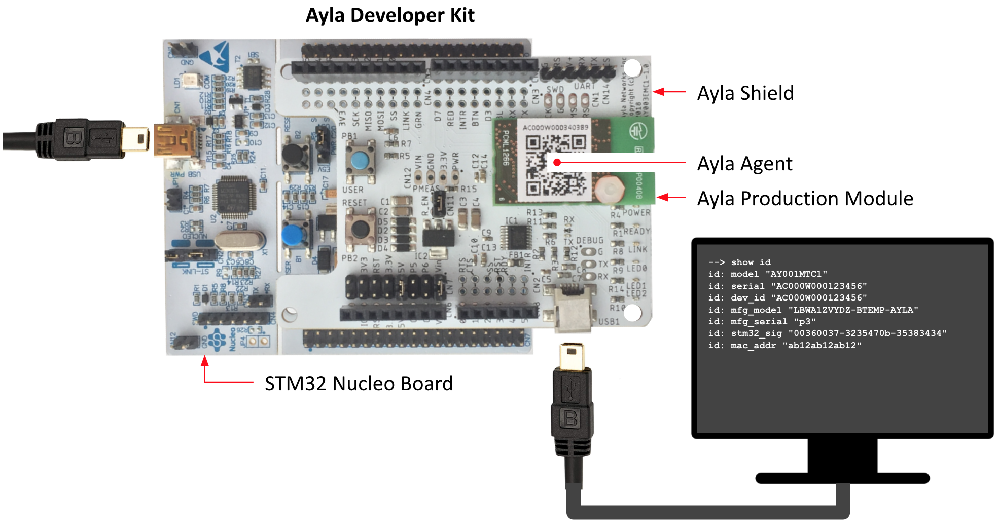

The Ayla Module Command-line Interface (CLI) provides a set of shell commands for configuring the Ayla Agent running on an [Ayla Production Module](/devices/ayla-production-module) such as the one on the Ayla Shield of the [Ayla Developer Kit](../ayla-developer-kit):

To run these commands, connect your computer to the Ayla Shield of an Ayla Developer Kit using a second [USB 2.0 A-Male to Mini-B Cable](https://www.amazon.com/AmazonBasics-USB-2-0-Cable-Male/dp/B00NH13S44/ref=sxts_kp?keywords=usb+type+b&pd_rd_i=B00NH13S44&pd_rd_r=d7322804-b9d2-4e0d-84f0-07e0f04b1b5d&pd_rd_w=nNpl4&pd_rd_wg=M7eIi&pf_rd_p=9e1f8218-b1c6-41ee-b8db-ab27d6c0f6de&pf_rd_r=DAD4Q395EY2EZ1QS1D1F&qid=1551889936&s=gateway), and establish serial communication for your particular operating system as described below.

## For Windows

## For Mac OS

1. Open a terminal.
1. List TTY and CU (Calling Unit) ports.
<pre>
$ ls -l1 /dev/{tty,cu}.*
</pre>
Output should look similar to the following:
<pre>
/dev/cu.Bluetooth-Incoming-Port
/dev/cu.usbserial-DN03TI2L
/dev/tty.Bluetooth-Incoming-Port
/dev/tty.usbserial-DN03TI2L
</pre>
1. Start the Ayla CLI with the command below. You may have to press Enter a second time.
<pre>
$ screen /dev/tty.usbserial-DN03TI2L 115200
</pre>
The screen prompt appears:
<pre>
--&gt;
</pre>
1. Enter <code>show id</code> to test your connection. Data similar to the following should appear:
<pre>
id: model "AY001MTC1"
id: serial "AC000W000123456"
id: dev_id "AC000W000123456"
id: mfg_model "LBWA1ZVYDZ-BTEMP-AYLA"
id: mfg_serial "p3"
id: stm32_sig "00360031-32354702-35383434"
id: mac_addr "ab12ab12ab12"
</pre>
1. To exit the screen session and return to your shell, press Control-a, Control-k, and 'y' to exit.

## For Linux
