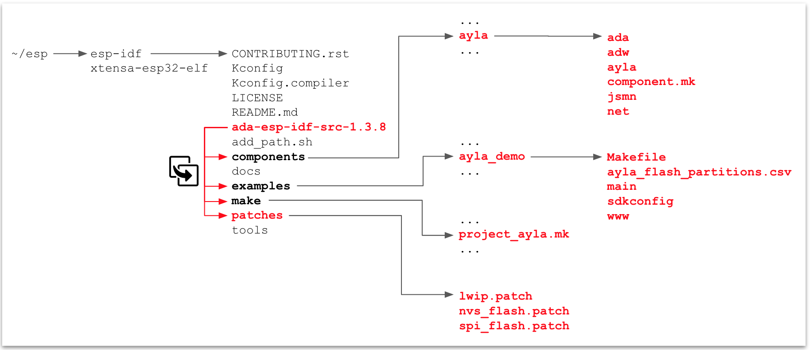

### Install the Ayla Agent for Espressif  

<ol>
<li>Download ada-esp-idf-src-1.3.8.tgz:
<pre>
$ cd &#126;/esp/esp-idf
$ tar xfz ~/Downloads/ada-esp-idf-src-1.3.8.tgz
</pre>
</li>
<li>Copy the Ayla source code on top of the Espressif installation:
<pre>
$ cp -R ada-esp-idf-src-1.3.8/&#42; .
</pre>
This diagram gives you an idea of where the Ayla files are copied:

</li>
</ol>

### Build and run the Ayla Demo Application

<ol>
<li>Change directory to <code>&#126;/esp/esp-idf/examples/ayla_demo</code>.</li>
<li>Set oem id, oem model, and template version in <code>./main/conf.h</code>:
<pre>
#define DEMO_OEM_ID "0dfc7900"
#define DEMO_LEDEVB_MODEL "ledevb"
#define DEMO_TEMPLATE_VERSION "ESP32 Dev Kit C 1.0"
</pre>
</li>
<li>Configure the app with the correct python version and serial port:
<pre>
$ make menuconfig
</pre>
</li>
<li>Build the app:
<pre>
$ make
</pre>
</li>
<li>Flash the app to the ESP32 Dev Kit:
<pre>
$ make flash
</pre>
</li>
</ol>

### Configure the application

<ol>
<li>Monitor the app:
<pre>
$ make monitor
</pre>
</li>
<li>Create/obtain a dsn and key for your device ...</li>
<li>Set dsn and key:
<pre>
# nvs-set "ada.f.id/dev_id" AC000W123456789
# nvs-set "ada.f.id/key" MIIB...
# esp-reboot
</pre>
</li>
<!--
<li>Set time:
<pre>
# time-set 2019 03 03 12 10 00
</pre>
</li>
<li>Generate a Factory Log Line to verify dsn:
<pre>
# factory-log
factory-log line:
3,1551808062,2019/03/05 17:47:42 UTC,label,0,AY008ESP1,AC000W123456789,30aea4dda048,esp32_wroom_32,p1,e53a7992d60645830,0dfc7900,ledevb,1,ADA demo customer,ayla_ledevb_demo 1.3 Mar  5 2019 12:45:19
</pre>
</li>
-->
<li>Set OEM Secret:
<pre>
# oem key &lt;secret&gt;
# save
</pre>
</li>
<li>Set up Wi-Fi:
<pre>
# nvs-set ada.f.wifi/profile/0/ssid &lt;ssid&gt;
# nvs-set ada.f.wifi/profile/0/security &lt;security_type&gt; # 0=none, 3=wpa, 4=wpa2
# nvs-set ada.f.wifi/profile/0/key &lt;passphrase&gt;
# nvs-set ada.f.wifi/profile/0/enable 1
# esp-reboot
</pre>
</li>
</ol>

Temporary Link: [Ayla White Box Agent User Guide](https://aylait.sharepoint.com/sites/eng/device/Shared%20Documents/Forms/AllItems.aspx?csf=1&e=1ah3r6&FolderCTID=0x01200035018376B736F7469262A6CA3CD80952&id=%2Fsites%2Feng%2Fdevice%2FShared%20Documents%2FEngineering%2FEngineering%20Devices%2FModule%20Software%2FAyla_Device_Agent%2Freleases%2Fada-1%2E3%2E8%2FAyla%20White%20Box%20Agent%20With%20ESP32%20User%20Guide%20-%20DRAFT%2Epdf&parent=%2Fsites%2Feng%2Fdevice%2FShared%20Documents%2FEngineering%2FEngineering%20Devices%2FModule%20Software%2FAyla_Device_Agent%2Freleases%2Fada-1%2E3%2E8)