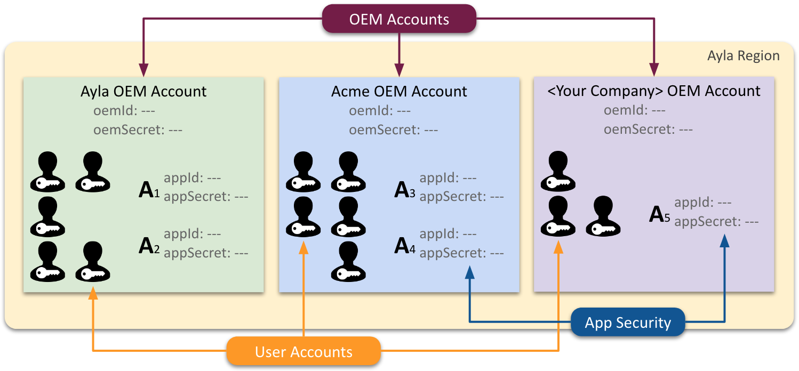
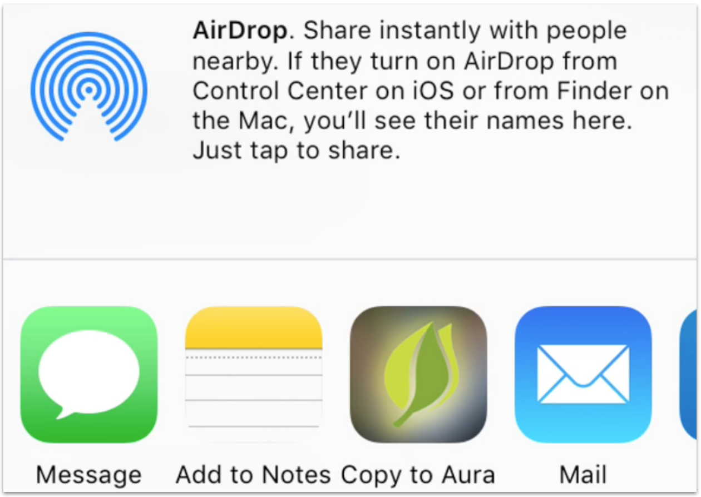
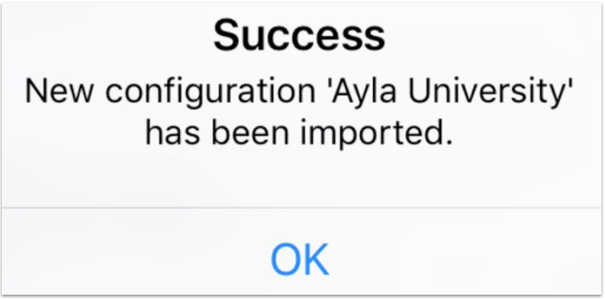

To complete the tutorials, you need access to the following Ayla resources:

1. <code>&lt;Your Company&gt;</code> OEM account in the Ayla Cloud
1. Ayla Github repositories

## Ayla accounts

The term "Ayla Account" can refer to an OEM account or a user account.

### Ayla OEM Account

The Ayla OEM Account is special. Anyone can create a user account (with limited access rights) in the Ayla OEM Account. If, for example, in the past, you created a user account by clicking <code>Sign Up</code> on the [Ayla Developer Portal](https://docs.aylanetworks.com/apps/ayla-developer-portal/), then you have a user account in the publicly available Ayla OEM Account with enough access rights to experiment with the [Ayla Design Kit](https://docs.aylanetworks.com/apps/ayla-developer-portal/). 

### &lt;Your Company&gt; OEM Account

To complete the Ayla Linux Agent tutorials, however, you need an OEM account admin to create for you a user account with Developer access rights in your company's OEM account so that you can access enough features in the following tools: 

1. [Ayla Developer Portal](https://docs.aylanetworks.com/apps/ayla-developer-portal/)
1. [Ayla Dashboard Portal](http://localhost/apps/ayla-dashboard-portal/)
1. Aura Mobile App (iOS or Android)

### Configuring the Aura Mobile App

The Aura mobile app is pre-configured to access the Ayla OEM Account in the US Dev region using a particular appId and appSecret. After downloading and installing Aura on your mobile device, complete the following steps to configure Aura to access your company's OEM account:

<ol>
<li>Copy & paste the following JSON into a text editor, and save it to a text file named <code>&lt;mycompany&gt;.auraconfig</code>:
<pre>
{
  "appId": "123",
  "appSecret": "456",
  "name": "My Company Name",
  "serviceLocation": "USA",
  "serviceType": "Development"
}
</pre>
</li>
<li>Log into the [Ayla Dashboard Portal](http://localhost/apps/ayla-dashboard-portal/).</li>
<li>Click OEM Profile in the sidebar.</li>
<li>Click Apps in the horizontal menu.</li>
<li>Create an app named Aura.</li>

<li>Copy & paste the Application ID and the Application Secret into your <code>&lt;mycompany&gt;.auraconfig</code> file, and save.</li>
<li>Email the file as an attachment to yourself.</li>
<li>Open the email on your mobile device.</li>

<li>Tap to Download.</li>
<li>Hard-press the <code>Tab to Download</code> window to reveal share options:</li>

<li>Click <code>Copy to Aura</code>. Aura should indicate success:</li>

<li>Click <code>Save</code> in Aura:</li>

<li>Log into Aura with the email address and password associated with your company's OEM account.</li>

</ol>

## Ayla Github repositories

To complete the Ayla Linux Agent tutorials, you need read access to the [device_linux_public](https://github.com/AylaNetworks/device_linux_public) Github repository which you can obtain by emailing [Ayla Support](https://connection.aylanetworks.com/s/contact-ayla-support) with your name, email address, and Github ID.
