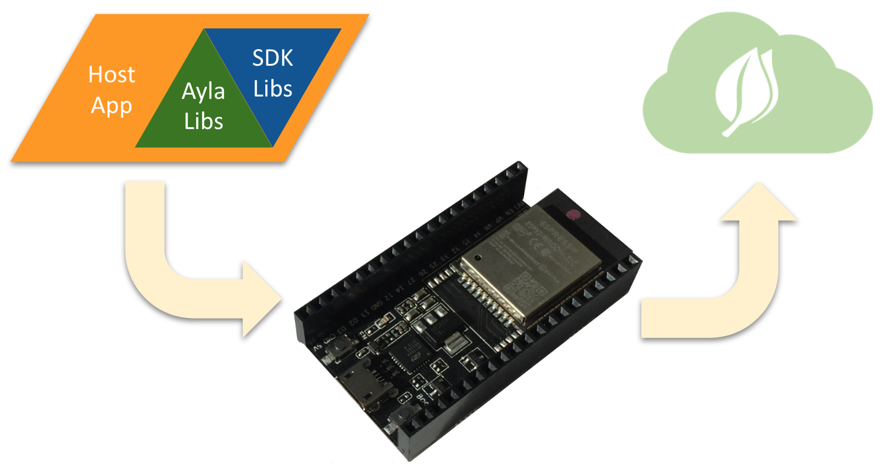

An Ayla agent on an Espressif ESP32 Dev Kit C enables you to quickly explore the [Ayla IoT Cloud](https://www.aylanetworks.com/) as a user and developer.

You can order an [Espressif ESP32 Dev Kit C](https://www.amazon.com/Espressif-ESP32-ESP32-DEVKITC-ESP-WROOM-32-soldered/dp/B01N0SB08Q/ref=sr_1_1?keywords=espressif+esp32+devkitc&qid=1551982192&s=gateway&sr=8-1) and a [USB 2.0 A-Male to Micro-B Cable](https://www.amazon.com/AmazonBasics-Male-Micro-Cable-Black/dp/B0719H12WD/ref=sr_1_1_sspa?keywords=USB+2.0+A-Male+to+Micro&qid=1551981677&s=gateway&sr=8-1-spons&psc=1) from Amazon. Then, click [Guide](guide).
