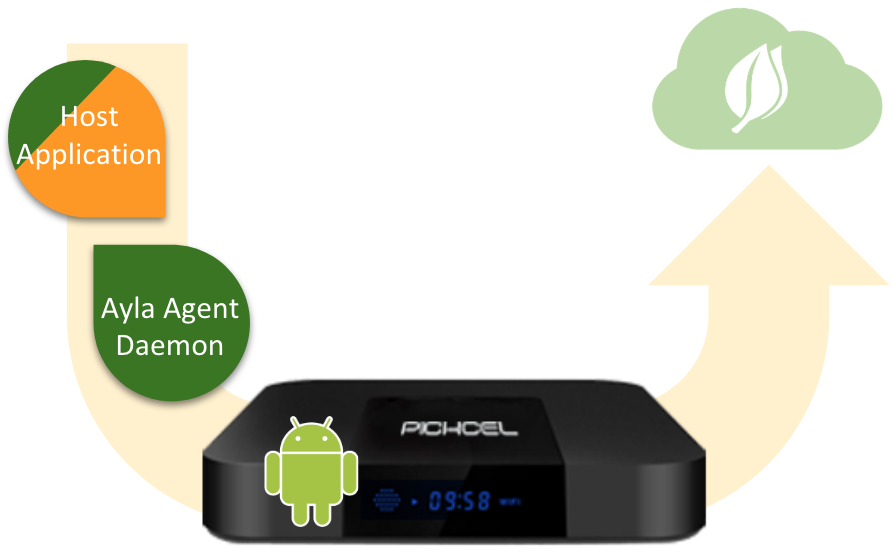

The Ayla Android Agent (daemon) enables Android applications running on Android-powered devices (often requiring UI capabilities) to access the Ayla Cloud. Example devices include digital media players, IoT hubs, fancy thermostats, and home security hubs.

Ayla also provides a sample host application:

