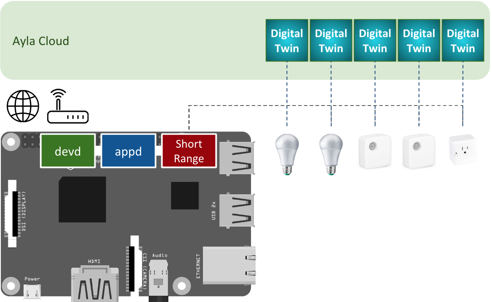
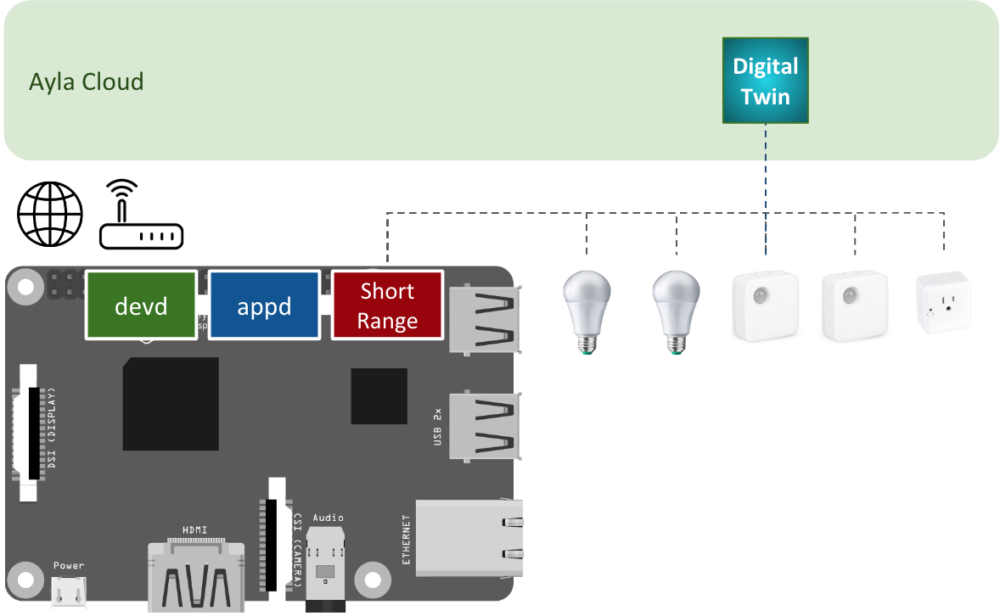

Ayla gateway agents connect devices with wired/wireless short-range capabilities (e.g. RS-232, RS-485, Bluetooth, Zigbee) to the Ayla Cloud where they are modeled and managed. There are two types of Ayla gateways:

1. Dynamic Gateway. The Ayla Cloud maintains one digital twin for <u>each</u> short-range device connected to the gateway.
1. Static Gateway. The Ayla Cloud maintains one digital twin for <u>all</u> the short-range devices connected to the gateway.

### Ayla Dynamic Gateway

### Ayla Static Gateway

