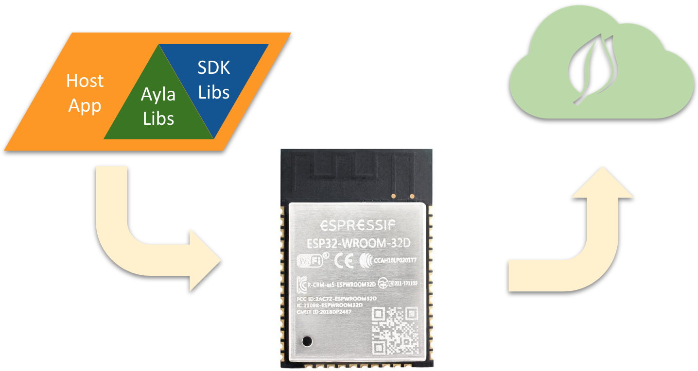

Ayla Integrated Agents are software libraries that extend the SDKs associated with particular chipsets used on communication modules. Ayla also provides a sample host application that links with the libraries and runs on the target chipset:

Ayla Integrated Agents eliminate the need for a separate MCU dedicated to the host application​ which reduces cost and footprint. The host application can access module resources and I/O​, and it can customize communication module behavior. The license allows source-code modifications, but not source-code redistribution.

Ayla offers integrated agents and sample host applications for the following:

|Chip Vendor|Reference Design|Target SDK Version|Ayla Version|Wi-Fi Setup|OTA|Status|
|-|-|-|-|-|-|-|
|Marvell|MW300|WMSDK 3.4.6|1.3|yes|yes|Production|
|Qualcomm|QCA4010|QCA4010 SDK r00006.2|1.3|yes|yes|Production|
|RealTek|RTK8711|Ameba 4.0a|1.4|yes|yes|Production|
|Espressif|ESP-WROOM-32|ESP-IDF|TBD|yes|yes|Development|
