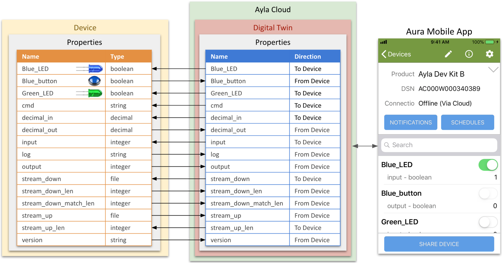
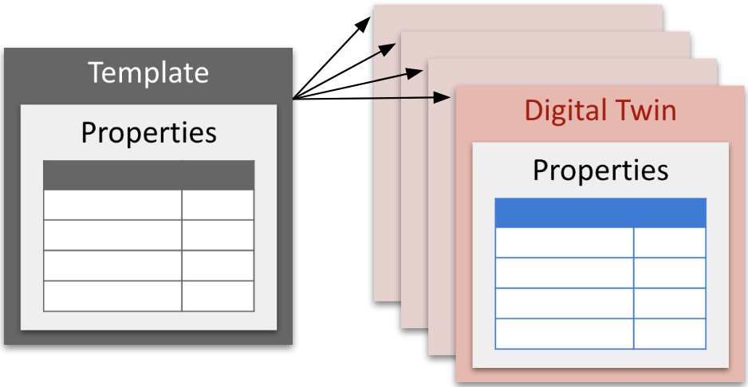

Composed of properties, a digital twin is a cloud-based model of a device or gateway, the representation that apps and portals see:

When a device connects to the Ayla Cloud, the cloud instantiates a digital twin (to represent the device) from one or more templates it selects based on information supplied by the device. Typically, the cloud instantiates many digital twins from the same template:

