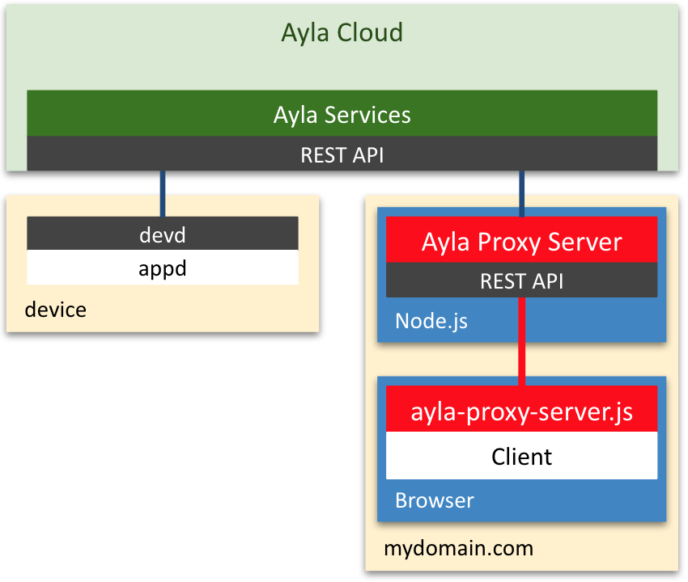

The Ayla Proxy Server is designed to be deployed in a Node.js environment in your domain, and to circumvent [CORS](https://en.wikipedia.org/wiki/Cross-origin_resource_sharing) by providing a clean Ayla REST API within your domain. Rather than accessing this REST API directly, however, your browser-based applications can leverage the Javascript interface implemented in <code>ayla-proxy-server.js</code>. See the diagram.

To get a device, for example, your application might use <code>getDevice</code>:

<pre>
function getDevice(deviceId, successCb=null, errorCb=null)
</pre>
