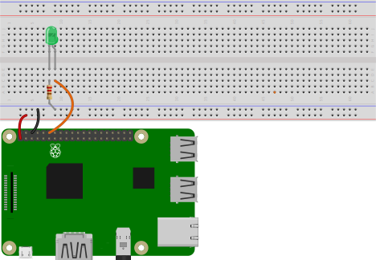

## Pinout

Use a 220 Ω resister.

## GPIO

<pre>
$ gpio readall
 +-----+-----+---------+------+---+---Pi 3+--+---+------+---------+-----+-----+
 | BCM | wPi |   Name  | Mode | V | Physical | V | Mode | Name    | wPi | BCM |
 +-----+-----+---------+------+---+----++----+---+------+---------+-----+-----+
 |     |     |    3.3v |      |   |  1 || 2  |   |      | 5v      |     |     |
 |   2 |   8 |   SDA.1 | ALT0 | 1 |  3 || 4  |   |      | 5v      |     |     |
 |   3 |   9 |   SCL.1 | ALT0 | 1 |  5 || 6  |   |      | 0v      |     |     |
 |   4 |   7 | GPIO. 7 |   IN | 0 |  7 || 8  | 1 | ALT5 | TxD     | 15  | 14  |
 |     |     |      0v |      |   |  9 || 10 | 1 | ALT5 | RxD     | 16  | 15  |
 |  17 |   0 | GPIO. 0 |   IN | 0 | 11 || 12 | 0 | OUT  | GPIO. 1 | 1   | 18  |
 |  27 |   2 | GPIO. 2 |   IN | 0 | 13 || 14 |   |      | 0v      |     |     |
 |  22 |   3 | GPIO. 3 |   IN | 0 | 15 || 16 | 0 | IN   | GPIO. 4 | 4   | 23  |
 |     |     |    3.3v |      |   | 17 || 18 | 0 | IN   | GPIO. 5 | 5   | 24  |
 |  10 |  12 |    MOSI | ALT0 | 0 | 19 || 20 |   |      | 0v      |     |     |
 |   9 |  13 |    MISO | ALT0 | 0 | 21 || 22 | 0 | IN   | GPIO. 6 | 6   | 25  |
 |  11 |  14 |    SCLK | ALT0 | 0 | 23 || 24 | 1 | OUT  | CE0     | 10  | 8   |
 |     |     |      0v |      |   | 25 || 26 | 1 | OUT  | CE1     | 11  | 7   |
 |   0 |  30 |   SDA.0 |   IN | 1 | 27 || 28 | 1 | IN   | SCL.0   | 31  | 1   |
 |   5 |  21 | GPIO.21 |   IN | 1 | 29 || 30 |   |      | 0v      |     |     |
 |   6 |  22 | GPIO.22 |   IN | 1 | 31 || 32 | 0 | IN   | GPIO.26 | 26  | 12  |
 |  13 |  23 | GPIO.23 |   IN | 0 | 33 || 34 |   |      | 0v      |     |     |
 |  19 |  24 | GPIO.24 |   IN | 0 | 35 || 36 | 0 | IN   | GPIO.27 | 27  | 16  |
 |  26 |  25 | GPIO.25 |   IN | 0 | 37 || 38 | 0 | IN   | GPIO.28 | 28  | 20  |
 |     |     |      0v |      |   | 39 || 40 | 0 | IN   | GPIO.29 | 29  | 21  |
 +-----+-----+---------+------+---+----++----+---+------+---------+-----+-----+
 | BCM | wPi |   Name  | Mode | V | Physical | V | Mode | Name    | wPi | BCM |
 +-----+-----+---------+------+---+---Pi 3+--+---+------+---------+-----+-----+
</pre>

## led.py

<pre>
import RPi.GPIO as GPIO
import time
GPIO.setwarnings(False)
GPIO.setmode(GPIO.BCM)
GPIO.setup(18, GPIO.OUT)
while True:
  GPIO.output(18, True)
  time.sleep(1)
  GPIO.output(18, False)
  time.sleep(1)
</pre>

## led.c

<pre>
#include &lt;stdio.h&gt;
#include &lt;wiringPi.h&gt;
#define LED 1
int main(void) {
  printf("Starting program\n");
  wiringPiSetup();
  pinMode(LED, OUTPUT);
  for(;;) {
    digitalWrite(LED, HIGH);
    delay(500);
    digitalWrite(LED, LOW);
    delay(500);
  }
  return 0;
}
</pre>
