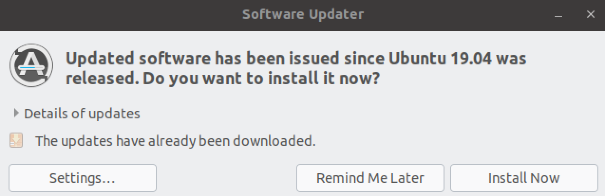
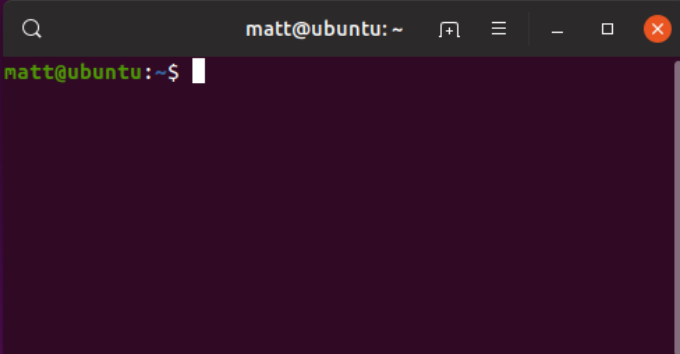

This page explains how to set up a [GNU](https://en.wikipedia.org/wiki/GNU_toolchain) build environment on [VMware](https://en.wikipedia.org/wiki/VMware)/[Ubuntu](https://en.wikipedia.org/wiki/Ubuntu) for building Ayla edge solutions. The following instructions were tested using Ubuntu 19.04 running on VMware Fusion v10.1.6 hosted on a MacBook running OS X El Capitan v10.11.6.

<ol>
<li>Browse to <a href="https://ubuntu.com/download/desktop">Download Ubuntu Desktop</a>.</li>
<li>Download <code>Ubuntu 19.04</code>.</li>
<li>Run VMware Fusion, click <code>File &gt; New</code>, and drag <code>ubuntu-19.04-desktop-amd64.iso</code> to the installation screen:

</li>
<li>Complete the installation:

</li>
<li>In the VM, if prompted, update software, and reboot:

</li>
<li>Open a terminal:

</li>
<li><code>sudo apt install git</code>.</li>
<li><code>sudo apt install screen</code>.</li>
<li>Add your user to the <code>dialout</code> group, and restart:
<pre>
$ groups matt
matt : matt adm cdrom sudo dip plugdev lpadmin sambashare
$ sudo usermod -a -G dialout matt
$ groups matt
matt : matt adm dialout cdrom sudo dip plugdev lpadmin sambashare
</pre>
</li>
<li>Inspect the OS environment:
<pre>
$ git --version
git version 2.20.1

$ screen --version
Screen version 4.06.02 (GNU) 23-Oct-17

$ python2 --version
Python 2.7.16

$ python3 --version
Python 3.7.3

$ unzip --version
caution:  both -n and -o specified; ignoring -o
UnZip 6.00 of 20 April 2009, by Debian. Original by Info-ZIP.

$ gcc --version
gcc (Ubuntu 8.3.0-6ubuntu1) 8.3.0
Copyright (C) 2018 Free Software Foundation, Inc.

$ make --version
GNU Make 4.2.1
Built for x86_64-pc-linux-gnu
Copyright (C) 1988-2016 Free Software Foundation, Inc.
</pre>
</li>
</ol>