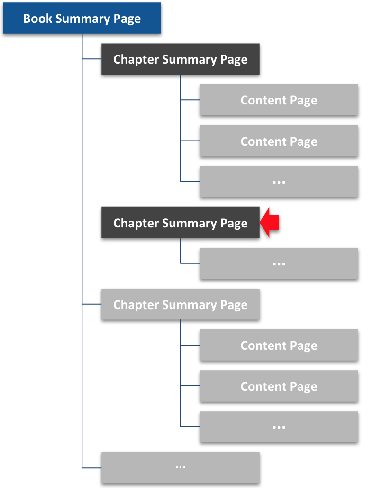

This is a <code>Chapter Summary Page</code>. It does not have any children <code>Content Pages</code>. That's okay. Sometimes it makes sense to put all chapter content on the Chapter Summary Page, especially if (1) you want readers to be able to easily search the page, or (2) the chapter does not contain much content. Click [Reference](../reference) to continue. 