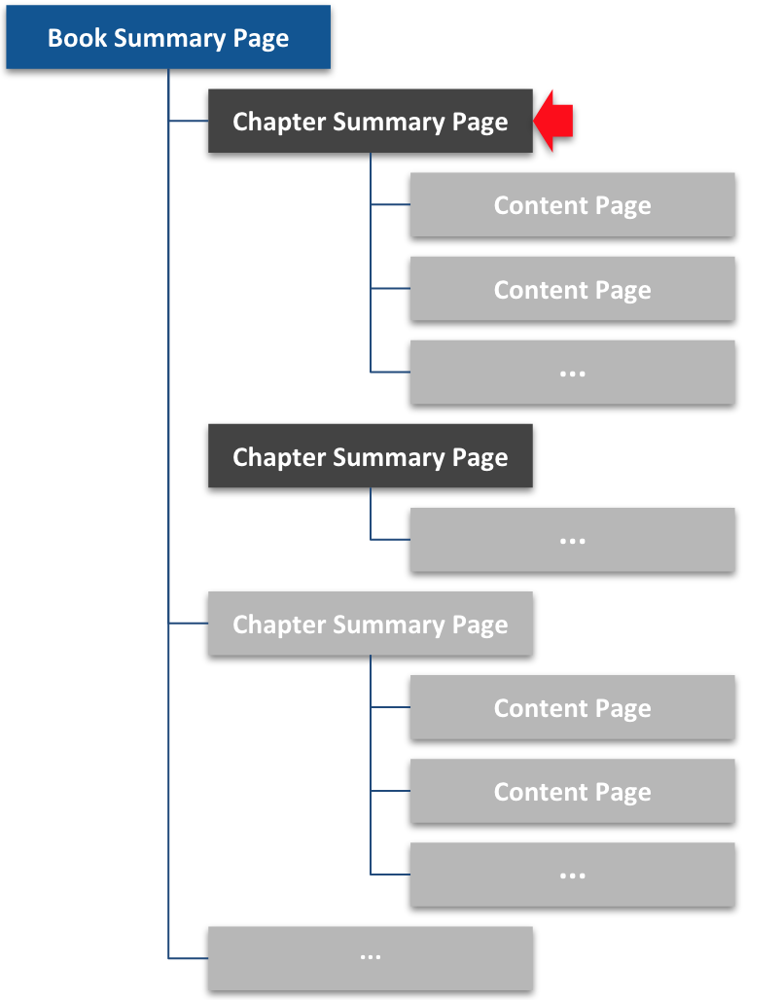

This is a <code>Chapter Summary Page</code>. All books have at least two. This particular chapter summary page is called <code>Getting Started</code>, but yours can have a different title appropriate for your topic. Click [Introduction](introduction) to continue.