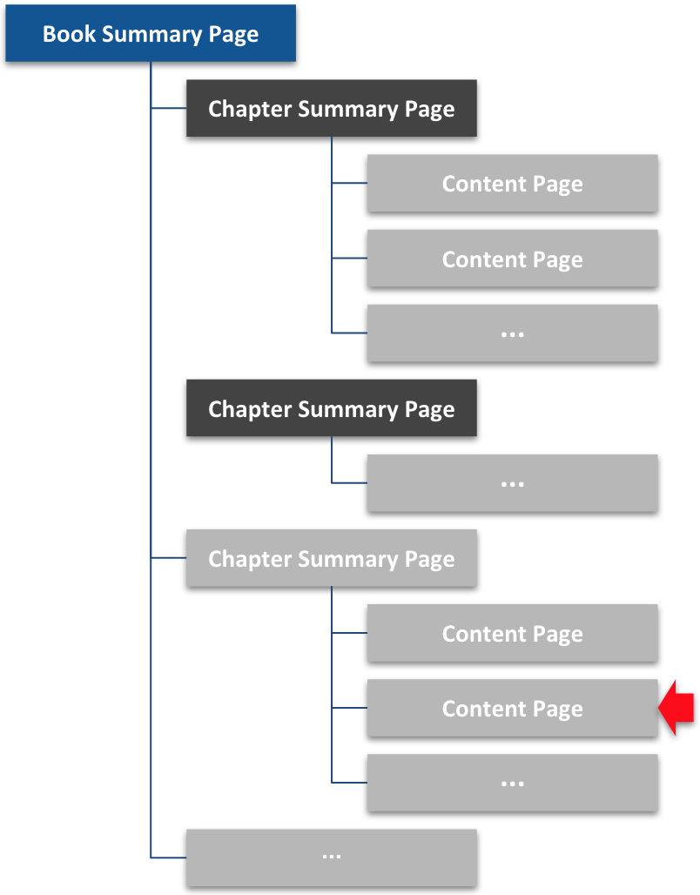

This is a <code>Content Page</code>. Putting API information on a single long page in the reference enables readers to search the page. Another option is to create a whole chapter dedicated to your API.