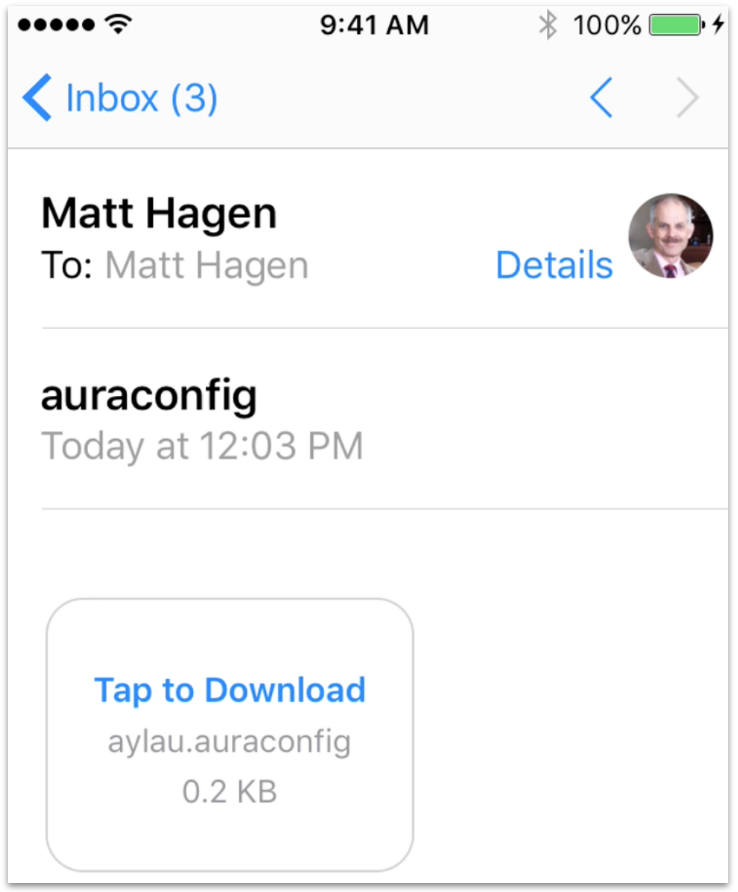
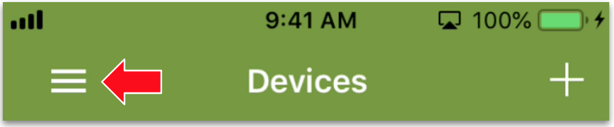

<aside id="pagebar" class="d-xl-block collapse">
  <ul>
    <li>
      <a href="#core-title">Aura Mobile App</a>
    </li>
    <li>
      <a href="#configuration">Configuration</a>
      <ul>
        <li><a href="#login-screen">Login Screen</a></li>
        <li><a href="#main-menu">Main Menu</a></li>
        <li><a href="#device-screen">Device Screen</a></li>
      </ul>
    </li>
  </ul>
</aside>

Available for iOS and Android, the Aura Mobile App is designed to help developers interact with any device deployed in either development or field accounts in any Ayla Cloud region. Firmware developers can use Aura to connect, register, and test edge solutions. Integrators can use Aura to test integrations between the Ayla Cloud and business systems. And, front-end developers can use Aura to envision the features and functionality they might need in a customized mobile app. 

# Configuration

By default, the Aura Mobile App is configured to access the Ayla Public Account, but you can configure it to access your Ayla Company Account. Here are the steps for iOS users:

1. Log into your Ayla Customer Account via the [Ayla Dashboard Portal](/system-administration/ayla-dashboard-portal/).
1. Click OEM Profile in the sidebar.
1. Click Apps in the horizontal menu.
1. Create an app configuration named Aura.
    <div></div>
    The configuration will be assigned an Application ID and an Application Secret:
    <div></div>
1. In a text editor, create a file called <code>&lt;mycompany&gt;.auraconfig</code>, and copy & paste the following into the file:
    ```
    {
      "appId": "",
      "appSecret": "",
      "name": "My Company Name",
      "serviceLocation": "USA",
      "serviceType": "Development"
    }
    ```
1. Copy & paste your Application ID and Application Secret into the file, customize the other fields, and save.
1. Email the file as an attachment to yourself.
1. Open the email on your mobile device.
    <div></div>
1. Tap to Download.
1. Hard-press the <code>Tab to Download</code> window to reveal share options:
    <div></div>
1. Click <code>Copy to Aura</code>. Aura should indicate success:
    <div></div>
1. Click <code>Save</code> in Aura:
    <div></div>
1. Log into Aura with the email address and password associated with your Ayla Customer account.

## Login Screen

The Login screen includes a Sign Up button, a Wi-Fi Setup button, and a gear icon:

<div></div>

* The Sign Up button enables a new user to create a user account with EndUser access rights in the Ayla Public (Cloud) Account. 
* The Wi-Fi Setup button enables users to navigate to the Settings screen of the mobile device. 
* The gear icon displays a **Configuration** screen, important when you want to point Aura to an Ayla Customer Account. Configuration parameters appear at the bottom of the screen. See [Configuration](#configuration) for details.

## Main Menu

Once logged in, tap the hamburger:

<div></div>

The Main Menu appears. The following diagram shows the structure of the Aura Mobile App:

<div></div>

## Device Screen

Tapping a device on the Devices List reveals the Device screen:

<div></div>
