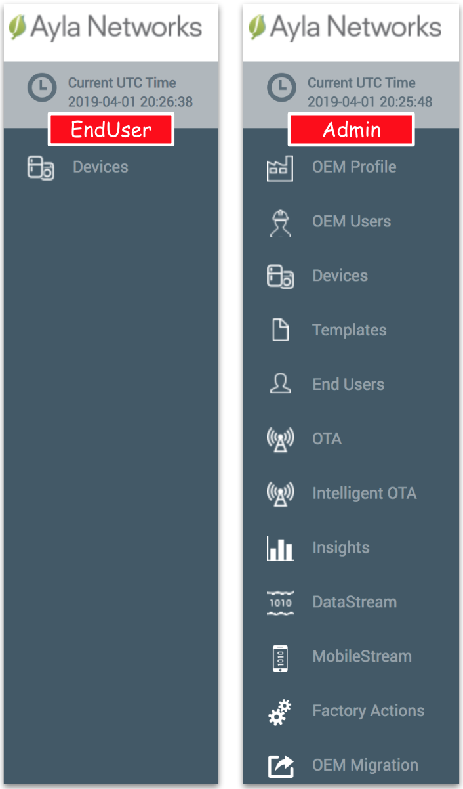

See [Ayla Customer Dashboard User Guide](/archive/ayla-customer-dashboard-user-guide).

To access the portal, use the link for your region and deployment type:

<table>
<tr>
<th>Region</th>
<th>Deployment</th>
<th>Domain</th>
</tr>
<tr>
<td rowspan="2">cn</td>
<td>dev</td>
<td><a href="https://dashboard-dev.ayla.com.cn" target="_blank">dashboard-dev.ayla.com.cn</a></td>
</tr>
<tr>
<td>field</td>
<td><a href="https://dashboard.ayla.com.cn" target="_blank">dashboard.ayla.com.cn</a></td>
</tr>
<tr>
<td>eu</td>
<td>field</td>
<td><a href="https://dashboard-field-eu.aylanetworks.com" target="_blank">dashboard-field-eu.aylanetworks.com</a></td>
</tr>
<tr>
<td rowspan="2">us</td>
<td>dev</td>
<td><a href="https://dashboard-dev.aylanetworks.com" target="_blank">dashboard-dev.aylanetworks.com</a></td>
</tr>
<tr>
<td>field</td>
<td><a href="https://dashboard.aylanetworks.com" target="_blank">dashboard.aylanetworks.com</a></td>
</tr>
</table>

Note that the Ayla Dashboard Portal will display more/less features depending on your access rights: 

