<aside id="pagebar" class="d-xl-block collapse">
  <ul>
    <li><a href="#core-title">Ayla DevKit v2.0</a></li>
    <li><a href="#supplements">Supplements</a>
      <ul>
        <li><a href="#notification-terms">Notification terms</a></li>
        <li><a href="#triggers">Triggers</a></li>
        <li><a href="#notifications">Notifications</a></li>
      </ul>
    </li>
</aside>

See [Ayla Developer Portal User Guide](/archive/ayla-developer-portal-user-guide).

To access the portal, use the link for your region:

<table>
<tr>
<th>region</th>
<th>deployment</th>
<th>domain</th>
</tr>
<tr>
<td rowspan="2">cn</td>
<td>dev</td>
<td><a href="https://developer.ayla.com.cn" target="_blank">developer.ayla.com.cn</a></td>
</tr>
<tr>
<td>field</td>
<td>&nbsp;</td>
</tr>
<tr>
<td>eu</td>
<td>field</td>
<td>&nbsp;</td>
</tr>
<tr>
<td rowspan="2">us</td>
<td>dev</td>
<td><a href="https://developer.aylanetworks.com" target="_blank">developer.aylanetworks.com</a></td>
</tr>
<tr>
<td>field</td>
<td>&nbsp;</td>
</tr>
</table>

# Supplements

## Notification terms

Navigate to a device properties tab, and note the Triggers and Notifications tabs:
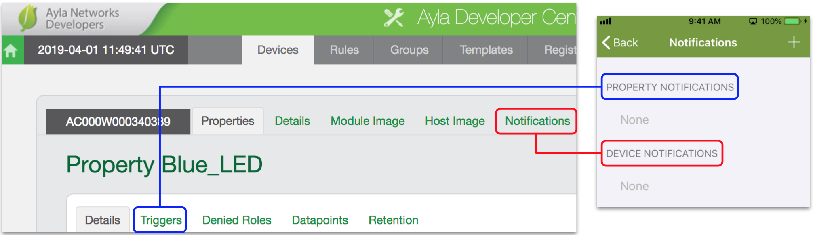
Triggers = Aura Property Notifications. Notifications = Aura Device Notifications.

## Triggers

1. Click the Triggers tab for the Green_LED property. A triggers list appears with (probably) one trigger:
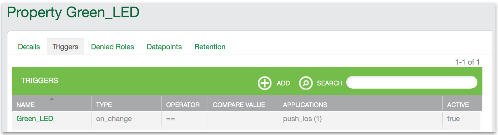
1. Click Green_LED on the Triggers list. An applications list appears with (probably) one application:
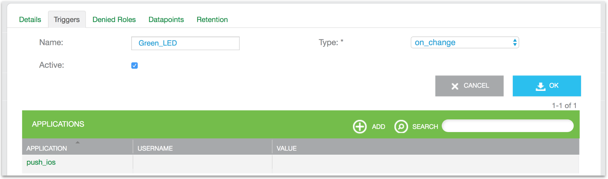
1. Click push_ios. An Edit Application window appears representing the Aura <u>property</u> notification.
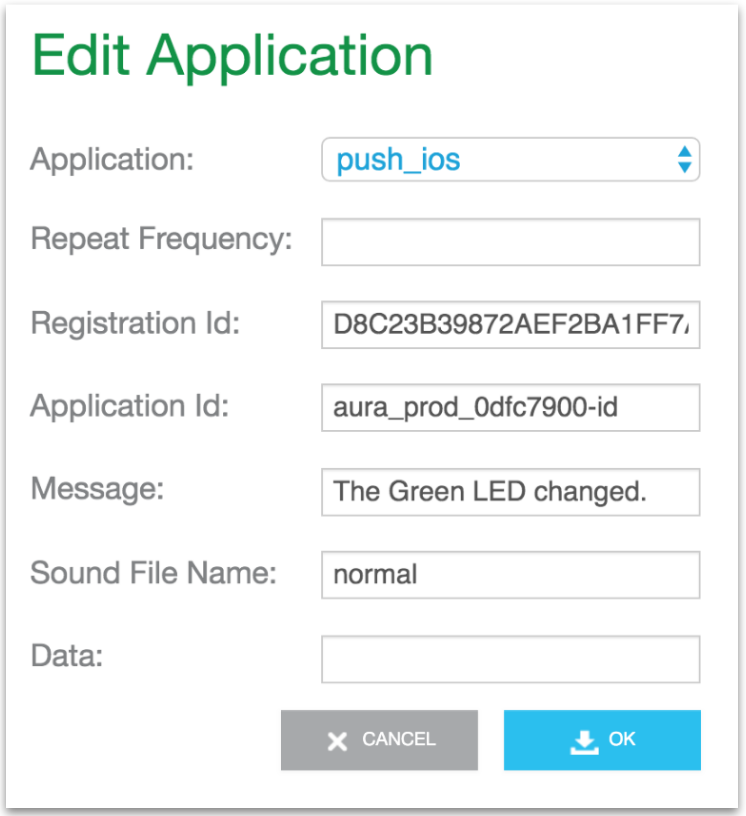
1. Click Cancel. Then, click Add, create an email application similar to the following (substitute an email), and click OK.
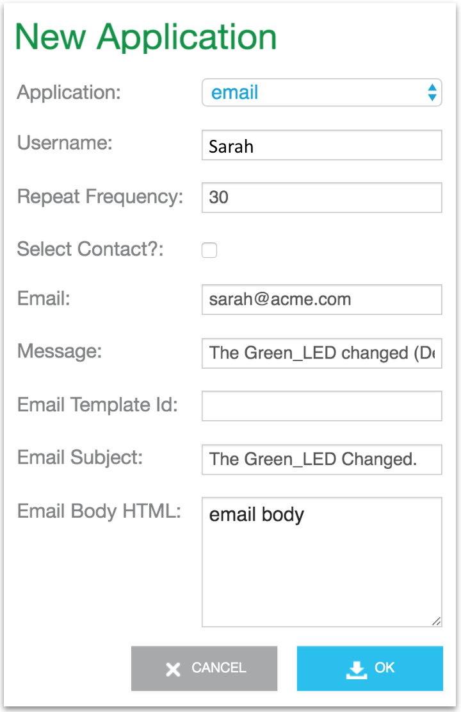
The new application appears on the list:
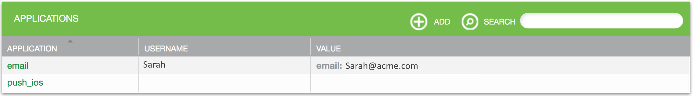
1. Toggle the Green_LED property value.
1. Check your email. You should receive one similar to the following:
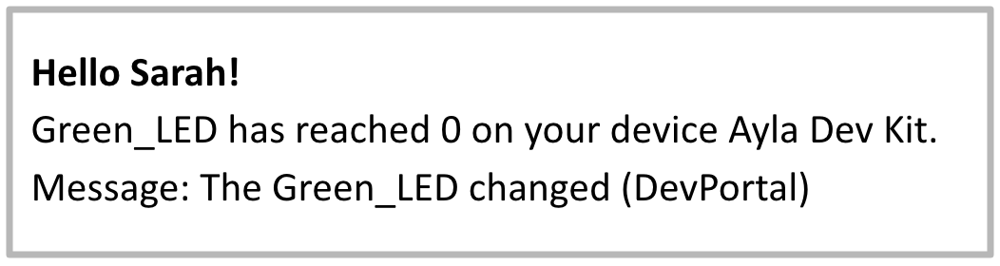

## Notifications

1. Click the Notifications tab. The notifications list appears with (probably) one notification:
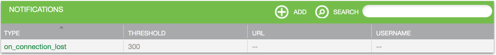
1. Click on_connection_lost on the list. An application list appears with (probably) one application:
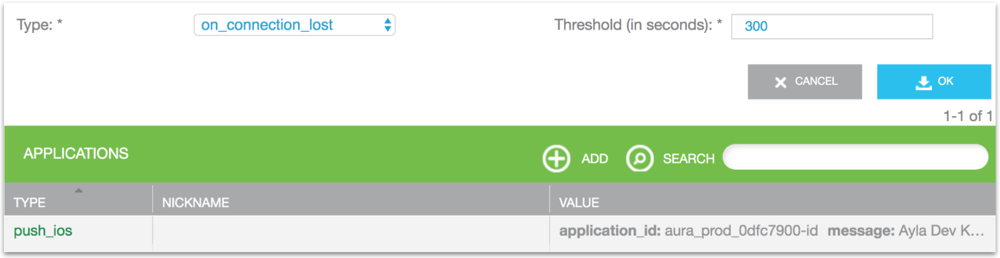
1. Click push_ios. An Edit Application window appears representing the Aura <u>device</u> notification.
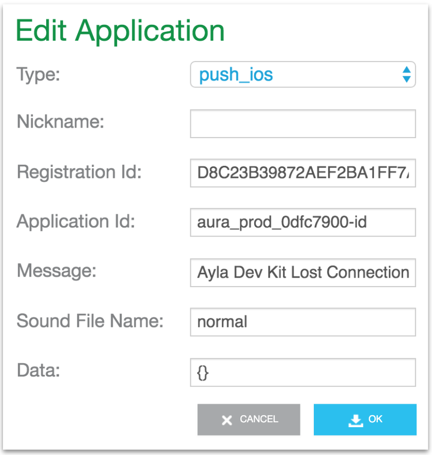
1. Click Cancel. Then, click Add, create an email application similar to the following (substitute an email), and click OK.
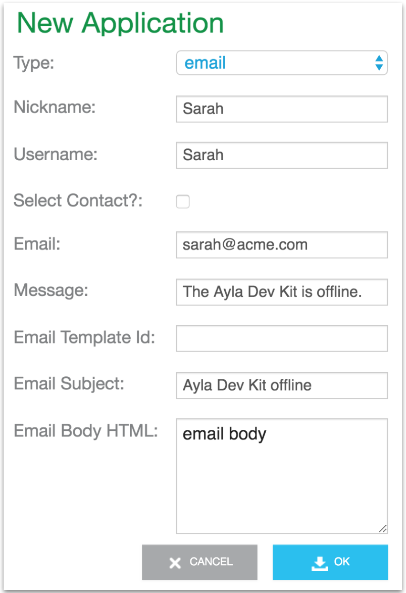
The new application appears on the list:
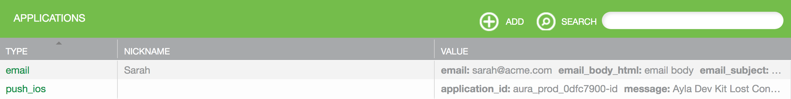
1. Power-off your dev kit, and wait for a few minutes.
1. Check your email. You should receive one similar to the following:
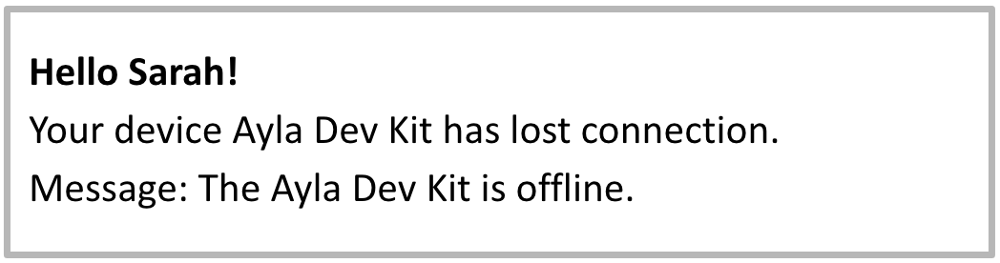