<aside id="pagebar" class="d-xl-block collapse">
  <ul>
    <li><a href="#core-title">On this page</a>
      <ul>
        <li><a href="#why-property-acks">Why property acks?</a></li>
        <li><a href="#requirements">Requirements</a></li>
        <li><a href="#asynchronous-updates">Asynchronous updates</a></li>
      </ul>
    </li>
    <li><a href="#implementation">Implementation</a>
      <ul>
        <li><a href="#setting-ack_enabled">Setting ack_enabled</a></li>
        <li><a href="#modifying-a-host-app">Modifying a host app</a></li>
        <li><a href="#modifying-a-mobile-app">Modifying a mobile app</a></li>
        <li><a href="#modifying-a-web-app">Modifying a web app</a></li>
      </ul>
    </li>
  </ul>
</aside>

## Why property acks?

The Ayla Cloud represents a device as a *Digital Twin* which includes a set of properties and values. For example, the cloud might use three property-value pairs (`on=true`, `set_pt=72`, and `temp=75`) to represent a thermostat:

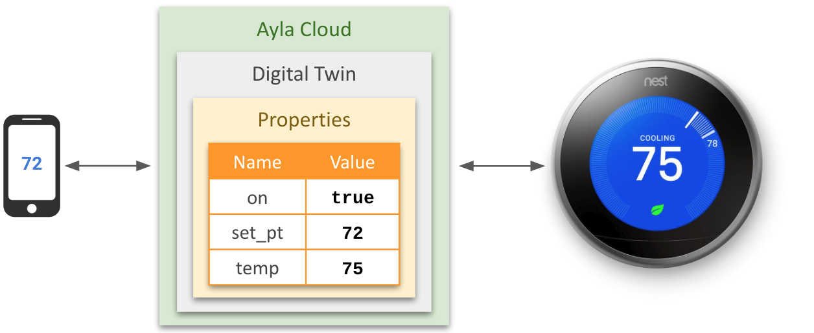

When a mobile app sets a property value (e.g. `set_pt=72`), the cloud attempts to updates two values: (1) the digital-twin value, and, if the device is online, and if the value is acceptable (e.g. in range), (2) the edge-device value:

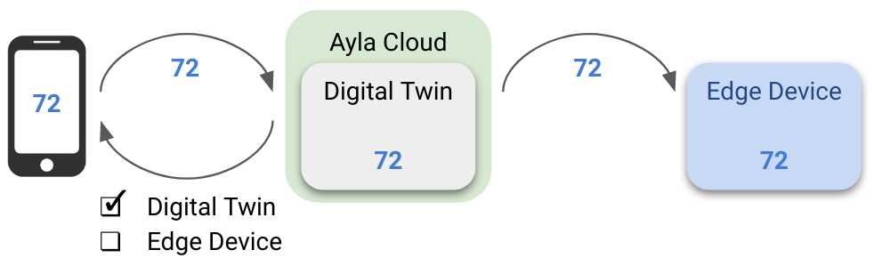

However, by default, as indicated by the checkboxes in the diagram above, the cloud reports (to the mobile app) the status of the digital-twin update only. It does not report the status of the edge-device update which may have failed. Ack-enabled properties solve this problem.

## Requirements

There are four requirements to ensuring that mobile or web applications can receive acknowledgments about edge-device property-value updates:

1. The `ack_enabled` attribute of the property must be set to `true`.
1. The edge-device host application must be ack-aware.
1. The edge-device Ayla agent must be ack-aware. Currently, the [Production Agent](/edge-solutions/ayla-host-library-and-reference-application) and the [Linux agent](/edge-solutions/ayla-linux-device-solution) can handle these types of acknowledgments, and they use different implementations.
1. The mobile or web application must ask the cloud for the acknowledgment.

When `ack_enabled=true`, the host application provides `status` and `message` information to the agent; the agent returns the information to the cloud; and the mobile or web app retrieves the information from the cloud. `ack_enabled` is a property attribute. The Ayla Cloud represents a property as a set of attributes and values. Here is an example:

<pre><code>{
  "type": "Property",
  <span style="color:black;">"name": "set_pt"</span>,
  "base_type": "integer",
  "read_only": false,
  "direction": "input",
  "scope": "user",
  "data_updated_at": "2020-04-19T18:59:15Z",
  "key": 33334444,
  "device_key": 11112222,
  "product_name": "Thermostat",
  "track_only_changes": false,
  "display_name": "set_pt",
  "host_sw_version": false,
  "time_series": false,
  "derived": false,
  "app_type": null,
  "recipe": null,
  "value": null,
  "denied_roles": [],
  "ack_message": "Out of range.",
  "ack_status": 1,
  "acked_at": "2020-04-21T13:17:48Z",
  <span style="color:black;">"ack_enabled": true</span>,
  "retention_days": 30
}</code></pre>

Setting the `ack_enabled` attribute to `true` is essential for ensuring that mobile and web apps receive positive or negative acknowledgments about whether property-value updates reach edge devices. The following diagram represents a positive acknowledgment:

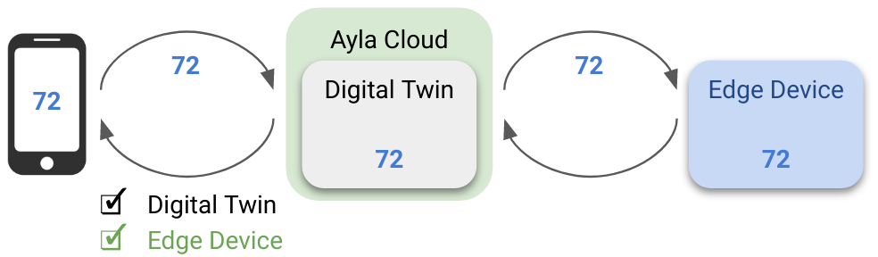

And, the one below, because the host application, after determining that the value is out of range, has rejected the update, represents a negative acknowledgment:

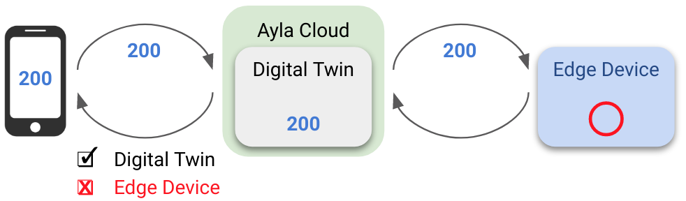

## Asynchronous updates

Updating the digital-twin and edge-device copies of a property value is asynchonous. Consider the following diagram which depicts an iOS/Android mobile app, the Ayla Cloud, and an edge device with an Ayla Agent, Ayla Host Library, and Host Application:

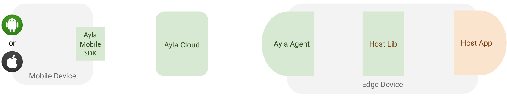

When `ack_enabled=false`, from the perspective of a mobile app, setting a property value means setting the value in the digital twin:

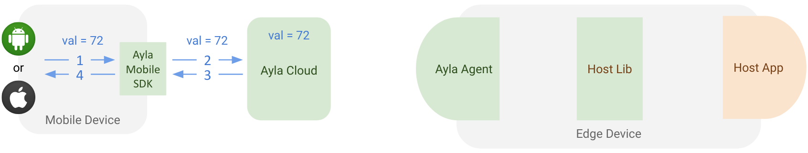

Aynchronously, the cloud sends `ANS Check` to the agent indicating that updates are available:

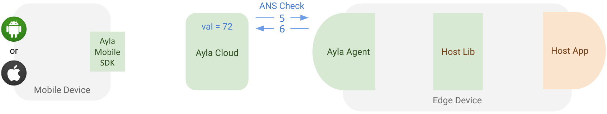

The agent retrieves the update information:

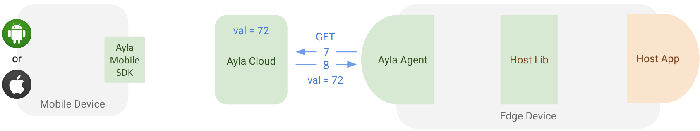

The agent passes the information to the host application which completes the edge-device update, and returns **control** (but not **status**) to the agent.

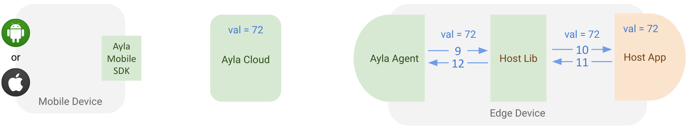

In this scenario above, no status information about the edge-device update flows back to the cloud, so the mobile app cannot ask the cloud whether the property value was actually updated on the edge device. But, when `ack_enabled=true`, and when the mobile app, agent, and host app are *ack-aware*, the edge-device update status flows back to the mobile app. The following shows a positive acknowledgment where `ack_status=0` means `success`, and the `ack_message` integer `123` is user-defined:

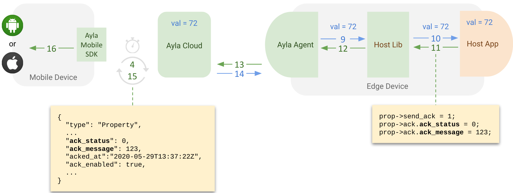

Below, the host app rejects the update, and returns a negative acknowledgment where `ack_status=1` means `error`, and the `ack_message` integer `456` is user-defined as `out of range`:

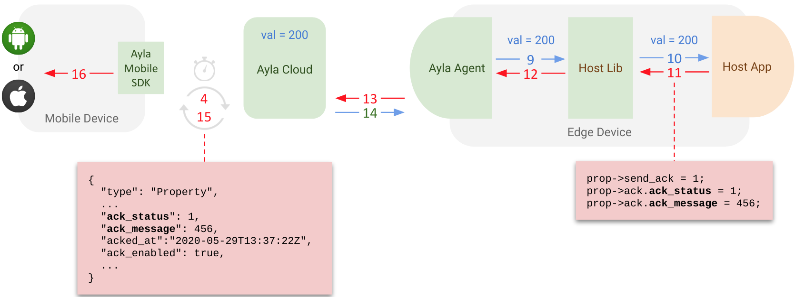

# Implementation

## Setting ack_enabled

You can set the `ack_enabled` attribute of a property by several means.

### Modify an existing template

1. Browse to the [Ayla Developer Portal](/system-administration/ayla-developer-portal/).
1. Click *Design a Device*.
1. Click the template name of a *Private* template.
1. Click *Properties*.
1. Click a particular property.
1. Check *Ack Enabled*.
1. Click *OK*.

If necessary, reassocate the modified template to your device:

1. Click *Devices*.
1. Click the *Serial Number* of your device.
1. Click *Template*.
1. In the dropdown, re-select the template.
1. Click Reassociate.

### Create a new template

1. Browse to the [Ayla Developer Portal](/system-administration/ayla-developer-portal/).
1. Click *Design a Device*.
1. Click *Add*, and fill out the form, and click OK.
1. Find the new template on the list, and click.
1. Click *Properties*.
1. Click *Import*, and important a csv file that specifies `ack_enabled=true`. Example:
    ```
    ack_enabled,base_type,direction,name,scope
    false,boolean,output,Blue_button,user
    true,boolean,input,Blue_LED,user
    true,string,input,cmd,user
    true,decimal,input,decimal_in,user
    false,decimal,output,decimal_out,user
    true,boolean,input,Green_LED,user
    true,integer,input,input,user
    false,string,output,log,user
    false,integer,output,output,user
    ```

## Modifying a host app

This example handles acknowledgments for a property named `set_pt` which specifies the *set point* for a thermostat:

```
enum demo_val_err {
  VAL_NO_ERR = 0,
  VAL_BAD_LEN,
  VAL_OUT_OF_RNG
};

static s32 set_pt;

static struct prop prop_table[] = {
  ...
	{ "set_pt", ATLV_INT, set_set_pt, prop_send_generic, &set_pt, sizeof(set_pt)},
  ...
};

static void set_set_pt(struct prop *prop, void *arg, void *valp, size_t len)
{
  s32 i = *(s32 *)valp;

  if (len != sizeof(s32)) {
    prop->ack.ack_status = 1;
    prop->ack.ack_message = VAL_BAD_LEN;
    return;
  }

  if (i > 120 || i < 35) {
    prop->ack.ack_status = 1;
    prop->ack.ack_message = VAL_OUT_OF_RNG;
    return;
  }

  prop->ack.ack_status = 0;
  prop->ack.ack_message = VAL_NO_ERR;
  set_pt = i;
}
```

## Modifying a mobile app

The [Ayla Mobile SDK](https://docs.aylanetworks.com/mobile-and-web-apps/ayla-mobile-sdk-api-reference/) device template automatically handles `acknowledge` properties without any changes to developer code. Typically the default timeout is extended to handle events with longer durations.

```
private void profileCloudCommand(TestSuite suite, AylaProperty prop, Object value) {
    RequestFuture<AylaDatapoint<Integer>> future = RequestFuture.newFuture();
    AylaAPIRequest<AylaDatapoint> request = prop.createDatapointCloud(value, null, future, future);
    AylaDatapoint dp;
    _cloudRequestCount++;
    long startTime = System.currentTimeMillis();
    try {
        dp = future.get(prop.isAckEnabled() ? 10 * 1000 : 3000, TimeUnit.MILLISECONDS);
    } catch (InterruptedException e) {
        fail();
        suite.logMessage(LogEntry.LogType.Error, "Interrupted");
        return;
    } catch (ExecutionException e) {
        fail();
        suite.logMessage(LogEntry.LogType.Error, "Error " + e.getMessage());
        return;
    } catch (TimeoutException e) {
        fail();
        suite.logMessage(LogEntry.LogType.Error, "Timed out waiting for response");
        return;
    }
    long duration = System.currentTimeMillis() - startTime;
    suite.logMessage(LogEntry.LogType.Info, "Changing "+ prop.getName() + " to " +
            ""+value + " via Cloud" );
    if (!dp.getValue().equals(value)) {
        suite.logMessage(LogEntry.LogType.Warning, "Returned datapoint value is " + dp.getValue());
    }
    if (prop.isAckEnabled()) {
        Date ackedAt = prop.getAckedAt();
        if (ackedAt != null) {
            long diff = ackedAt.getTime() - request.getNetworkResponseTimestamp();
            suite.logMessage(LogEntry.LogType.Info, "Property ack'd by device " +
                    Math.abs(diff) + "ms " +
                    (diff <= 0 ? "before" : "after") + " the server response");
        }
    }
    long networkTime = request.getNetworkTimeMs();;
    _cloudNetworkTime += networkTime;
    if(_cloudMinTime > networkTime){
        _cloudMinTime = networkTime;
    }
    if(_cloudMaxTime < networkTime){
        _cloudMaxTime = networkTime;
    }
    _cloudRequestPassCount++;
    _cloudTotalTime += duration;
    suite.logMessage(LogEntry.LogType.Info, "Cloud Operation Time: " + duration + "ms; Network: " +
            networkTime+ "ms");
}
```

## Modifying a Web app

Like the [Ayla Mobile SDK](https://docs.aylanetworks.com/mobile-and-web-apps/ayla-mobile-sdk-api-reference/), the [Ayla Javascript Client](https://github.com/AylaNetworks/JS_AylaSDK/blob/develop/src/device/AylaProperty.ts) handles `acknowledge` properties without requiring changes to developer code.