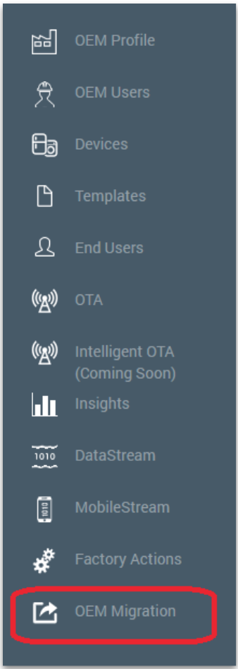
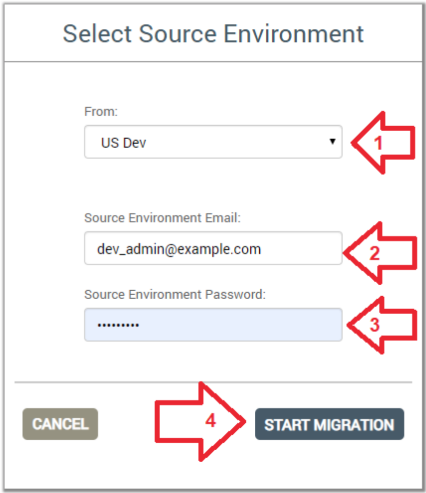
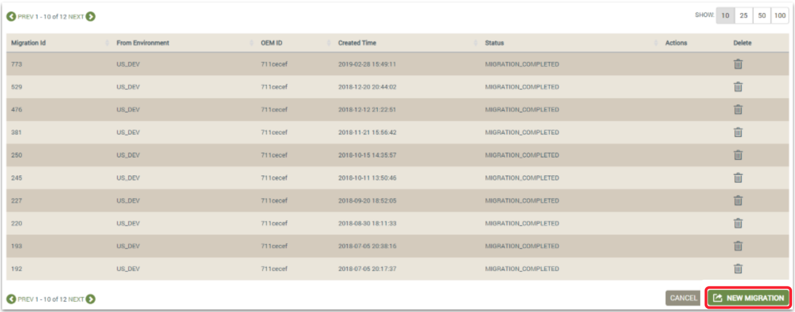
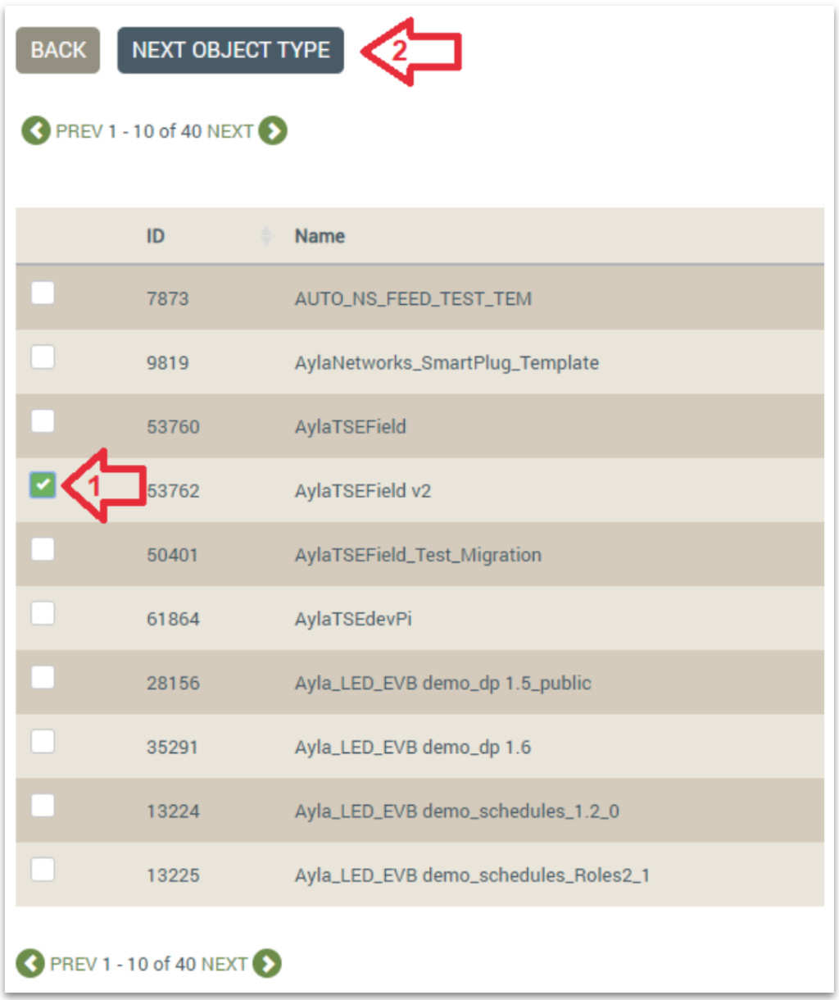
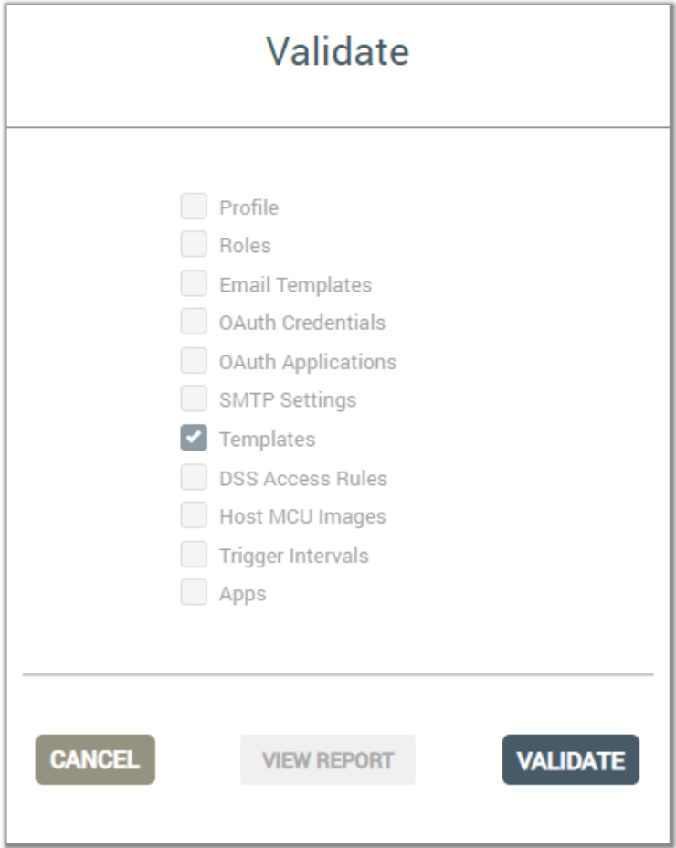
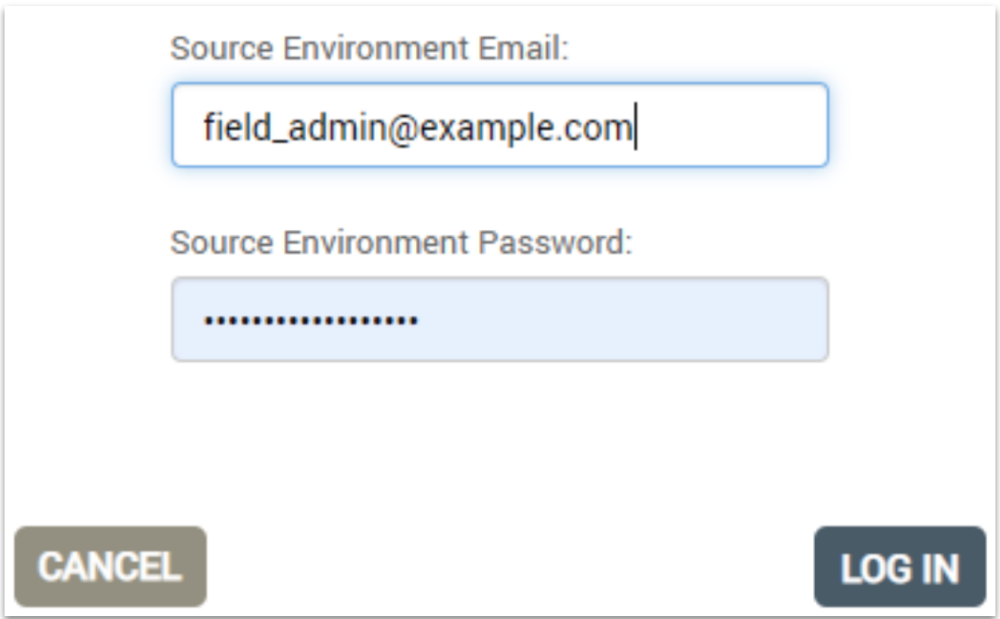

This tech note helps Ayla Network OEMs migrate templates from development services to field services.

1. Sign into the Ayla Dashboard of the destination (field) service, using an `OEM:Admin` user account.
    

1. Click `OEM Migration` in the left column.
    

1. Select the service (e.g. `US Dev`) where the template currently resides, enter the credentials of your source admin account, and click `Start Migration`.
    

1. Click `New Migration`.
    

1. Check `Templates`, and click `Continue`.
    

1. Check the template you want to migrate, and select `Next Object Type`.
    

1. Click `Validate`.
    

1. Enter the credentials of your destination admin account, and click `LOG IN`.
    

1. Once Validation completes, select `GO TO MIGRATION`.
    

1. Select `MIGRATE`.
    

1. Enter the credentials of your destination admin account, and click `LOG IN`.
    

1. Once Migration completes, Select `DONE`.
    

    The template should appear in the Ayla Dashboard of the field service with a new ID.
