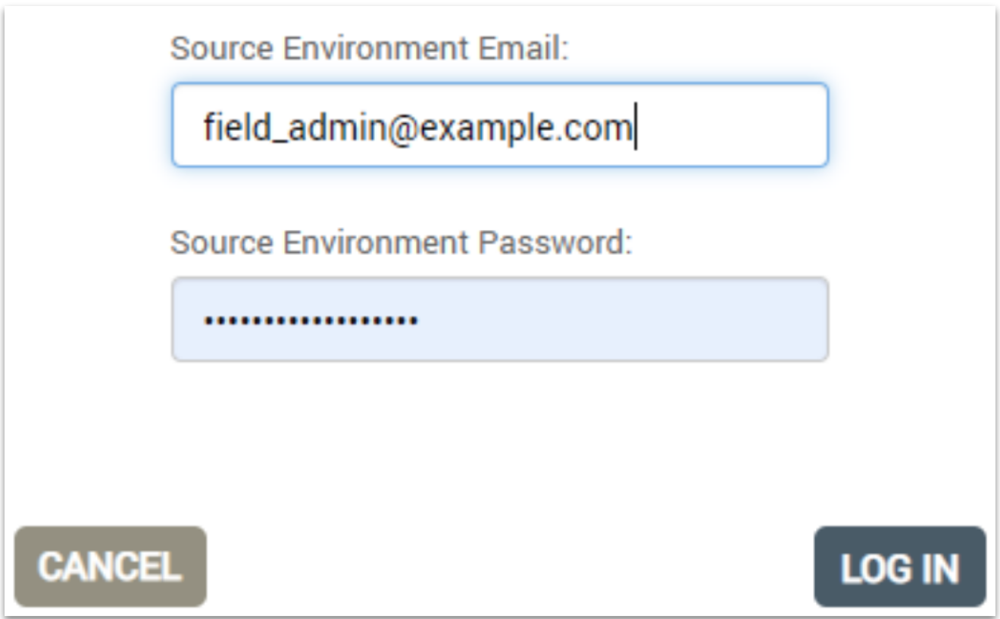
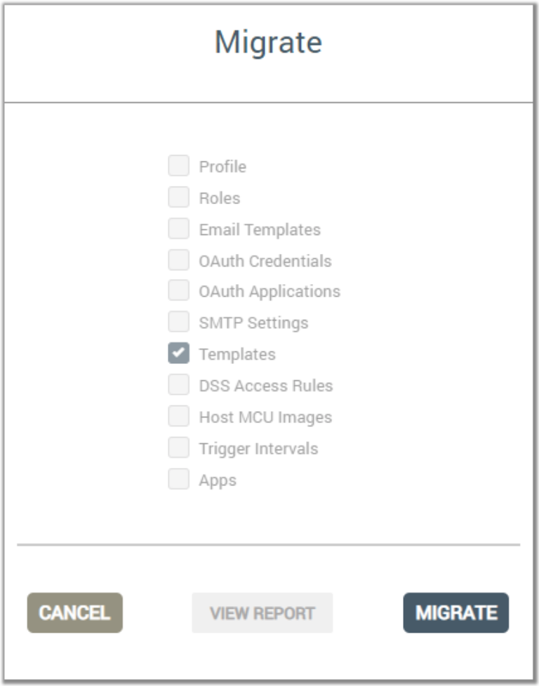

By Trinh Phan on Month, 00, 0000

<aside id="pagebar" class="d-xl-block collapse">
<ul>
<li><a href="#core-title">Supporting end users</a></li>
<li><a href="#migrate-templates">Migrate templates</a></li>
<li><a href="#fix-wi-fi-issues">Fix Wi-Fi issues</a></li>
<li><a href="#escalate-issues">Escalate issues</a></li>
</ul>
</aside>

This page provides guidance for teams tasked with supporting end users of devices that connect to the Ayla IoT Cloud. The guidance is limited, for the most part, to Ayla-related topics such as how to use the Ayla Dashboard, how to fix common connectivity issues, how to determine which issues to escalate to Ayla Support, and how to escalate those issues. This page does not explain how to troubleshoot any particular device.

## Migrate templates

This section describes how to migrate templates from development services to field services.

1. Sign into the Ayla Dashboard of the destination (field) service, using an `OEM:Admin` user account.
    

1. Click `OEM Migration` in the left column.
    

1. Select the service (e.g. `US Dev`) where the template currently resides, enter the credentials of your source admin account, and click `Start Migration`.
    

1. Click `New Migration`.
    

1. Check `Templates`, and click `Continue`.
    

1. Check the template you want to migrate, and select `Next Object Type`.
    

1. Click `Validate`.
    

1. Enter the credentials of your destination admin account, and click `LOG IN`.
    

1. Once Validation completes, select `GO TO MIGRATION`.
    

1. Select `MIGRATE`.
    

1. Enter the credentials of your destination admin account, and click `LOG IN`.
    

1. Once Migration completes, Select `DONE`.
    

    The template should appear in the Ayla Dashboard of the field service with a new ID.

## Fix Wi-Fi issues

This section provides steps for troubleshooting IoT device connectivity issues.

1. Reset the router and Wi-Fi access point. If they are two separate devices, reset the router first, and then reset the access point. The following steps apply to most routers and access points:
    1. Power off the device by pressing the power switch or unplugging.
    1. Wait for 30 seconds.
    1. Power on.
    1. Verify completion usually indicated by a solid LED light.
1. Whitelist the following router ports: 80, 443, 53, 55055, 55056.
1. Set up the IoT device within proper distance of the access point.
    1. Place the device within 10 feet of the access point (preferably) in the same room.
    1. Place the device at least one foot away from the access point.
    1. After completing initial setup, move the device to the desired location, and verify connectivity.
1. Verify that the IoT device is configured to use the intended SSID, and be aware of the following:
    1. The device may be within range of several Wi-Fi access points.
    1. The target access point should be enabled for 2.4 GHz (802.11 B/G/N).
    1. In rare cases, your device may be within range of two access points with the same SSID. In this case, be sure to configure the device with the MAC address of the intended access point. Instructions for finding the MAC address should be in the Admin section of the Wi-Fi Access Point user manual.
1. Check Wi-Fi security, keeping the following in mind:
    1. Wi-Fi access point security keys are usually case sensitive, so you may want to retype it.
    1. Ayla supports the following Wi-Fi security schemes: `Open`, `WEP`, `WPA (PSK)`, `WPA2_Personal (PSK)`, `WPS` (except for AP-Mode registration.).
1. Check the Wi-Fi signal strength and quality at the location where you plan to deploy your device. Here are some approaches:
    1. Use a cell phone or tablet to check the Wi-Fi signal strength and data rate at the location. These values will provide a reasonable baseline.
    1. Download and use a Wi-Fi Analyzing App for iOS or Android available at the online stores. Performance may depend on your internet service plan.
1. Check for other 2.4 GHz consumer devices that might be interfering with the Wi-Fi signal. These might include Bluetooth devices, baby monitors, cordless phones, walkie talkies, remote control toys, wireless video and audio equipment, microwaves, and wireless keyboard and mice.
1. Reset the IoT device to factory settings as described in the device manufacturer user manual.

## Escalate issues
