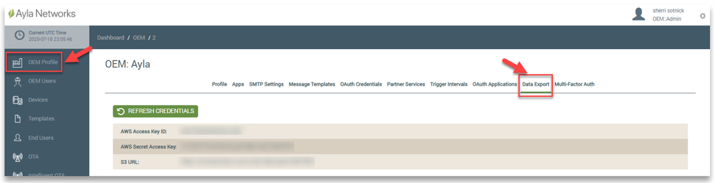
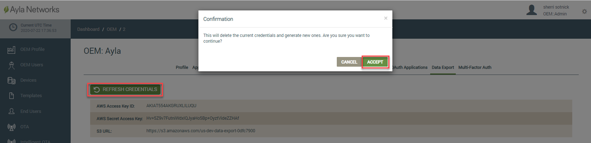
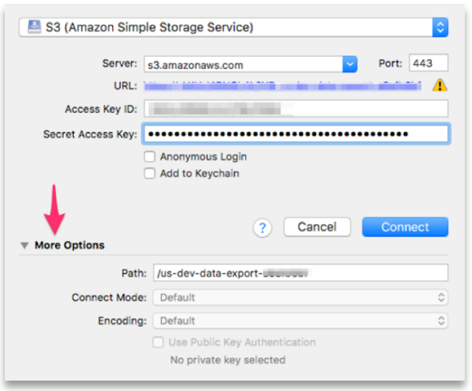
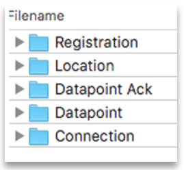
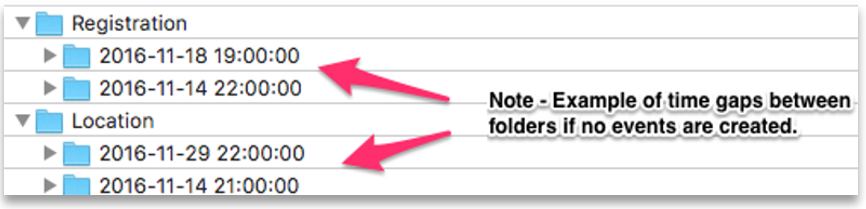
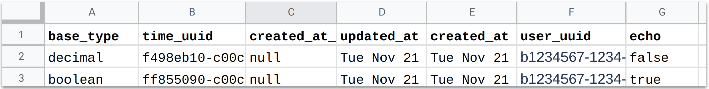

Ayla Networks provides two methods for extracting data on device events in the Ayla Cloud. The Ayla Data Export feature is one method, which is for historic data. This feature provides developers and data analysts with great flexibility for retrieving and consuming historic device event data.

Ayla's DataStream Service (DSS) is the other method, which enables customers to use Cloud-scale event ingestion services (AWS Kinesis and Azure Event Hub) to retrieve near real-time data from the Ayla platform.

## Why Use Ayla's Data Export Feature

This feature can assist in the analysis and debugging of the following use cases:

* Troubleshooting inconsistent device behavior over a period of time
* Identifying usage patterns and scope for improvement
* Maintaining an archive of device events data for product lifecycle management

Customers who do not need access to real-time data or who do not wish to build external systems to maintain an active DataStream Services (DSS) subscription can use this feature to export their historic data for analysis or archiving. This feature also allows our customers to access and retrieve data beyond the current standard data retention policy on the Ayla Customer Dashboard, which is 90 days from the date of capture.

## Where the Data Files Are Stored 

The following 5 device event types are stored on Amazon S3 (Simple Storage Service):

* Datapoint
* Datapoint Ack
* Location
* Connection
* Registration

Amazon S3 creates a folder for each event type to compile its data files. When new event data is available after the most recent save, the event data files are posted to Amazon S3 in their respective event type folders. You may notice more time-stamped subfolders being added under specific event type folders if the volume of data being generated for that event type is high. Each event type folder can have multiple subfolders that are timestamped based on when the data within the folder was created. Each subfolder contains only one CSV event data file.

## How to Use Ayla's Data Export Feature

To use this feature, complete the following three major steps, which are described in this section:

1. Retrieve the OEM Access Credentials: Gain access to the Ayla Customer Dashboard with OEM::Admin privileges.
2. Use an Amazon S3 compatible client:  View and retrieve device event files using a Graphical User Interface (GUI) or Command Line Interface (CLI) to Amazon S3.
3. View and Consume the event data files:  Use the appropriate application to read and consume the generated .csv device event data files.

### Step 1: Retrieve the OEM Access Credentials

1. Log in to the [Ayla Customer Dashboard](https://dashboard.aylanetworks.com).
2. Click **OEM Profile** in the navigation panel, and then click the **Data Export** tab to view the OEM access credentials. Refer to the following example:

   

   The access credentials remain valid indefinitely unless an OEM Admin requests new credentials.

3. To request new access credentials, click the **REFRESH CREDENTIALS** button, and then click **ACCEPT** in the confirmation message. Refer to the following example:

   

### Step 2: Use an Amazon S3 Compatible Client to Access the Data Files

The Ayla Cloud Service regularly implements processes to aggregate new device events that are packaged into data files. These files are stored on Amazon S3 and organized by date, timestamp, and event type. The data files may contain duplicate events or out-of-sequence event data. These files are maintained for 12 months. You may use any client compatible with Amazon S3 to access the Ayla data files. Following are two examples of these clients:

* Cyberduck
  + This client uses a Mac/Windows GUI.
  + Navigate to [http://cyberduck.io](http://cyberduck.io) for more information.
* s3Cmd
  + This client uses a Mac/Windows CLI.
  + Navigate to [http://s3tools.org/s3cmd](http://s3tools.org/s3cmd) for more information.
   
Please note that Ayla Networks does not endorse any particular client, including the two examples above. The example in this tech note uses the Cyberduck client. Therefore, the fields may be different if you are using another client. Using the Cyberduck client, access the Ayla data files on Amazon S3 as follows:

1. Download the client from its company website, and then open the client. The example below these three steps shows the open connection window for the Cyberduck client.
 
2. Select the Amazon S3 option in the fields for the protocol and server, and then enter the OEM access credentials in the corresponding fields. (This is also shown in the example below these three steps.) If you are working across multiple OEMs, make sure that you enter the correct OEM access credentials for the data files you wish to view.

3. Enter any additional parameters in the other fields, and then click **Connect**. 

Once you successfully connect to Amazon S3, you gain access to the device event data files associated with the OEM access credentials that were entered.

Following is an example of the folders for the 5 event types on Amazon S3. As mentioned earlier, the Ayla device event data files are grouped into these 5 event types.

Following is an example of the event subfolders within the main folder for each of the 5 event types. Each subfolder is tagged with a timestamp formatted as YYYY-MM-DD-HH:MM:SS in UTC. The frequency in which the subfolders and data files are created in the event type folders varies depending on the amount of data generated for the event type. Some event types typically generate more data than others. You may therefore see some gaps between the timestamped subfolders (also shown in the example below). For instance, the Datapoint or Datapoint Ack event folders typically have more subfolders and data files compared to Registration or Location event folders. 

### Step 3: View and Consume the Event Data Files

Every subfolder in the event type folders has one CSV event data file. You therefore need an application (such as Microsoft Excel) to view the saved .csv data files. The example below shows the contents of a CSV file opened in Microsoft Excel. Notice that each individual parameter of the datapoint event displays as a single line entry in the .csv file. This data-entry pattern is the same in the .csv files across all event types. String values are base64 encoded.

## The Parameters Associated with the Ayla Device Event Types

The following table shows the parameters used by each Ayla Device Event Type. The display_name, val_string, and metadata values are base64 encoded.

||Datapoint &nbsp;| Datapoint ACK |Connection &nbsp;|Location &nbsp;|Registration &nbsp;|
|-|:-:|:-:|:-:|:-:|:-:|
|acked_at||X||||
|ack_id||X||||
|ack_message||X||||
|ack_status||X||||
|base_type|X|X||||
|closed|X|X||||
|created_at|X|X||X||
|created_at_from_device|X|X||||
|direction (input/ouput)|X|||||
|discarded|X|X||||
|display_name|X|X||||
|dsn|X|X|X|X|X|
|echo|X|X||||
|event_type|||X|||
|ip||||X||
|lat||||X||
|long||||X||
|metadata|X|X||||
|oem_id|X||X|X|X|
|oem_model|X|X|X|X|X|
|property_name|X|X||||
|provider||||X||
|registered|||||X|
|registered_at|||||X|
|registration_type|||||X|
|scope|X|X||||
|status|||X|||
|time_uuid|X|X||||
|unregistered_at|||||X|
|updated_at|X|X||||
|user_uuid|X|X|X|X|X|
|val_boolean|X|X||||
|val_decimal|X|X||||
|val_float|X|X||||
|val_int|X|X||||
|val_string|X|X||||
