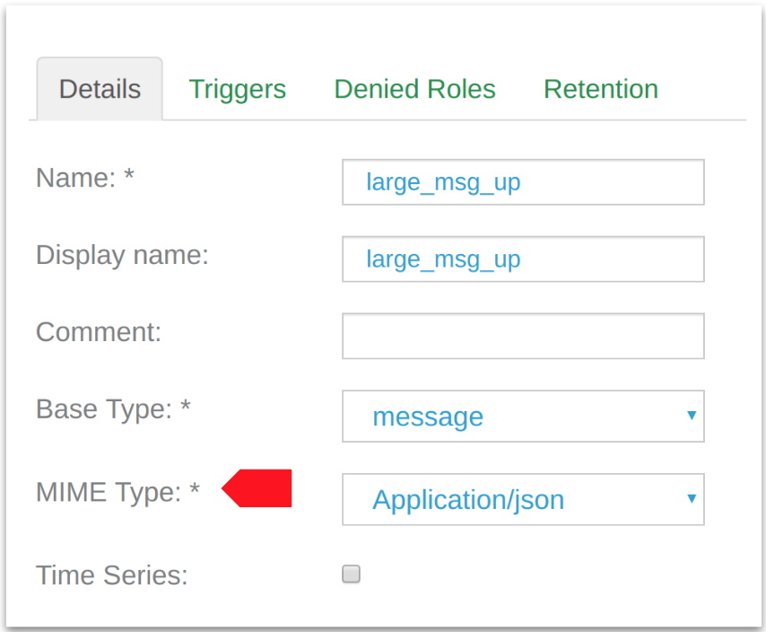
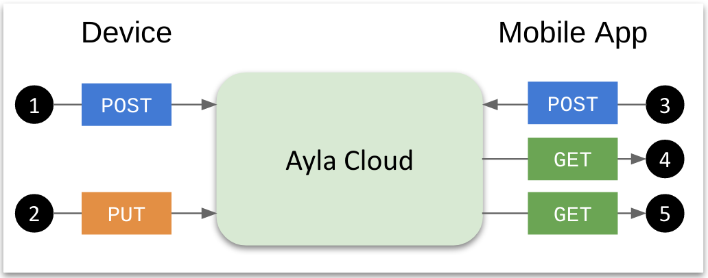

To meet the requirements of customers who want to send large JSON, binary, or text datapoints to the Ayla Cloud, and subsequently read the datapoints multiple times, or stream them to third-party systems, Ayla has added a new `message` device property base_type to the existing list of `boolean`, `integer`, `decimal`, `string`, and `file`. The Ayla Cloud stores message property values. It does not parse or interpret them, so they cannot cause actions within the cloud.

Message properties help customers reduce transaction costs: Ayla charges for small transactions and for each 4KB chunk of large transactions. So, if a device or mobile app uploads large amounts of data (e.g. images, logs, binary and JSON files) to the cloud without the need for the cloud to interpret the data, then bundling data in message properties significantly reduces the number of transactions which reduces cost.

# Characteristics

## Size

The maximum size of a datapoint associated with a device property of type `message` is 512 KB. For comparison, the maximum size of `string` property values is 1024 bytes. The relatively large size of message properties influences several factors discussed below including read/write latencies, read/write rates, limitations on total transactions in an hour, and the steps necessary to write and read datapoints.

## mime_type

Message properties includes an attribute called `mime_type`:

```
{
  "type": "Property",
  "name": "large_msg_up",
  "base_type": "message",
  "mime_type": "application/json",
  "read_only": true,
  "direction": "output",
  ...
  ...
}
```

The `mime_type` attribute supports `application/json`, `application/octet-stream`, and `text/plain`. Users can use the Ayla Developer Portal to set `mime_type` for a message property in a template:

<div></div>

## Multiple reads

Message property values can be read multiple times by mobile apps and other clients. For comparison, `file` properties, which also accommodate large datapoint sizes, can be read only once.

## Storage

Message property datapoints are stored in Cassandra in a dedicated partition named `property_name + dsn +  oem_id`. Partitions are partitioned hourly and limited to 100MB. An average datapoint size of 2800 bytes, and an average creation rate of 10 datapoints per second fills the partition in about an hour. Larger datapoint sizes require slower rates. All datapoints except the most recently stored are deleted after 90 days. 

## Other limitations

* `message` properties support metadata.
* `message` properties do not support schedules, LAN mode, batching, or search by property value.
* `message` properties cannot cause cloud actions. The Ayla Cloud stores them, but it does not parse or interpret them.
* There is no API to edit a `message` datapoint.
* There is no API to delete a `message` datapoint, although associating another template (that does not include the `message` property) with the device removes the datapoints.
* It takes 2-3 secs to upload a datapoint of size 512KB. 

# Dataflow Overview

This diagram shows how a device writes a message property datapoint, and how a mobile/web app creates and gets a datapoint:

<div></div>

## Device operations

1. The device posts an empty request body, or one containing datapoint metadata, signaling the intention to upload the actual data. The cloud creates a datapoint partition in Cassandra, and returns a datapoint Id (e.g. `3d03f51c-d348-11ea-8170-9217ea80cd72`) to the device.
1. The device puts the JSON, binary, or text data.

## Mobile/web app operations

1. The mobile/web app posts the JSON, binary, or text data and, optionally, datapoint metadata.
1. The app gets a list of datapoint IDs. 
1. The app specified a particular datapoint id to return the JSON, binary, or text data.

# Device Details

This section shows how to implement message properties in a host application on a device. For additional details, see the [Ayla Linux Agent](https://github.com/AylaNetworks/device_linux_public) github repository. As with other properties, message properties are defined in an array of properties shared by the host app and the Ayla agent:

```
static struct prop appd_prop_table[] = {
  {
    .name = "large_msg_up",
    .type = PROP_MESSAGE,
    .send = appd_large_prop_send,
    .arg = large_msg_up,
    .len = sizeof(large_msg_up),
    .buflen = sizeof(large_msg_up),
    .confirm_cb = appd_large_prop_confirm_cb,
    .ads_failure_cb = appd_prop_ads_failure_cb
  },
  {
    .name = "large_msg_up_test",
    .type = PROP_STRING,
    .set = appd_large_msg_up_test_set,
    .send = prop_arg_send,
    .arg = large_msg_up_test,
    .len = sizeof(large_msg_up_test),
    .ads_failure_cb = appd_prop_ads_failure_cb
  }
}
```

In this case, `large_msg_up`, is configured to send data from the device to the cloud, and `large_msg_down` is configured to both receive and send data. The Ayla agent is responsible for calling `POST`, `PUT`, and `GET`, and chunking/assembling data as necessary.

# Mobile/Web app details

Mobile and web apps use the following three APIs to write and read message properties:

* createMsgDatapointByDsn (id=359)
* getDatapointsByDsn (id=138)
* getDatapointByDsn (id=358)

See the [API Browser](https://docs.aylanetworks.com/cloud-services/api-browser/) for details. 
