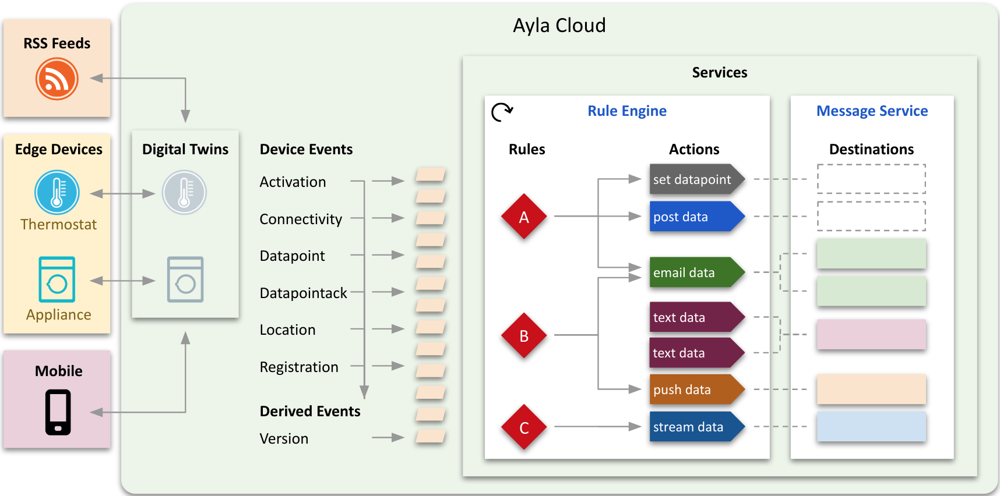
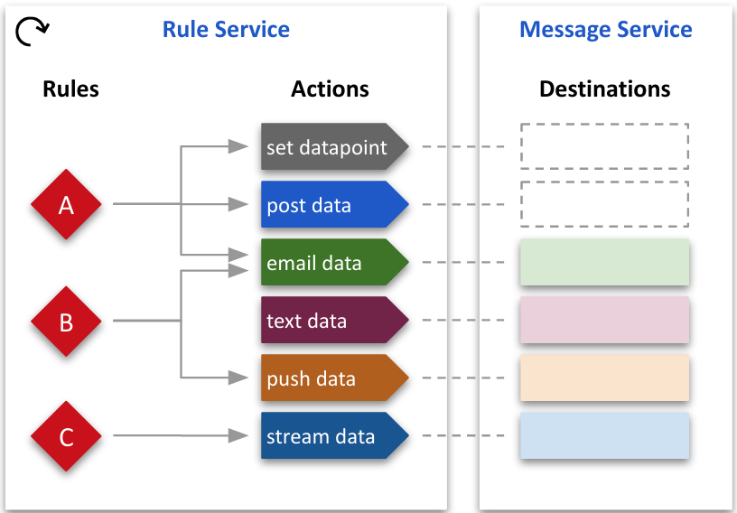
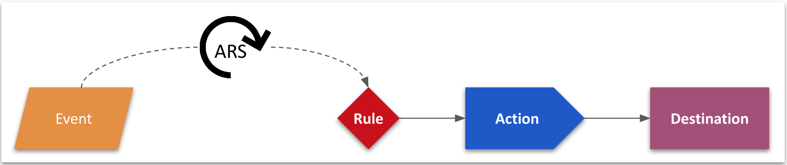
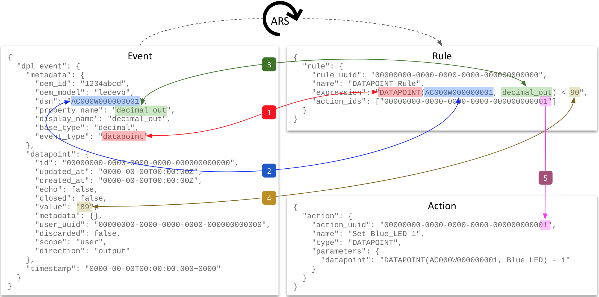
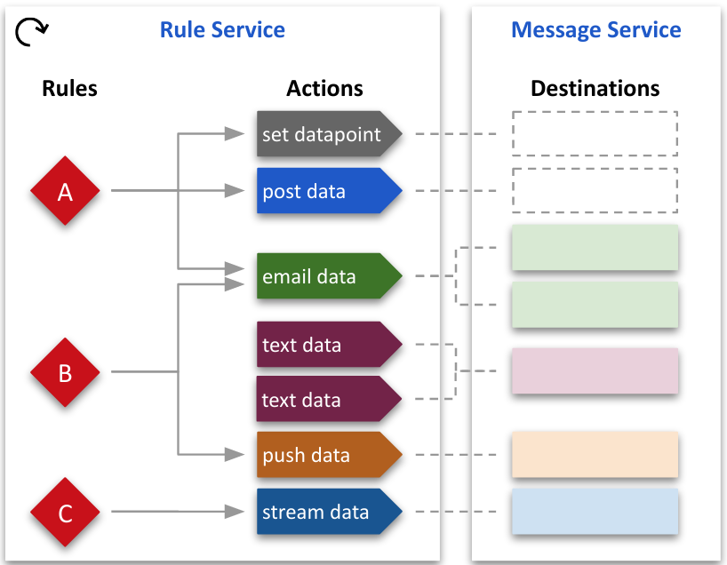
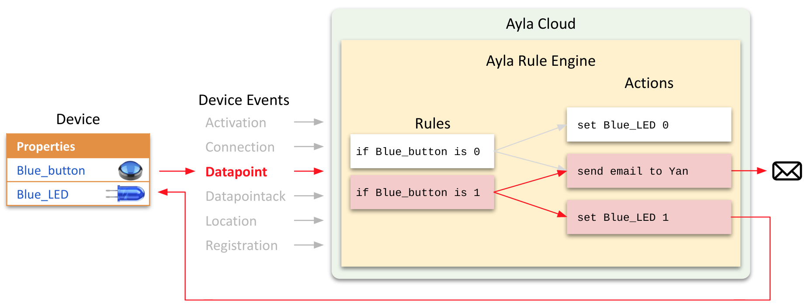
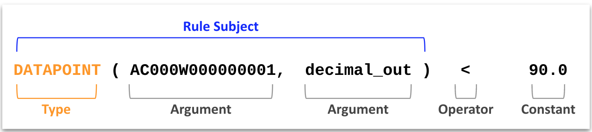
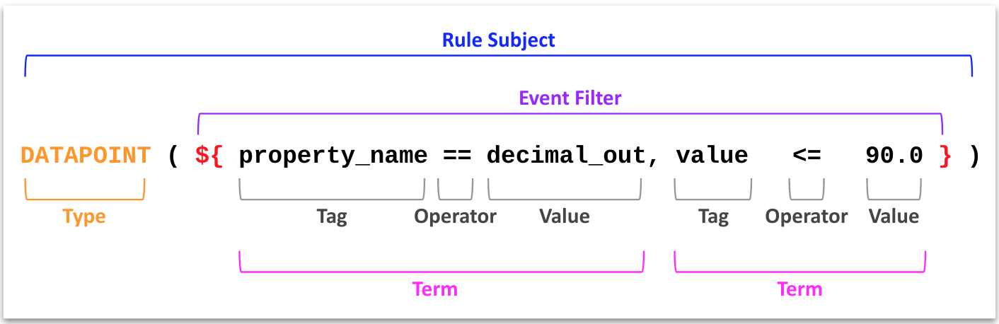
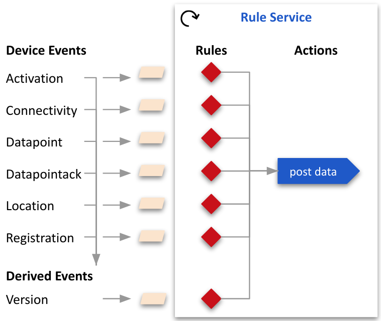

<aside id="pagebar" class="d-xl-block collapse">
  <ul>
    <li>
      <a href="#core-title">Ayla Rule Service</a>
      <ul>
        <li><a href="#digital-twin">Digital Twin</a></li>
        <li><a href="#event">Event</a></li>
        <li><a href="#rule">Rule</a></li>
        <li><a href="#action">Action</a></li>
        <li><a href="#destination">Destination</a></li>
        <li><a href="#relationships">Relationships</a></li>
      </ul>
    </li>
    <li>
      <a href="#example">Example</a>
      <ul>
        <li><a href="#use-case">Use Case</a></li>
        <li><a href="#procedure">Procedure</a></li>
        <li><a href="#directions">Directions</a></li>
      </ul>
    </li>
    <li>
      <a href="#expressions">Expressions</a>
      <ul>
        <li><a href="#concrete-expressions">Concrete expressions</a></li>
        <li><a href="#abstract-expressions">Abstract expressions</a></li>
      </ul>
    </li>
    <li>
      <a href="#events-and-rules">Events and rules</a>
      <ul>
        <li><a href="#connectivity">connectivity</a></li>
        <li><a href="#datapoint">datapoint</a></li>
        <li><a href="#location">location</a></li>
        <li><a href="#registration">registration</a></li>
      </ul>
    </li>
    <li>
      <a href="#functions">Functions</a>
      <ul>
        <li><a href="#distance-functions">Distance functions</a></li>
        <li><a href="#retrieval-functions">Retrieval functions</a></li>
        <li><a href="#string-functions">String functions</a></li>
        <li><a href="#timedate-functions">Time/Date functions</a></li>
      </ul>
    </li>
  </ul>
</aside>

This tech note offers a preview of the Ayla Rule Service which, driven by system events, performs user-defined actions based on user-defined rules. Design, implementation, and APIs are subject to change. The diagram below provides an overview:



The following descriptions support the diagram:

## Digital Twin

A digital twin is a cloud-based state machine that reflects the attributes, properties, and schedules of a real-world thing like a thermostat. Device attributes are key-value pairs. Examples include the following:

```
{
  "device": {
    "id": 100,
    "product_name": "My Device",
    "dsn": "AC000W000000001",
    "oem": "1234abcd",
    "oem_model": "ledevb",
    "sw_version": "Version 1.2",
    "user_uuid": "00000000-0000-0000-0000-000000000000",
    "mac": "aabbcc112233",
    "lat": "00.0000",
    "lng": "00.0000",
    "ip": "000.000.000.000",
    "template_id": 000000,
    "registered": true,
    "activated_at": "0000-00-00T00:00:00Z",
    "connection_status": "Online",
    "connected_at": "0000-00-00T00:00:00Z"
  }
}
```

Device properties are objects with their own attributes. Typically, a single device would have many properties. Here is an example of one such property showing a subset of attributes:

```
{
  "property": {
    "key": 200,
    "device_key": 100,
    "name": "temperature",
    "base_type": "decimal",
    "read_only": true,
    "direction": "output",
    "value": 72.0
  }
}
```

Device schedules are similar to properties. Here is an example:

```
{
  "schedule": {
    "key": 300
    "device_id": 100,
    "name": "thermostat_schedule",
    "display_name": "thermostat_schedule",
    "active": false,
    "day_occur_of_month": null,
    "direction": "input",
    "duration": null,
    "end_date": "",
    "end_time_each_day": "00:00:00",
    "fixed_actions": true,
    "interval": null,
    "months_of_year": [],
    "days_of_month": [],
    "days_of_week": [],
    "start_date": "",
    "start_time_each_day": "00:00:00",
    "time_before_end": "",
    "utc": false,
    "version": "1"
  }
}
```

## Event

An event is both (a) an occurence and (b) a record of the occurence created by the Ayla Cloud. A **device event** is a change in the state of a digital twin caused by an edge device, mobile app, RSS feed, schedule, or some other actor. A **derived event**, issued by a cloud subsystem, is the reinterpretation of a device event. The OTA Update subsystem, for example, issues `version` *derived* events based on `connectivity`, `datapoint`, and `registration` *device* events. The following table lists events of interest:

|Type|Category|Description|
|-|-|
|activation|Device|The value of the `activated_at` device attribute has changed. An activation event is associated, not with any particular device, but with a DSN. Activation occurs when a reserved DSN is first provisioned (i.e. associated with a device for the first time). Reassociating a DSN with a different device does not cause another activation event.|
|connectivity|Device|The value of the `connection_status` device attribute has changed.|
|datapoint|Device|The value of a device property has changed.|
|datapointack|Device|The cloud has received an ack from a device indicating that the device has changed the value of a to-device property on the device. See also [Handling ack-enabled properties](https://docs.aylanetworks.com/tech-notes/00000002).|
|location|Device|The value the `lat` or `lng` device attribute has changed.|
|registration|Device|The value of the `registered` device attribute has changed.|
|version|Derived|One of the following device attributes has change:<ul><li>`connection_status` equals `online`</li><li>`registered` equals `true`</li><li>`sw_version` equals a new value</li></ul>|

## Rule

A rule includes the following fields:

```
{
  "rule": {
    "rule_uuid": "00000000-0000-0000-0000-000000000000",
    "name": "",
    "description": "",
    "expression": "",
    "action_ids": [],
    "is_enabled": true
  }
}
```

Rule expressions are assertions like these:

```
The Blue_button boolean property value of Device AC000W000000001 equals 1.
The Oxygen_Pct decimal property value of Device AC000W000000001 is less than 90.0.
The cmd string property value of Device AC000W000000001 equals "cmd_on".
The registered boolean attribute value of Device AC000W000000001 is true.
```

Expressions are written with [Ayla Rule Expression Syntax](#expressions) (ARES). Here are the same expressions using ARES:

```
DATAPOINT(AC000W000000001,Blue_button) == 1
DATAPOINT(AC000W000000001,Oxygen_Pct) < 90.0
str_equals(DATAPOINT(AC000W000000001,cmd),'cmd_on')
REGISTRATION(AC000W000000001,true)
```

`str_equals` is a ARES function. Another similar one is `str_contains`. 

Below is an example rule. If ARS finds that an event satisfies a rule expression, it performs the rule action(s).

```
{
  "rule": {
    "rule_uuid": "00000000-0000-0000-0000-000000000000",
    "name": "Blue_button == 1",
    "description": "",
    "expression": "DATAPOINT(AC000W000000001,Blue_button) == 1",
    "action_ids": [
      "00000000-0000-0000-0000-000000000001",
      "00000000-0000-0000-0000-000000000002",
      "00000000-0000-0000-0000-000000000003"
    ],
    "is_enabled": true
  }
}
```

The following core set of APIs enables clients to manage rules. See also the [API Browser](https://docs.aylanetworks.com/cloud-services/api-browser/).

```
POST    /rulesservice/v1/rules
GET     /rulesservice/v1/rules
GET     /rulesservice/v1/rules/:ruleId
PUT     /rulesservice/v1/rules/:ruleId
DELETE  /rulesservice/v1/rules/:ruleId
```

## Action

An action includes the following fields:

```
{
  "action": {
    "action_uuid": "00000000-0000-0000-0000-000000000000",
    "name": "",
    "description": "",
    "type": "",
    "parameters": {},
    "destination_ids": [],
    "is_enabled": true
  }
}
```

Action types include (but are not limited to) the ones in the table below. This list will change.

|Name|Description|Available Today in US Dev
|-|-|
|`DATAPOINT`|Set a property value.|Yes|
|`URL`|Post data to an endpoint.|Yes|
|`AMS_EMAIL`|Email data.|No|
|`AMS_SMS`|Text data.|No|
|`AMS_PUSH`|Push data.|No|
|`DATASTREAM`|Stream data to Kinesis.|No|

Parameters are key-value pairs. Each action type has a set of possible parameter keys. Below, for example, is a `DATAPOINT` action with one parameter. The key is `datapoint`, and the value is an ARES expression that means "set input to 5":

```
{
  "action": {
    "action_uuid": "00000000-0000-0000-0000-000000000000",
    "name": "Set input to 5",
    "description": "",
    "type": "DATAPOINT",
    "parameters": {
      "datapoint": "DATAPOINT(AC000W000000001, input) = 5"
    },
    "is_enabled": true
  }
}
```

Below is a `URL` action with two parameters, `body` and `endpoint`:

```
{
  "action": {
    "action_uuid": "00000000-0000-0000-0000-000000000000",
    "name": "URL Action Test",
    "description": "",
    "type": "URL",
    "parameters": {
      "body": "{\"key1\":\"val1\",\"key2\":\"val2\"}",
      "endpoint": "https://docs.aylanetworks.com/api/v1/tests"
    },
    "is_enabled": true
  }
}
```

The `body` parameter value can contain placeholders which are replaced by ARS at run time with event and rule information. Here are examples:

```
"body": "{{{dpl_event}}}"
"body": "{\"event_metadata_dsn\":\"{{event.metadata.dsn}}\",\"event_user_uuid\":\"{{event.user_uuid}}\"}"
```

Both `DATAPOINT` and `URL` actions use *parameters* rather than *destination* objects to specify destination information. This may change as the dotted boxes in the diagram suggest:



The other types of actions, however, do use destination objects to specify destination information. Here is an example of an `AMS_EMAIL` action:

```
{
  "action": {
    "action_uuid": "00000000-0000-0000-0000-000000000000",
    "name": "Email List",
    "description": "",
    "type": "AMS_EMAIL",
    "parameters": {},
    "destination_ids": [
      "00000000-0000-0000-0000-000000000000",
      "00000000-0000-0000-0000-000000000000",
      "00000000-0000-0000-0000-000000000000"
    ],
    "is_enabled": true
  }
}
```

The following core set of APIs enables clients to manage actions. See also the [API Browser](https://docs.aylanetworks.com/cloud-services/api-browser/).

```
POST    /rulesservice/v1/actions
GET     /rulesservice/v1/actions
GET     /rulesservice/v1/actions/:actionId
PUT     /rulesservice/v1/actions/:actionId
DELETE  /rulesservice/v1/actions/:actionId
```

## Destination

A destination includes the following fields:

```
{
  "destination": {
    "uuid": "00000000-0000-0000-0000-000000000000",
    "type": ""
    "provider": ""
  }
}
```

Destination types include `email`, `sms`, and `push`. Providers are tied to type. `email` providers include `smtp`. `sms` providers include `twilio` and `yunpian`. `push` providers include `fcm` and `apns`. Depending on the type, destinations may include additional fields.

The following core set of APIs enables clients to manage destinations. See also the [API Browser](https://docs.aylanetworks.com/cloud-services/api-browser/).

```
POST    /messageservice/v1/destinations
GET     /messageservice/v1/destinations
GET     /messageservice/v1/destinations/:destinationId
PUT     /messageservice/v1/destinations/:destinationId
DELETE  /messageservice/v1/destinations/:destinationId
```

## Relationships

This section explores the relationships among events, rules, actions, and destinations:



Included in the diagram is ARS, the active process. 

### Event-to-Rule

ARS determines whether an event satisfies a rule expression. Consider the diagram below featuring a `datapoint` event. `DPL` stands for *Data PipeLine*. 



To determine whether a `datapoint` event satisfies a `DATAPOINT` rule expression, ARS does the following:

1. Compares `event_type` (`datapoint`) to the rule subject name (`DATAPOINT`).
1. Compares `dsn` (`AC000W000000001`) to the first argument of the rule subject (`AC000W000000001`).
1. Compares `property_name` (`decimal_out`) to the second argument of the rule subject (`decimal_out`).
1. Compares the `value` (`89`) to the constant of the rule expression (`90`) using the `<` operator.
1. Uses the Rule `action_ids` array to find and perform the associated action(s).

### Rule-to-Action

The following diagram applies to both rule-to-action and action-to-destination relationships.



* One rule can reference zero to many actions.
* One rule can reference different types of actions.
* More than one rule can reference the same action.
* Actions do not reference rules. (This is under consideration.)
* Deleting a rule does not delete an action.

### Action-to-Destination

* One action can reference zero to many destinations that are the same type as the action.
* One action cannot reference different types of destinations. 
* Destinations do not reference actions.
* Deleting an action does not delete a destination.

# Example

This example shows you how to create and test one rule and one action.

## Use Case

The example involves the following use case:

1. You have a device called *Edge Device* (`dsn = AC000W000000001`) connected to the Ayla Cloud.
1. Your device has three properties:
    <table>
    <tr><th>Name</th><th>Type</th><th>Direction</th></tr>
    <tr><td>`decimal_in`</td><td>decimal</td><td>To Device</td></tr>
    <tr><td>`decimal_out`</td><td>decimal</td><td>From Device</td></tr>
    <tr><td>`Blue_LED`</td><td>boolean</td><td>To Device</td></tr>
    </table>
1. Whenever the *Edge Device* host app receives a new `decimal_in` value, it sets `decimal_out` to the same value, and sends the new `decimal_out` value to the cloud. This is a technique for prompting your device to send certain values to the cloud as if originating at the device, thus simulating changes in temperature, pressure, gas levels, etc.
1. When `decimal_out` is less than 90.0, you must set `Blue_LED` to 1. The first requires a rule, and the second an action.

## Procedure

The diagram below, and the steps that follow, outline the procedure:



1. Using the Aura Mobile App or another client, the user sets the digital twin `decimal_in` property value to 89.
1. The Ayla Cloud writes `decimal_in=89` to the device. (In reality, the cloud tells the device about the new value, and the device retrieves it.)
1. The host app on the device sets `decimal_out=89`, and sends the new `decimal_out` value to the cloud. (Steps 1 and 2 are simply a mechanism for simulating a *from-device* property value change.)
1. The Ayla Cloud creates a `DATAPOINT` device event representing the `decimal_out` property value change, and shares the event with the system.
1. ARS realizes that the event satisfies the assertion in Rule A: `decimal_out < 90.0`.
1. ARS initiates the associated `set_datapoint` action. At this stage, most action types (e.g. email, sms, post, stream) would need to retrieve destination information from an associated destination object. Currently, `DATAPOINT` and `URL` actions do not because they already contain destination information in parameters.
1. The action sets the digital twin `Blue_LED` property value to 1.
1. The Ayla Cloud writes `Blue_LED=1` to the device.

## Directions

To accomplish this use case, you need to create one action and one rule as follows:

1. Open the [API Browser](https://docs.aylanetworks.com/cloud-services/api-browser/) in another tab.
1. Click Accounts, choose a Region, enter email, password, app_id, and app_secret, click Get Tokens, and close the tab.
1. Click Devices, select a device, and ensure that it includes the three properties listed above.
1. Set `decimal_in` to 100, and set `Blue_LED` to 0.
1. Click Rules Service, expand `createAction`, and create the following action:
    ```
    {
      "action": {
        "name": "Set Blue_LED 1",
        "type": "DATAPOINT",
        "parameters": {
          "datapoint": "DATAPOINT(AC000W000000001, Blue_LED) = 1"
        }
      }
    }
    ```
1. Under Response Data, click Show, and note the new `action_uuid`. You need this in the next step.
1. Expand `createRule`, and create the following rule using the `action_uuid`:
    ```
    {
      "rule": {
        "name": "decimal_out is less than 90",
        "description": "",
        "expression": "DATAPOINT(AC000W000000001,decimal_out) < 90.0",
        "action_ids": ["00000000-0000-0000-0000-000000000000"]
      }
    }
    ```
1. Set `decimal_in` to 89. 
1. Check `Blue_LED`. It should be set to 1.

# Expressions

ARS expects rule expressions and certain action parameters to be written with Ayla Rule Expression Syntax (ARES) which allows for arbitrary complexity and nesting. 

Here are basic facts about rule expressions:

1. Rule expressions evaluate to `true` or `false`. Below is a rule expression:
    ```
    DATAPOINT(AC000W000000001, Blue_LED) == 1
    ```
1. Rule expressions include at least one rule subject. Below, the entire line is a rule subject:
    ```
    DATAPOINT(AC000W000000001, Blue_LED)
    ```
1. Rule expressions can include many rule subjects. The one below includes two rule subjects:
    ```
    DATAPOINT(AC000W000000001, Blue_LED) == 1 && DATAPOINT(AC000W000000001, Green_LED) == 1
    ```
1. Rule subject names are uppercase. Below, the rule subject name is `CONNECTION`:
    ```
    CONNECTION(AC000W000000001, online) == 0
    ```
1. Rule expression space characters are optional.
1. A rule subject name is also the rule subject type. It indicates the type of event the rule can evaluate:
    <table>
    <tr><th>Event</th><th>Rule Subject Type</th></tr>
    <tr><td>activation</td><td>ACTIVATION</td></tr>
    <tr><td>connectivity</td><td>CONNECTION</td></tr>
    <tr><td>datapoint</td><td>DATAPOINT</td></tr>
    <tr><td>datapointack</td><td>DATAPOINTACK</td></tr>
    <tr><td>location</td><td>LOCATION</td></tr>
    <tr><td>registration</td><td>REGISTRATION</td></tr>
    <tr><td>version</td><td>VERSION</td></tr>
    </table>
1. Rule expressions use the following operators:
    <table>
    <thead>
    <tr>
    <th>Operator</th>
    <th>Meaning</th>
    </tr>
    </thead>
    <tbody>
    <tr>
    <td><code>&amp;&amp;</code></td>
    <td>AND</td>
    </tr>
    <tr>
    <td><code>||</code></td>
    <td>OR</td>
    </tr>
    <tr>
    <td><code>&gt;</code></td>
    <td>GT</td>
    </tr>
    <tr>
    <td><code>&gt;=</code></td>
    <td>GTE</td>
    </tr>
    <tr>
    <td><code>&lt;</code></td>
    <td>LT</td>
    </tr>
    <tr>
    <td><code>&lt;=</code></td>
    <td>LTE</td>
    </tr>
    <tr>
    <td><code>==</code></td>
    <td>EQ</td>
    </tr>
    <tr>
    <td><code>+</code></td>
    <td>Addition</td>
    </tr>
    <tr>
    <td><code>-</code></td>
    <td>Substraction</td>
    </tr>
    <tr>
    <td><code>*</code></td>
    <td>Multiplication</td>
    </tr>
    <tr>
    <td><code>/</code></td>
    <td>Division</td>
    </tr>
    <tr>
    <td><code>=</code></td>
    <td>Assignment</td>
    </tr>
    </tbody>
    </table>
1. Some rule expressions require functions to, for example, compare strings:
    ```
    str_equals(DATAPOINT(AC000W000000001,cmd),'cmd_on')
    ```
    See also [Functions](#functions).
1. Rule expressions can be **concrete** or **abstract**.

## Concrete expressions

Here is a concrete rule expression which asserts that the `Blue_button` property value of device `AC000W000000001` equals `1`



The following list describes concrete rule expressions:

1. They contain arguments that target specific entities (e.g. device, user) rather than types of entities (e.g. model, status).
1. They are limited to the `user` scope. An EndUser can create concrete rules for owned entities. 
1. Evaluation causes a database query.

**Concrete rules** evaluate the following event types with the following rule subjects. Strikethrough indicates not supported.

|Event Type|Subject|Type|
|-|-|-|
|activation|<code>ACTIVATION(dsn, activated&#124;deactivated)</code>|`boolean`|
|connectivity|<code>CONNECTION(dsn, online&#124;offline&#124;all)</code>|`boolean`|
|datapoint|`DATAPOINT(dsn, prop_name)`|Same as property|
|~~datapointack~~|`DATAPOINTACK(dsn, prop_name)`|`boolean`|
|location|`LOCATION(dsn)`|`(decimal,decimal)`|
|location|`LOCATION(uuid)`|`(decimal,decimal)`|
|registration|<code>REGISTRATION(dsn, true&#124;false&#124;all)</code>|`boolean`|

## Abstract expressions

Here is an abstract rule expression which asserts that the `decimal_out` property value is LTE `90.0` for any device.



The following list describes abstract rule expressions:

1. They contain terms that filter for types of entities (e.g. model, status) rather than specific entities (e.g. device, user).
1. They are limited to `oem` scope. Only an OEM::Admin can create abstract rules.
1. Evaluation does not cause a database query because abstract rules are cached in ARS memory.
1. One OEM can have up to 100 abstract rules.
1. Tags refer to field names within the Event JSON object.
1. All terms with the `${ }` construct must evaluate to `true` in order for the rule to evaluate to `true`.

**Abstract rules** evaluate the following event types with the following rule subjects. All rule subjects evaluate to `true` or `false`.

|Event Type|Subject|Tags|
|-|-|-|
|activation|`ACTIVATION(${})`|`dsn, oem_model, status`|
|connectivity|`CONNECTION(${})`|`dsn, oem_model, status`|
|datapoint|`DATAPOINT(${})`|`dsn, oem_model, property_name, value`|
|location|`LOCATION(${})`|`TBD`|
|registration|`REGISTRATION(${})`|`dsn, oem_model, registered`|
|version|`VERSION(${})`|`oem_model, ayla_model, ayla_model_version, oem_model_version, base_mod_img_model, base_mod_img_version, from_mod_img_version, from_host_img_version`|

# Events and rules

<span style="color:orange;">Under construction.</span>

This section helps you visualize all relevant device events through the use of various techniques for generating events, various concrete and abstract rules, and a URL action similar to the following:

```
{
  "action": {
    "name": "URL dpl_event",
    "type": "URL",
    "parameters": {
      "body": "{{{dpl_event}}}",
      "endpoint": "https://domain.com/api/v1/ruletests"
    }
  }
}
```

The approach is illustrated in this diagram:



## connectivity

This is a `connectivity` event:

```
{
  "dpl_event": {
    "metadata": {
      "oem_id": "1234abcd",
      "oem_model": "ledevb",
      "dsn": "AC000W000000001",
      "event_type": "connectivity"
    },
    "timestamp": "2020-08-28T09:45:36.000+0000",
    "connection": {
      "event_time": "2020-08-28T09:45:36Z",
      "user_uuid": "00000000-0000-0000-0000-000000000000",
      "status": "Online",
      "metadata": {
        "oem_id": "1234abcd",
        "oem_model": "ledevb",
        "dsn": "AC000W000000001",
        "event_type": "connectivity"
      }
    }
  }
}
```

This `CONNECTION` **concrete** rule references the action that posts the event to the endpoint:

```
{
  "rule": {
    "name": "CONNECTION rule (concrete)",
    "description": "",
    "expression": "CONNECTION(AC000W000000001, online) == 1",
    "action_ids": ["00000000-0000-0000-0000-000000000000"]
  }
}
```

## datapoint

This is a `datapoint` event:

```
{
  "dpl_event": {
    "metadata": {
      "oem_id": "1234abcd",
      "oem_model": "ledevb",
      "dsn": "AC000W000000001",
      "property_name": "Blue_LED",
      "display_name": "Blue_LED",
      "base_type": "boolean",
      "event_type": "datapoint"
    },
    "datapoint": {
      "id": "00000000-0000-0000-0000-000000000000",
      "updated_at": "2020-08-28T09:36:15Z",
      "created_at": "2020-08-28T09:36:15Z",
      "echo": false,
      "closed": false,
      "value": "1",
      "metadata": {},
      "user_uuid": "00000000-0000-0000-0000-000000000000",
      "discarded": false,
      "scope": "user",
      "direction": "input"
    },
    "timestamp": "2020-08-28T09:36:15.000+0000"
  }
}
```

This `DATAPOINT` **concrete** rule references the action that posts the event to the endpoint:

```
{
  "rule": {
    "name": "DATAPOINT rule (concrete)",
    "description": "",
    "expression": "DATAPOINT(AC000W000000001, Blue_LED) == 1",
    "action_ids": ["00000000-0000-0000-0000-000000000000"]
  }
}
```

## location

This is a `location` event:

```
{
  "dpl_event": {
    "metadata": {
      "oem_id": "1234abcd",
      "oem_model": "ledevb",
      "dsn": "AC000W000000001",
      "event_type": "location"
    },
    "location_event": {
      "user_uuid": "00000000-0000-0000-0000-000000000000",
      "dsn": "AC000W000000001",
      "ip": "67.255.234.73",
      "lat": " 44.787100",
      "provider": "user-based",
      "created_at": "2020-08-28T09:11:11Z",
      "long": "-64.123400"
    },
    "timestamp": "2020-08-28T09:11:11.813+0000"
  }
}
```

This `LOCATION` **concrete** rule references the action that posts the event to the endpoint:

```
{
  "rule": {
    "name": "LOCATION rule (concrete)",
    "description": "",
    "expression": "distance_miles(LOCATION(AC000W000000001),lat_long(42.3601,-71.0589) ) > 10",
    "action_ids": ["00000000-0000-0000-0000-000000000000"]
  }
}
```

## registration

This is a `registration` event:

```
{
  "dpl_event": {
    "metadata": {
      "oem_id": "1234abcd",
      "oem_model": "linuxevb",
      "dsn": "AC000W000000001",
      "event_type": "registration"
    },
    "registration_event": {
      "dsn": "AC000W000000001",
      "user_uuid": "00000000-0000-0000-0000-000000000000",
      "registered": true,
      "registration_type": "Same-LAN",
      "registered_at": "2020-08-29T10:32:47Z",
      "unregistered_at": null
    },
    "timestamp": "2020-08-29T10:32:47.000+0000"
  }
}
```

This `REGISTRATION` **concrete** rule references the action that posts the event to the endpoint:

```
{
  "rule": {
    "name": "REGISTRATION rule (concrete)",
    "description": "",
    "expression": "REGISTRATION(AC000W000000001, true) == 1",
    "action_ids": ["00000000-0000-0000-0000-000000000000"]
  }
}
```

This `REGISTRATION` **abstract** rule references the action that posts the event to the endpoint:

```
{
  "rule": {
    "name": "REGISTRATION rule (abstract)",
    "description": "",
    "expression": "REGISTRATION(${oem_model == linuxevb, registered == true })",
    "action_ids": ["00000000-0000-0000-0000-000000000000"]
  }
}
```

# Functions

<span style="color:orange;">Under construction.</span>

## Distance functions

### distance_km

`distance_km(LOCATION(dsn), LOCATION(uuid))`

### distance_miles

`distance_miles(LOCATION(dsn), LOCATION(uuid))`

### lat_long

`lat_long(latitude,longitude)`

## Retrieval functions

### changed

`changed(DATAPOINT(dsn, property_name))`

## String functions

### str_contains

`str_contains(DATAPOINT(dsn,prop_name), 'other string')`

### str_equals

`str_equals(DATAPOINT(dsn,prop_name), 'foo')`

## Time/Date functions

### current_time

`current_time()`

### time

`time(dsn)`

`time(uuid)`

`time('2017-05-26T20:40:22.000Z')`
