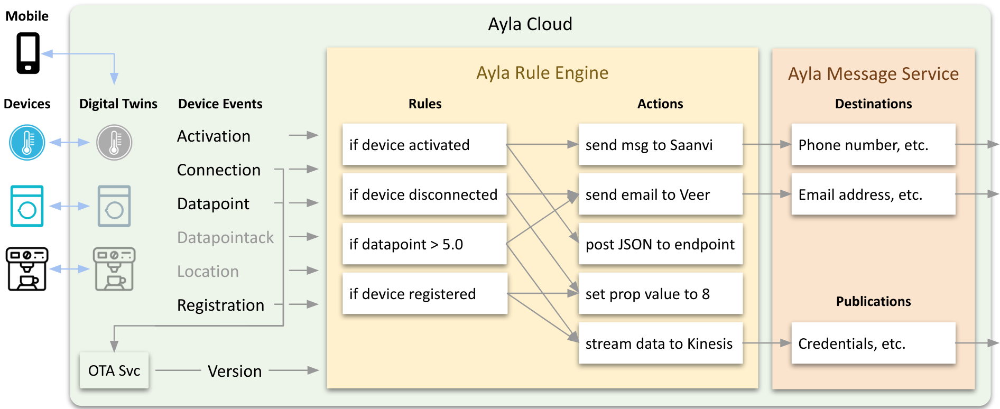

<aside id="pagebar" class="d-xl-block collapse">
  <ul>
    <li>
      <a href="#core-title">Ayla Rule Engine</a>
    </li>
    <li>
      <a href="#example">Example</a>
      <ul>
        <li><a href="#user-level-perspective">User-level perspective</a></li>
        <li><a href="#api-level-perspective">API-level perspective</a></li>
      </ul>
    </li>
    <li>
      <a href="#terminology">Terminology</a>
      <ul>
        <li><a href="#abstract-rule">Abstract Rule</a></li>
        <li><a href="#action">Action</a></li>
        <li><a href="#action-type">Action Type</a></li>
        <li><a href="#ayla-rule-engine-are">Ayla Rule Engine (ARE)</a></li>
        <li><a href="#ayla-rule-expression-syntax-ares">Ayla Rule Expression Syntax (ARES)</a></li>
        <li><a href="#concrete-rule">Concrete Rule</a></li>
        <li><a href="#event">Event</a></li>
        <li><a href="#function">Function</a></li>
        <li><a href="#group-notation-syntax">Group Notation Syntax</a></li>
        <li><a href="#rule">Rule</a></li>
        <li><a href="#rule-evaluation">Rule Evaluation</a></li>
        <li><a href="#rule-expression">Rule Expression</a></li>
        <li><a href="#rule-service-api">Rule Service API</a></li>
        <li><a href="#rule-subject">Rule Subject</a></li>
      </ul>
    </li>
  </ul>
</aside>

This Tech Note explores the Ayla Rule Engine (ARE) which employs user-defined rules and actions to process various types of events. Consider the following diagram:



As illustrated in the diagram, devices provide the rule engine with a steady supply of events indicating various device-related state changes. Ayla Cloud subsystems like the OTA Service also supply the rule engine with events derived from device events. The `version` event, for example, indicates that a device's firmware needs to be updated. The rule engine leverages user-defined rules to make sense of these events. Rules always evaluate to true or false. If a rule evaluates to true, the rule engine performs the action(s) associated with the rule. The rule engine in the diagram, for example, sends an email to Sarah and posts data to an endpoint when a particular device becomes active. Rules use Ayla Rule Expression Syntax (ARES) to encode conditional expressions. Actions also use ARES to define parameters. OEM users create and manage rules and actions via the Rules tab in the Ayla Developer Portal. Developers use Rules Services APIs as described in the [API Browser](https://docs.aylanetworks.com/cloud-services/api-browser/) to do the same.

# Example

Suppose, for example, as part of home security, you want to turn on a webcam when a door opens.

## User-level perspective

## API-level perspective

# Terminology

## Abstract Rule

* Also known as oem-level rule or event filter.
* example: `DATAPOINT(${oem_model=foo, property_name = bar, value > 1})`
* they are abstract in the sense that they are NOT about a concrete device or property;
* they are NOT about concrete subjects; instead, they are rather about events, because as a rule of thumb, they do not specify any concrete device or user inside them. Because of that, one can think of an abstract rule as a filter; each abstract rule forces ARE to check if an incoming event fits the conditions defined inside the filter construct ${ }; The filter can define any number of conditions inside the construct ${}; in the example above, there are three comma separated conditions (shown in bold). Any data (JSON's field plus value, e.g. "oem_model": "foo1") found in the event can be chosen to be evaluated in a separate condition; An abstract rule fires only if all conditions inside the construct ${} are met;
* they are used in the OEM context. One can say that an OEM owns all event related to its fleet; Only OEM Admins (and sometimes OEM stuff members) can create abstract rules; Primary current use of abstract rules is DSSv2 - used for streaming particular kind of events to a specific destination chosen by an OEM;
* at evaluation time, each concrete rule created for an OEM is used to evaluate each incoming event for that OEM;
* because we restrict each OEM to be able to create only 100 or fewer abstract rules, we can keep all abstract rules (for all OEMs) in the memory of an Evaluation Service instance; thus concrete rules do not require Rule Evaluation Service to make calls to the database, which makes their evaluation mush faster than that for the concrete rules;
* An event filter is a comma separated list of filter terms surrounded by curly brackets.
* Each event filter term consists of three parts: name, symbol, value.
    ```
    {oem_model <= foo, oem_model_version < 'abc efg'}
    VERSION(${oem_model <= foo, oem_model_version < bar})
    ```
* Allowed event filter name tags:
    * oem_model
    * oem_model_version
    * status
    * dsn
    * property_name
    * ayla_model
    * ayla_model_version
    * base_mod_img_model
    * base_mod_img_version
    * from_mod_img_version
    * from_host_img_version

## Action

## Action Type

## Ayla Rule Engine (ARE)

## Ayla Rule Expression Syntax (ARES)

## Concrete Rule

* example: DATAPOINT(dsn1, property_name1) > 2;
* they are concrete in the sense that they are expression about concrete names or ids (such as DSN, property name, user UUID, etc);
* the are 'about' subjects, i.e. DATAPONT(dsn1, property_name1)
* they can be expressions about concrete subjects, where subjects can be arguments of functions, for example, for a string property: str_contains(DATAPOINT(dsn1, str_prop1), 'foo' );  here subject DATAPOINT(dsn1, str_prop1) is the first argument of function str_contains();
* they are used in END User context (users can create them 'about' the devices they own); We can say that users own only events that are related to their own devices;
* at evaluation time, Rule Evaluation service takes an incoming event, uses that event to build a concrete subject from it and then queries database to see if there are any rules that need to be evaluated for this concrete subject.
* they are not cached in the memory of the Evaluation Service instance; thus for each event ARE has to make a query to the database;

## Event

* Device events and derived events.

## Function

## Group Notation Syntax

## Rule

## Rule Evaluation

* Process of replacing a rule expression with the equivalent boolean value.
* Evaluation becomes possible upon substitution of every rule subject with its corresponding value.

## Rule Expression

* Abstract and concrete.
* Concrete subject arguments are used like literals in a typical programming language (i.e. without quotes).
* Space characters are optional in rule expressions.
* Single-subject expressions
* Multiple-subject expressions
    ```
    (DATAPOINT(dsn_1,prop_name_1) > DATAPOINT(dsn_2,prop_name_2)) && DATAPOINT(dsn_1,prop_name_3)
    ```

## Rule Service API

### Errors

APIs return 403, 404, and 422 with `data.errors[]`.

|Code|Description|
|-|-|
|ARE-403|You are not authorized to access specified data|
|ARE-404|Action not found|
|ARE-404|Device property of rule subject not found|
|ARE-404|Rule not found|
|ARE-443|Action with given name already exists|
|ARE-488|Action subject property is oem scope or read only, hence cannot be modified|
|ARE-491|Action subject property direction is output, hence cannot be modified|

## Rule Subject

* Entities in a rule expression are called rule subjects.
    ```
    DATAPOINT(dsn_1, prop_name_1)
    LOCATION(uuid_1)
    ```
* Rule subject names are always uppercase.
* Rule subject arguments can be dsn, property name, user uuid.
* Rule subjects can be standalone terms or function arguments.
    ```
    distance_miles(LOCATION(uuid_1), LOCATION(dsn_1))
    ```
* Each rule subject corresponds to a particular Ayla Data Pipeline (DPL) event. 
* Each rule subject has a type and value at the time of rule evaluation.

Events map to rule subjects:

|Event|Subject|Type|
|-|-|-|
|activation|<code>ACTIVATION(dsn, activated&#124;deactivated)</code>|boolean|
|connection|<code>CONNECTION(dsn, online&#124;offline&#124;all)</code>|boolean|
|datapoint|`DATAPOINT(dsn, propName)`|Same as property type|
|datapoint|`VERSION()`|boolean?|
|datapointack|`DATAPOINTACK(dsn, propName)`|boolean|
|location|`LOCATION(dsn)`|(lat, long) pair of decimals|
|location|`LOCATION(uuid)`|(lat, long) pair of decimals|
|registration|<code>REGISTRATION(dsn, true&#124;false&#124;all)</code>|boolean|
|???|`VIRTEVENT(eventType, dsn)`|boolean|
|???|`VIRTEVENT(event_type, uuid)`|boolean|

VERSION is a special kind of event that is generated by the OTA service. OTA Service can generate such event based on incoming datapoint, or device connectivity event, or device registration event. Current primary used of version events is so called smart OTA  when OEM can specify an OTA job that will be performed only on certain conditions - for example when device comes online and has a particular oem model. VERSION rules can only be abstract.
