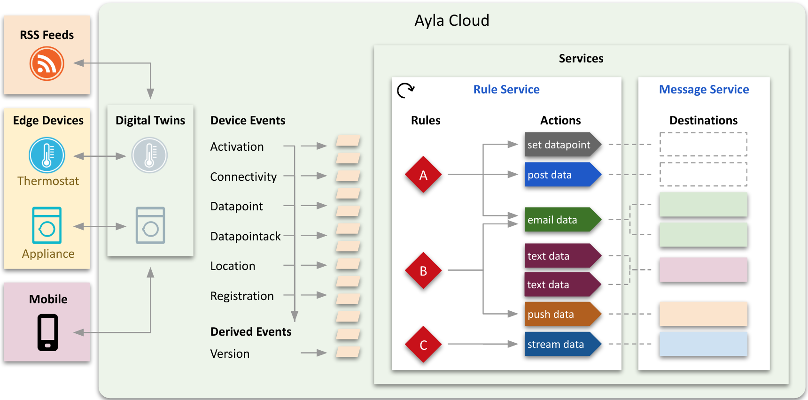
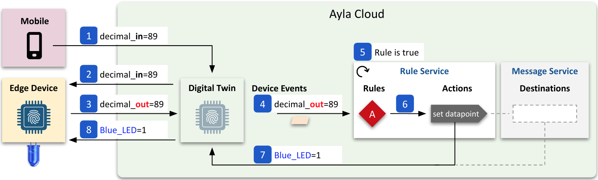

<aside id="pagebar" class="d-xl-block collapse">
  <ul>
    <li>
      <a href="#core-title">Ayla Rule Engine</a>
      <ul>
        <li><a href="#digital-twin">Digital Twin</a></li>
        <li><a href="#event">Event</a></li>
        <li><a href="#rule">Rule</a></li>
        <li><a href="#action">Action</a></li>
        <li><a href="#destination">Destination</a></li>
        <li><a href="#relationships">Relationships</a></li>
      </ul>
    </li>
    <li>
      <a href="#example">Example</a>
      <ul>
        <li><a href="#procedure">Procedure</a></li>
        <li><a href="#explanation">Explanation</a></li>
      </ul>
    </li>
  </ul>
</aside>

This tech note introduces the Ayla Rule Engine (ARE) which, driven by system events, performs user-defined actions based on user-defined rules. At this time, Ayla Engineering is designing, implementing, and modifying ARE, so APIs may change. Ayla plans to replace device and property notifications with ARE. The diagram below provides an overview of ARE:



The following descriptions support the diagram:

## Digital Twin

A digital twin is a cloud-based state machine that reflects the attributes, properties, and schedules of a real-world thing like a thermostat. Device attributes are key-value pairs. Examples include the following:

```
{
  "device": {
    "id": 100,
    "product_name": "My Device",
    "dsn": "AC000W000000001",
    "oem": "1234abcd",
    "oem_model": "ledevb",
    "sw_version": "Version 1.2",
    "user_uuid": "00000000-0000-0000-0000-000000000000",
    "mac": "aabbcc112233",
    "lat": "00.0000",
    "lng": "00.0000",
    "ip": "000.000.000.000",
    "template_id": 000000,
    "registered": true,
    "activated_at": "0000-00-00T00:00:00Z",
    "connection_status": "Online",
    "connected_at": "0000-00-00T00:00:00Z"
  }
}
```

Device properties are objects with their own attributes. Here is a device property showing a subset of attributes:

```
{
  "property": {
    "key": 200,
    "device_key": 100,
    "name": "temperature",
    "base_type": "decimal",
    "read_only": true,
    "direction": "output",
    "value": 72.0
  }
}
```

Device schedules are similar to properties. Here is an example:

```
{
  "schedule": {
    "key": 300
    "device_id": 100,
    "name": "thermostat_schedule",
    "display_name": "thermostat_schedule",
    "active": false,
    "day_occur_of_month": null,
    "direction": "input",
    "duration": null,
    "end_date": "",
    "end_time_each_day": "00:00:00",
    "fixed_actions": true,
    "interval": null,
    "months_of_year": [],
    "days_of_month": [],
    "days_of_week": [],
    "start_date": "",
    "start_time_each_day": "00:00:00",
    "time_before_end": "",
    "utc": false,
    "version": "1"
  }
}
```

## Event

An event is both (a) an occurence and (b) a record of the occurence created by the Ayla Cloud. Events fall into two major categories:

* A **device event** is a change in the state of a digital twin caused by an edge device, mobile app, RSS feed, schedule, or some other actor. The Ayla Cloud watches for certain types of device events including activation, connectivity, datapoint, datapointack, location, and registration.
* A **derived event**, issued by a cloud subsystem, is the reinterpretation of a device event. The OTA Update subsystem, for example, issues *version* derived events based on *connectivity*, *datapoint*, and *registration* device events.

Here is an example of an event record:

```
{
  "dpl_event": {
    "metadata": {
      "oem_id": "1234abcd",
      "oem_model": "ledevb",
      "dsn": "AC000W000000001",
      "property_name": "decimal_out",
      "display_name": "decimal_out",
      "base_type": "decimal",
      "event_type": "datapoint"
    },
    "datapoint": {
      "id": "10000001-abcd-abcd-abcd-100000000001",
      "updated_at": "2020-08-11T12:31:21Z",
      "created_at": "2020-08-11T12:31:21Z",
      "echo": false,
      "closed": false,
      "value": "1.0",
      "metadata": {},
      "user_uuid": "20000002-abcd-abcd-abcd-200000000002",
      "discarded": false,
      "scope": "user",
      "direction": "output"
    },
    "timestamp": "2020-08-11T12:31:21.000+0000"
  }
}
```

## Rule

A rule includes the following fields:

```
{
  "rule": {
    "rule_uuid": "00000000-0000-0000-0000-000000000000",
    "name": "",
    "description": "",
    "expression": "",
    "action_ids": [],
    "is_enabled": true
  }
}
```

Rule expressions are assertions like these:

```
The Blue_button boolean property value of Device AC000W000000001 equals 1.
The Oxygen_Pct decimal property value of Device AC000W000000001 is less than 90.0.
The cmd string property value of Device AC000W000000001 equals "cmd_on".
The registered boolean attribute value of Device AC000W000000001 is true.
```

Expressions are written with Ayla Rule Expression Syntax (ARES). Here are the same expressions using ARES:

```
DATAPOINT(AC000W000000001,Blue_button) == 1
DATAPOINT(AC000W000000001,Oxygen_Pct) < 90.0
str_equals(DATAPOINT(AC000W000000001,cmd),'cmd_on')
REGISTRATION(AC000W000000001,true)
```

`str_equals` is a ARES function. Another is `str_contains`. 

Below is an example rule. If ARE finds that an event satisfies a rule expression, it performs the rule action(s).

```
{
  "rule": {
    "rule_uuid": "00000000-0000-0000-0000-000000000000",
    "name": "Blue_button == 1",
    "description": "",
    "expression": "DATAPOINT(AC000W000000001,Blue_button) == 1",
    "action_ids": [
      "00000000-0000-0000-0000-000000000001",
      "00000000-0000-0000-0000-000000000002",
      "00000000-0000-0000-0000-000000000003"
    ],
    "is_enabled": true
  }
}
```

The following core set of APIs enables clients to manage rules. See also the [API Browser](https://docs.aylanetworks.com/cloud-services/api-browser/).

```
POST    /rulesservice/v1/rules
GET     /rulesservice/v1/rules
GET     /rulesservice/v1/rules/:ruleId
PUT     /rulesservice/v1/rules/:ruleId
DELETE  /rulesservice/v1/rules/:ruleId
```

## Action

An action includes the following fields:

```
{
  "action": {
    "action_uuid": "00000000-0000-0000-0000-000000000000",
    "name": "",
    "description": "",
    "type": "",
    "parameters": {},
    "destination_ids": [],
    "is_enabled": true
  }
}
```

Action types include (but are not limited to) the ones in the table below. This list will change.

|Name|Description|
|-|-|
|`DATAPOINT`|Set a property value.|
|`URL`|Post data to an endpoint.|
|`AMS_EMAIL`|Email data.|
|`AMS_SMS`|Text data.|
|`AMS_PUSH`|Push data.|
|`DATASTREAM`|Stream data to Kinesis.|

Parameters are key-value pairs. Each action type has a set of possible parameter keys. Below, for example, is a `DATAPOINT` action with one parameter. The key is `datapoint`, and the value is an ARES expression that means "set input to 5":

```
{
  "action": {
    "action_uuid": "00000000-0000-0000-0000-000000000000",
    "name": "Set input to 5",
    "description": "",
    "type": "DATAPOINT",
    "parameters": {
      "datapoint": "DATAPOINT(AC000W000000001, input) = 5"
    },
    "is_enabled": true
  }
}
```

Below is a `URL` action with two parameters, `body` and `endpoint`:

```
{
  "action": {
    "action_uuid": "00000000-0000-0000-0000-000000000000",
    "name": "URL Action Test",
    "description": "",
    "type": "URL",
    "parameters": {
      "body": "{\"key1\":\"val1\",\"key2\":\"val2\"}",
      "endpoint": "https://docs.aylanetworks.com/api/v1/tests"
    },
    "is_enabled": true
  }
}
```

The `body` parameter value can contain placeholders which are replaced by ARE at run time with event and rule information. Here are examples:

```
"body": "{{{dpl_event}}}"
"body": "{\"event_metadata_dsn\":\"{{event.metadata.dsn}}\",\"event_user_uuid\":\"{{event.user_uuid}}\"}"
```

Neither `DATAPOINT` nor `URL` actions has an array of destination IDs. Rather, both use parameters to specify destination information. This may change as the dotted boxes in the diagram suggest:


The other types of actions, however, do specify destination information in associated destination objects. Here is an example of an `AMS_EMAIL` action:

```
{
  "action": {
    "action_uuid": "00000000-0000-0000-0000-000000000000",
    "name": "Email List",
    "description": "",
    "type": "AMS_EMAIL",
    "parameters": {},
    "destination_ids": [
      "00000000-0000-0000-0000-000000000000",
      "00000000-0000-0000-0000-000000000000",
      "00000000-0000-0000-0000-000000000000"
    ],
    "is_enabled": true
  }
}
```

The following core set of APIs enables clients to manage actions. See also the [API Browser](https://docs.aylanetworks.com/cloud-services/api-browser/).

```
POST    /rulesservice/v1/actions
GET     /rulesservice/v1/actions
GET     /rulesservice/v1/actions/:actionId
PUT     /rulesservice/v1/actions/:actionId
DELETE  /rulesservice/v1/actions/:actionId
```

## Destination

A destination includes the following fields:

```
{
  "destination": {
    "uuid": "00000000-0000-0000-0000-000000000000",
    "type": ""
    "provider": ""
  }
}
```

Destination types include `email`, `sms`, and `push`. Providers are tied to type. `email` providers include `smtp`. `sms` providers include `twilio` and `yunpian`. `push` providers include `fcm` and `apns`. Depending on the type, destinations may include additional fields.

The following core set of APIs enables clients to manage destinations. See also the [API Browser](https://docs.aylanetworks.com/cloud-services/api-browser/).

```
POST    /messageservice/v1/destinations
GET     /messageservice/v1/destinations
GET     /messageservice/v1/destinations/:destinationId
PUT     /messageservice/v1/destinations/:destinationId
DELETE  /messageservice/v1/destinations/:destinationId
```

## Relationships

The general purpose of rules, actions, and destinations, and the relationships among them, are fairly well established, but details are still in flux. Consider the following diagram:


Regarding jobs, rules provide ARE with a criteria for determining whether events should cause actions. Actions provide ARE with the type of action to perform, and any data to transmit. And, destinations, provide ARE with delivery information. 

The next diagram illustrates relationships among rules, actions, and destinations:


### Rule-to-Action

* One rule can reference zero to many actions.
* One rule can reference different types of actions.
* More than one rule can reference the same action.
* Actions do not reference rules. (This is under consideration.)
* Deleting a rule does not delete an action.

### Action-to-Destination

* One action can reference zero to many destinations that are the same type as the action.
* One action cannot reference different types of destinations. 
* Destinations do not reference actions.
* Deleting an action does not delete a destination.

# Example

This section demonstrates how to solve the following use case with ARE:

1. You have a device called Edge Device (`dsn = AC000W000000001`) connected to the Ayla Cloud.
1. Your device has three properties:
    <table>
    <tr><th>Name</th><th>Type</th><th>Direction</th></tr>
    <tr><td>`decimal_in`</td><td>decimal</td><td>To Device</td></tr>
    <tr><td>`decimal_out`</td><td>decimal</td><td>From Device</td></tr>
    <tr><td>`Blue_LED`</td><td>boolean</td><td>To Device</td></tr>
    </table>
1. Whenever your host app receives a new `decimal_in` value, it sets `decimal_out` to the same value, and sends the new `decimal_out` value to the cloud. This is a technique for forcing your device to send certain values to the cloud as if the values were originating at the device, thus simulating changes in temperature, pressure, gas levels, etc.
1. You need to set `Blue_LED` to 1 when `decimal_out` is less than 90.0.

## Procedure

To accomplish this use case, you need to create one action and one rule as follows:

1. Open the [API Browser](https://docs.aylanetworks.com/cloud-services/api-browser/) in another tab.
1. Click Accounts, choose a Region, enter email, password, app_id, and app_secret, click Get Tokens, and close the tab.
1. Click Devices, select a device, and ensure that it includes the three properties listed above.
1. Set `decimal_in` to 100, and set `Blue_LED` to 0.
1. Click Rules Service, expand `createAction`, and create the following action:
    ```
    {
      "action": {
        "name": "Set Blue_LED 1",
        "type": "DATAPOINT",
        "parameters": {
          "datapoint": "DATAPOINT(AC000W000000001, Blue_LED) = 1"
        }
      }
    }
    ```
1. Under Response Data, click Show, and note the new `action_uuid`. You need this in the next step.
1. Expand `createRule`, and create the following rule using the `action_uuid`:
    ```
    {
      "rule": {
        "name": "decimal_out is less than 90",
        "description": "",
        "expression": "DATAPOINT(AC000W000000001,decimal_out) < 90.0",
        "action_ids": ["00000000-0000-0000-0000-000000000000"]
      }
    }
    ```
1. Set `decimal_in` to 89. 
1. Check `Blue_LED`. It should be set to 1.

## Explanation

The diagram below, and the steps that follow, clarify the process:



1. Using the Aura Mobile App or another client, the user sets the digital twin `decimal_in` property value to 89.
1. The Ayla Cloud writes `decimal_in=89` to the device. (In reality, the cloud tells the device about the new value, and the device retrieves it.)
1. The host app on the device sets `decimal_out=89`, and sends the new `decimal_out` value to the cloud. (Steps 1 and 2 are simply a mechanism for simulating a *from-device* property value change.)
1. The Ayla Cloud creates a `DATAPOINT` device event representing the `decimal_out` property value change, and shares the event with the system.
1. ARE realizes that the event satisfies the assertion in Rule A.
1. ARE initiates the associated `set_datapoint` action. At this stage, most action types (e.g. email, sms, post, stream) would need to retrieve destination information from an associated destination object. Currently, `DATAPOINT` and `URL` actions do not.
1. The action sets the digital twin `Blue_LED` property value to 1.
1. The Ayla Cloud writes `Blue_LED=1` to the device.