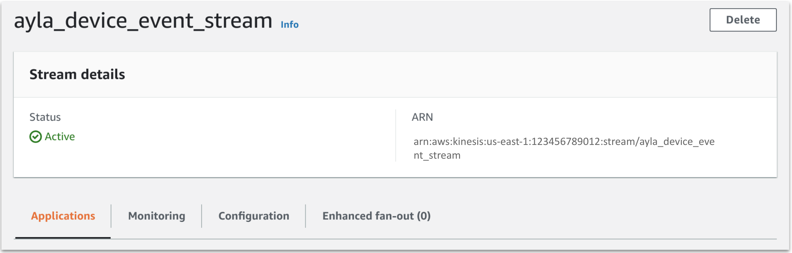

<aside id="pagebar" class="d-xl-block collapse">
  <ul>
    <li>
      <a href="#core-title">Stream/download events</a>
    </li>
    <li>
      <a href="#device-event-table">Device event table</a>
    </li>
    <li>
      <a href="#device-event-records">Device event records</a>
      <ul>
        <li><a href="#activation">activation</a></li>
        <li><a href="#connectivity">connectivity</a></li>
        <li><a href="#datapoint">datapoint</a></li>
        <li><a href="#datapointack">datapointack</a></li>
        <li><a href="#location">location</a></li>
        <li><a href="#registration">registration</a></li>
      </ul>
    </li>
    <li>
      <a href="#streaming-events">Streaming events</a>
      <ul>
        <li><a href="#kinesis-notes">Kinesis notes</a></li>
      </ul>
    </li>
    <li>
      <a href="#downloading-events">Downloading events</a>
    </li>
  </ul>
</aside>

This tech note describes the origin and purpose of Ayla Cloud device events. It also explains how to stream device events in near real-time to Amazon Kinesis or Microsoft Event Hub, and how to download device event data (CSV files) for historical analysis. Consider the following diagram:


The steps below explain the diagram:

1. A digital twin is a cloud-based state machine that reflects the attributes, properties, and schedules of a real-world thing like a thermostat.
1. A device event (represented by the pink star) is a change in the state of a digital twin caused by an edge device, mobile app, RSS feed, schedule, or some other actor.
1. A device event also refers to the record (created by the Ayla Cloud) that describes the state change.
1. The Ayla Cloud propagates events to listening services via the Data Pipeline (DPL), driving cloud activity. For an example, see [Ayla Rule Service (ARS)](/tech-notes/00000013/).
1. Customers stream device events to Amazon Kinesis or Microsoft Event Hub where they host integrated systems that, by analyzing data in near real-time, and taking action, participate in the event-driven activity of the Ayla Cloud.
1. The Ayla Cloud stores device event records locally in Cassandra.
1. It offloads the records hourly to Amazon S3 as CSV files, storing them in folders categorized by event type and date.
1. Customers download the CSV files for historical analysis.

# Device event table

The Ayla Cloud generates the device events described in the following table:

<table>
<tr>
<th>Type</th>
<th>Description</th>
</tr>
<tr>
<td>activation</td>
<td>The value of the <code>activated_at</code> device attribute has changed. An activation event is associated, not with any particular device, but with a DSN. Activation occurs when a reserved DSN is first provisioned (i.e. associated with a device for the first time). Reassociating a DSN with a different device does not cause another activation event.</td>
</tr>
<tr>
<td>connectivity</td>
<td>The value of the <code>connection_status</code> device attribute has changed.</td>
</tr>
<tr>
<td>datapoint</td>
<td>The value of a device property has changed.</td>
</tr>
<tr>
<td>datapointack</td>
<td>The cloud has received an ack from a device indicating that the device has changed the value of a to-device property on the device. See also <a href="https://docs.aylanetworks.com/tech-notes/00000002">Handling ack-enabled properties</a>.</td>
</tr>
<tr>
<td>location</td>
<td>The value the <code>lat</code> or <code>lng</code> device attribute has changed.</td>
</tr>
<tr>
<td>registration</td>
<td>The value of the <code>registered</code> device attribute has changed.</td>
</tr>
</table>

# Device event records

Below are examples of device event records. DPL stands for Data Pipeline.

## activation

```
{
  "dpl_event": {
    "metadata": {
      "oem_id": "1234abcd",
      "oem_model": "generic",
      "dsn": "AC000W000000001",
      "event_type": "activation"
    },
    "activation": {
      "id": "00000000-0000-0000-0000-000000000000",
      "device_type": "Wifi",
      "status": "Activated",
      "event_time": "0000-00-0T00:00:00Z"
    }
  }
}
```

## connectivity

```
{
  "dpl_event": {
    "metadata": {
      "oem_id": "1234abcd",
      "oem_model": "ledevb",
      "dsn": "AC000W000000001",
      "event_type": "connectivity"
    },
    "timestamp": "2020-08-28T09:45:36.000+0000",
    "connection": {
      "event_time": "2020-08-28T09:45:36Z",
      "user_uuid": "00000000-0000-0000-0000-000000000000",
      "status": "Online",
      "metadata": {
        "oem_id": "1234abcd",
        "oem_model": "ledevb",
        "dsn": "AC000W000000001",
        "event_type": "connectivity"
      }
    }
  }
}
```

## datapoint

```
{
  "dpl_event": {
    "metadata": {
      "oem_id": "1234abcd",
      "oem_model": "ledevb",
      "dsn": "AC000W000000001",
      "property_name": "Blue_LED",
      "display_name": "Blue_LED",
      "base_type": "boolean",
      "event_type": "datapoint"
    },
    "datapoint": {
      "id": "00000000-0000-0000-0000-000000000000",
      "updated_at": "2020-08-28T09:36:15Z",
      "created_at": "2020-08-28T09:36:15Z",
      "echo": false,
      "closed": false,
      "value": "1",
      "metadata": {},
      "user_uuid": "00000000-0000-0000-0000-000000000000",
      "discarded": false,
      "scope": "user",
      "direction": "input"
    },
    "timestamp": "2020-08-28T09:36:15.000+0000"
  }
}
```

## datapointack

```
{
  "dpl_event": {
    "metadata": {
      "oem_id": "1234abcd",
      "oem_model": "linuxevb",
      "dsn": "AC000W000000002",
      "property_name": "Blue_LED",
      "display_name": "Blue_LED",
      "base_type": "boolean",
      "resource_tags": [],
      "event_type": "datapointack"
    },
    "datapointack": {
      "id": "00000000-0000-0000-0000-000000000000",
      "created_at_from_device": null,
      "updated_at": "2018-09-24T10:24:57Z",
      "created_at": "2018-09-24T10:24:57Z",
      "user_uuid": "00000000-0000-0000-0000-000000000000",
      "echo": false,
      "closed": false,
      "value": 1,
      "ack_message": 0,
      "ack_status": 200,
      "ack_id": "00000000-0000-0000-0000-000000000000",
      "acked_at": "2018-09-24T10:24:57Z",
      "metadata": {}
    },
    "timestamp": "2020-08-28T09:36:15.000+0000"
  }
}
```

## location

```
{
  "dpl_event": {
    "metadata": {
      "oem_id": "1234abcd",
      "oem_model": "ledevb",
      "dsn": "AC000W000000001",
      "event_type": "location"
    },
    "location_event": {
      "user_uuid": "00000000-0000-0000-0000-000000000000",
      "dsn": "AC000W000000001",
      "ip": "22.22.22.22",
      "lat": " 44.787100",
      "provider": "user-based",
      "created_at": "2020-08-28T09:11:11Z",
      "long": "-64.123400"
    },
    "timestamp": "2020-08-28T09:11:11.813+0000"
  }
}
```

## registration

```
{
  "dpl_event": {
    "metadata": {
      "oem_id": "1234abcd",
      "oem_model": "linuxevb",
      "dsn": "AC000W000000001",
      "event_type": "registration"
    },
    "registration_event": {
      "dsn": "AC000W000000001",
      "user_uuid": "00000000-0000-0000-0000-000000000000",
      "registered": true,
      "registration_type": "Same-LAN",
      "registered_at": "2020-08-29T10:32:47Z",
      "unregistered_at": null
    },
    "timestamp": "2020-08-29T10:32:47.000+0000"
  }
}
```

# Streaming events

Ayla supports the streaming of device events to [Amazon Kinesis](https://aws.amazon.com/kinesis/) and [Microsoft Azure Event Hubs](https://azure.microsoft.com/en-us/services/event-hubs/). See Step 5 in the Overview diagram at the top of this page. Streaming **datapoint** events impacts transaction counts and costs (see [Ayla Cloud Platform Usage Policy](https://docs.aylanetworks.com/policies/ayla-cloud-platform-usage-policy/)). The following steps show you how to work with Ayla streams: 

1. Create an [Amazon Kinesis](https://aws.amazon.com/kinesis/) or [Microsoft Azure Event Hubs](https://azure.microsoft.com/en-us/services/event-hubs/) stream.
1. Browse to the [Ayla Dashboard](https://docs.aylanetworks.com/system-administration/ayla-dashboard-portal/).
1. In the sidebar, click DataStream.
1. In the Streaming tab, click Create Stream.
1. Select a Transport (e.g. Amazon Kinesis), and fill in the form:
    
1. Click Create.
1. Use the Aura Mobile app or another client to generate datapoints.

## Kinesis notes

These notes show you how to verify that Ayla DataStream Service and Amazon Kinesis worked together to deliver event data successfully.

### Verify receipt

1. Browse to your [Amazon Kinesis Dashboard](https://console.aws.amazon.com/kinesis/home):
    
1. Click the Total data streams number to display the data streams list:
    
1. Click the Data stream name to display stream details:
    
1. Click Monitoring, and scroll down to the Incoming data sum (byles) graph:
    

### Verify data

There are several ways to see the device event data you streamed from Ayla to Amazon Kinesis. If you have [AWS CLI](https://aws.amazon.com/cli/) installed on your machine (or in a Docker container), you can perform [Basic Kinesis Data Stream Operations](https://docs.aws.amazon.com/streams/latest/dev/fundamental-stream.html):

1. If you need to reconfigure credentials, run the following:
    ```
    # aws configure
    ```
1. Get a `ShardIterator`:
    ```
    # aws kinesis get-shard-iterator --shard-id shardId-000000000000 --shard-iterator-type TRIM_HORIZON --stream-name ayla_device_event_stream
    ```
    Results resemble the JSON object below:
    ```
    {
      "ShardIterator": "AAAAAAAAAAHuuMzWK6Oiq0cE ..."
    }
    ```
1. Use the `ShardIterator` to get records:
    ```
    # aws kinesis get-records --shard-iterator AAAAAAAAAAHuuMzWK6Oiq0cE ...
    ```
    Results resemble the JSON object below. Press the space bar to see additional records. 
    ```
    {
      "Records": [
        {
          "SequenceNumber": "49610351375069880172831461320730727673358583106002485250",
          "ApproximateArrivalTimestamp": "2020-08-31T09:43:52.399000+00:00",
          "Data": "VGVzdCBNZXNzYWdl",
          "PartitionKey": "TEST_DSN0000000000"
        },
        {
          "SequenceNumber": "49610351375069880172831461320731936599178197735177191426",
          "ApproximateArrivalTimestamp": "2020-08-31T09:43:52.482000+00:00",
          "Data": "VGVzdCBNZXNzYWdl",
          "PartitionKey": "TEST_DSN0000000000"
        },
        {
          "SequenceNumber": "49610351375069880172831461320733145524997817518312652802",
          "ApproximateArrivalTimestamp": "2020-08-31T09:45:08.097000+00:00",
          "Data": "eyJtZXRhZGF0YSI6eyJvZW1faWQiOiJhYmNkMTIzNCIsIm9lbV9tb2RlbCI6ImxlZGV2YiIsImRzbiI6IkFDMDAwVzAwMDAwMDAwMSIsInByb3BlcnR5X25hbWUiOiJCbHVlX0xFRCIsImRpc3BsYXlfbmFtZSI6IkJsdWVfTEVEIiwiYmFzZV90eXBlIjoiYm9vbGVhbiIsImV2ZW50X3R5cGUiOiJkYXRhcG9pbnQifSwiZGF0YXBvaW50Ijp7ImlkIjoiMDAwMDAwMDAtMDAwMC0wMDAwLTAwMDAtMDAwMDAwMDAwMDAwIiwidXBkYXRlZF9hdCI6IjIwMjAtMDgtMzFUMDk6NDU6MDdaIiwiY3JlYXRlZF9hdCI6IjIwMjAtMDgtMzFUMDk6NDU6MDdaIiwiZWNobyI6ZmFsc2UsImNsb3NlZCI6ZmFsc2UsInZhbHVlIjoiMCIsIm1ldGFkYXRhIjp7fSwidXNlcl91dWlkIjoiMDAwMDAwMDAtMDAwMC0wMDAwLTAwMDAtMDAwMDAwMDAwMDAwIiwiZGlzY2FyZGVkIjpmYWxzZSwic2NvcGUiOiJ1c2VyIiwiZGlyZWN0aW9uIjoiaW5wdXQifSwidGltZXN0YW1wIjoxLjU5ODg2NzExRTEyfQ==",
          "PartitionKey": "AC000W000000001"
        }
      ]
    }
    ```
1. Copy the Base64 string in the `Data` field of the third record above.
1. Use [base64decode.org](https://www.base64decode.org/) to decode the data:
    ```
    {
      "metadata": {
        "oem_id": "abcd1234",
        "oem_model": "ledevb",
        "dsn": "AC000W000000001",
        "property_name": "Blue_LED",
        "display_name": "Blue_LED",
        "base_type": "boolean",
        "event_type": "datapoint"
      },
      "datapoint": {
        "id": "00000000-0000-0000-0000-000000000000",
        "updated_at": "2020-08-31T09:45:07Z",
        "created_at": "2020-08-31T09:45:07Z",
        "echo": false,
        "closed": false,
        "value": "0",
        "metadata": {},
        "user_uuid": "00000000-0000-0000-0000-000000000000",
        "discarded": false,
        "scope": "user",
        "direction": "input"
      },
      "timestamp": 1.59886711E12
    }
    ```

# Downloading events

The Ayla Cloud stores device event records locally in Cassandra, and offloads them hourly as CSV files to Amazon S3. See Steps 6 and 7 in the Overview diagram at the top of this page. You can use any S3 Browser, together with credentials provided by Ayla, to view the S3 directory structure and download CSV files. The following example uses the [My S3 Browser](https://chrome.google.com/webstore/detail/my-s3-browser/lgkbddebikceepncgppakonioaopmbkk) Chrome extension:

1. Browse to the [Ayla Dashboard](https://docs.aylanetworks.com/system-administration/ayla-dashboard-portal/).
1. In the sidebar, click OEM Profile.
1. Click the Data Export tab to view your current Amazon S3 credentials:
    
    **Important**: The format of the S3 Url above is used in path-style requests. Amazon S3 buckets created after September 30, 2020, will support only virtual hosted-style requests. See [Amazon S3 Path Deprecation Plan](https://aws.amazon.com/blogs/aws/amazon-s3-path-deprecation-plan-the-rest-of-the-story).
1. If you want new credentials, click Refresh Credentials.
1. Configure your S3 Browser:
    
1. View the directory structure:
    
1. Drill into a device event folder:
    
1. Drill into a date/time folder, and download:
    

CSV files do __not__ include column headers. Below are examples with column headers __added__:

**Connection**

```
oem_id,oem_model,dsn,event_time,user_uuid,status
abcd1234,ledevb,AC000W000000001,Mon Feb 03 21:30:45 UTC 2020,00000000-0000-0000-0000-000000000000,Online
```

**Datapoint**

```
oem_id,oem_model,dsn,property_name,display_name,base_type,id,updated_at,created_at,user_uuid,echo,closed,discarded,scope,value,metadata,direction
abcd1234,ledevb,AC000W000000001,log,bG9n,string,00000000-0000-0000-0000-000000000000,Wed Feb 05 12:08:26 UTC 2020,Wed Feb 05 12:08:26 UTC 2020,00000000-0000-0000-0000-000000000000,false,false,false,user,Q01EXzE=,e30=,output
```

**Location**

```
oem_id,oem_model,dsn,ip,lat,long,provider,user_uuid,created_at
abcd1234,ledevb,AC000W000000001,22.22.22.22, 10.000000,-10.000000,user-based,00000000-0000-0000-0000-000000000000,Fri Aug 28 08:52:08 UTC 2020
```

**Registration**

```
oem_id,oem_model,dsn,user_uuid,registered,registration_type,unregistered_at,registered_at
abcd1234,ledevb,AC000W000000001,00000000-0000-0000-0000-000000000000,false,Dsn,,Fri Apr 24 09:57:47 UTC 2020
```
