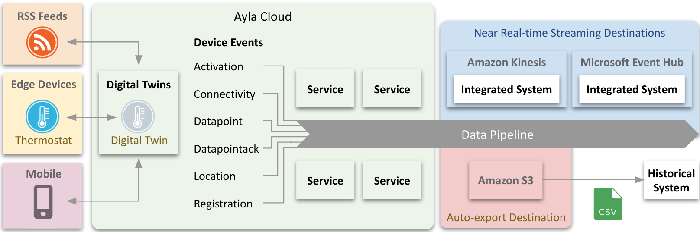

This tech note explains the origin and purpose of Ayla Cloud device events, and how to leverage them in near real-time integrated systems and historical analytic systems. Consider the following diagram:

A digital twin is a cloud-based state machine that reflects the attributes, properties, and schedules of a real-world thing like a thermostat. A device event is a change in the state of a digital twin caused by an edge device, mobile app, RSS feed, schedule, or some other actor. The term *device event* refers to both (a) the occurence and (b) the record of the occurence created by the Ayla Cloud. 

---

[My S3 Browser](https://chrome.google.com/webstore/detail/my-s3-browser/lgkbddebikceepncgppakonioaopmbkk?hl=en) Chrome extension.
