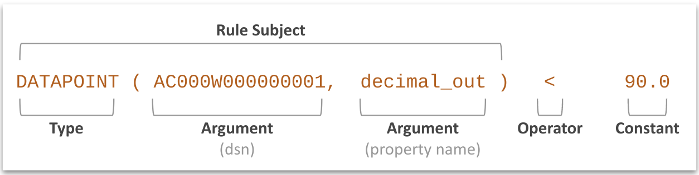
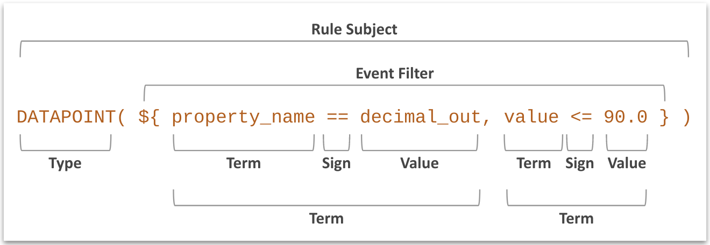

# Ayla Rule Expression Syntax

ARS expects rule expressions and certain action parameters to be written with Ayla Rule Expression Syntax (ARES) which allows for arbitrary complexity and nesting. 

## Expressions

Here is a **concrete** rule expression:

This expression asserts that the `Blue_button` property value of device `AC000W000000001` equals `1`. The expression is concrete because it targets a particular device and property. Any device owner can create a concrete rule for their own devices.

Here is an **abstract** rule expression:

## Rule subjects

Each row in the following table links a device event type to an ARES rule subject and the post-evaluation data type. Some rule subjects are only available at the `OEM` level. They can span the devices of many users, and they 

A rule type may be available at the `OEM` or `User` level, *Abstract* and *Concrete* respectively. See [Concrete vs. Abstract](#concrete-vs-abstract).

The checkmark means the subject is currently supported:

||Event Type|Rule Subject|Rule Data Type|
|-|-|-|-|
|&#10003;|activation|<code>ACTIVATION(dsn, activated&#124;deactivated)</code>|`boolean`|
|&#10003;|connectivity|<code>CONNECTION(dsn, online&#124;offline&#124;all)</code>|`boolean`|
|&#10003;|datapoint|`DATAPOINT(dsn, prop_name)`|Same as property|
||datapointack|`DATAPOINTACK(dsn, prop_name)`|`boolean`|
||location|`LOCATION(dsn)`|`(decimal,decimal)`|
||location|`LOCATION(uuid)`|`(decimal,decimal)`|
|&#10003;|registration|<code>REGISTRATION(dsn, true&#124;false&#124;all)</code>|`boolean`|
|&#10003;|version|`VERSION(${filter})`|`boolean`|

## Operators

The following table lists ARES operators:

|Operator|Meaning|Example|
|-|-|-|
|<code>&&</code>|AND|sss|
|<code>&#124;&#124;</code>|OR|sss|
|<code>></code>|GT|sss|
|<code>>=</code>|GTE|sss|
|<code><</code>|LT|sss|
|<code><=</code>|LTE|sss|
|<code>==</code>|EQ|sss|
|<code>+</code>|Addition|sss|
|<code>-</code>|Substraction|sss|
|<code>*</code>|Multiplication|sss|
|<code>/</code>|Division|sss|
|<code>=</code>|Assignment|sss|

## Functions

## Concrete vs. Abstract

### Concrete expressions

`DATAPOINT(dsn1, property_name1) > 2`

* User context
* Evaluate concrete subjects 

### Abstract expressions

`DATAPOINT(${oem_model=foo, property_name = bar, value > 1})`

* OEM context
* Evaluate (filter) event data
* Use the `${ }` construct.
* Conditions are comma-separated.
* JSON field : value (e.g. `"oem_model": "foo1"`)
* Each abstract rule forces ARS to check if an incoming event fits the conditions defined inside the filter construct `${ }`.
* Fires only if all conditions inside the construct `${ }` are met.
* AKA filters or oem-level rules.
* OEM owns all event related to its fleet; Only OEM Admins (and sometimes OEM stuff members) can create abstract rules; Primary current use of abstract rules is DSSv2 - used for streaming particular kind of events to a specific destination chosen by an OEM;
* at evaluation time, each abstract rule created for an OEM is used to evaluate each incoming event for that OEM.
* Because we restrict each OEM to be able to create only 100 or fewer abstract rules, we can keep all abstract rules (for all OEMs) in the memory of an Evaluation Service instance; thus concrete rules do not require Rule Evaluation Service to make calls to the database, which makes their evaluation mush faster than that for the concrete rules;

