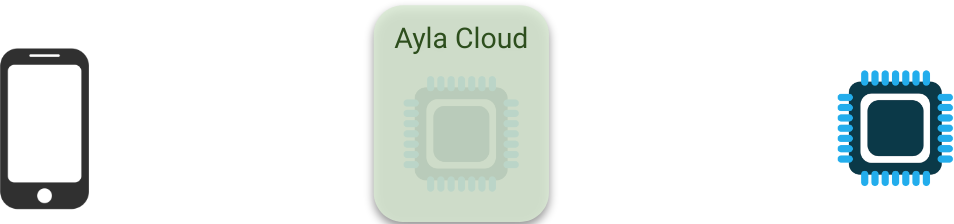
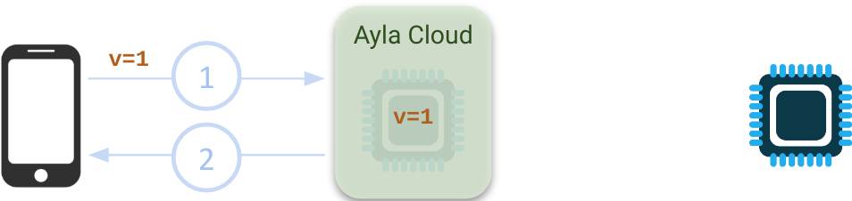
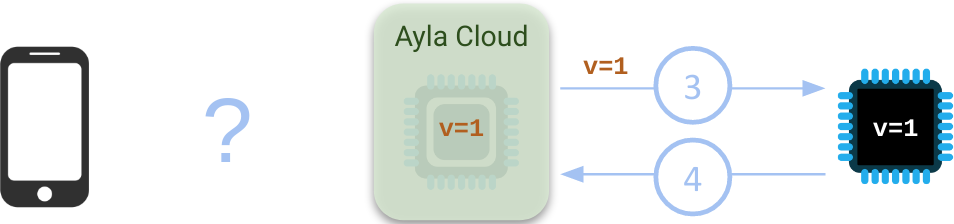
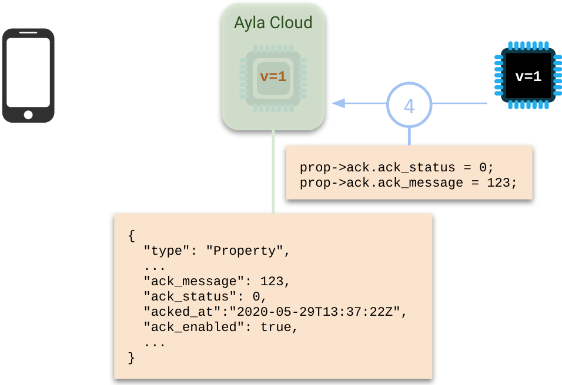

<span style="color:red;">Under construction.</span>

Ack-enabled properties solve a notification problem for web and mobile apps that interact with the Ayla Cloud. Consider a client, the Ayla Cloud with a digital twin, and the corresponding device (i.e. Ayla agent and host application):



When the client sends a request to set the value of some device property to `v=1`, the cloud updates the property value in the digital twin, and responds to the client:



If the device is online, the cloud attempts to set `v=1` on the device. If the value is acceptable to the device, the device sets the value, and responds to the cloud. However, this result is not propagated to the client: 



If the value is not acceptable (e.g. out of range), the device does not set the value, and indicates the error in the response. Again, this result is not propagated to the client:


Ack-enabled properties solve this client-notification problem for both success and error cases. If a property is ack-enabled, the device is responsible for including `status` and `message` fields in the response describing the outcome of a set operation. `status` is an unsigned byte, and 0 means success. `message` is a signed 32-bit integer, and the value is user-defined. Receiving this ack, the cloud stores the information in the digital twin:



The client can obtain the ack information from the cloud in the following ways:

1. A mobile app leverages the [Ayla Mobile SDK](https://docs.aylanetworks.com/mobile-and-web-apps/ayla-mobile-sdk-api-reference/) to poll the cloud for the acknowledgement.
1. A web app polls the cloud by iteratively calling `getPropertyByDevId` or `getPropertyByDsn`. See the [API Browser](https://docs.aylanetworks.com/cloud-services/api-browser/).

Consider an ack-enabled property named `input` with a corresponding set function named `set_input`:

```
enum demo_val_err {
  VAL_NO_ERR = 0,
  VAL_BAD_LEN,
  VAL_OUT_OF_RNG
};

static s32 input;

static struct prop prop_table[] = {
  ...
	{ "input", ATLV_INT, set_input, prop_send_generic, &input, sizeof(input)},
  ...
};

static void set_input(struct prop *prop, void *arg, void *valp, size_t len)
{
  s32 i = *(s32 *)valp;

  if (len != sizeof(s32)) {
    prop->ack.ack_status = 1;
    prop->ack.ack_message = VAL_BAD_LEN;
    return;
  }

  if (i > 0x7fff || i < -0x8000) {
    prop->ack.ack_status = 1;
    prop->ack.ack_message = VAL_OUT_OF_RNG;
    return;
  }

  prop->ack.ack_status = 0;
  prop->ack.ack_message = VAL_NO_ERR;
  input = i;
}
```

`set_function` sets the `prop_ack` structure fields and returns. `prop_ack` is defined like this:

```
struct prop_ack {
  char ack_id[PROP_ACK_ID_LEN + 1];  // ACK ID from ADS 
  u8 ack_status;                     // status of property set (0 for success)
  s32 ack_message;                   // customer-selected message value
  u8 ack_src;                        // source of ACK request
};
```
