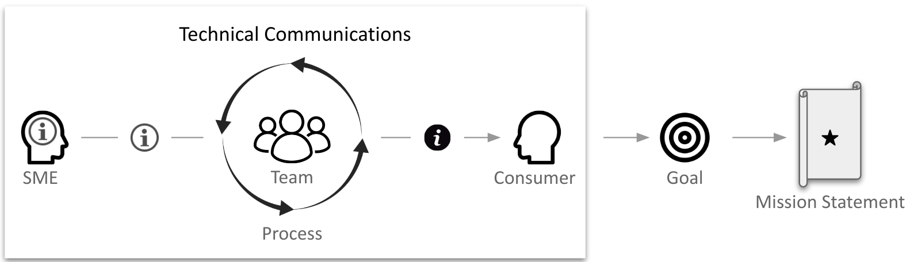
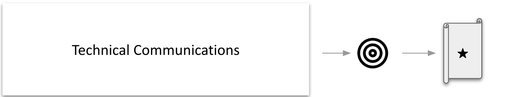
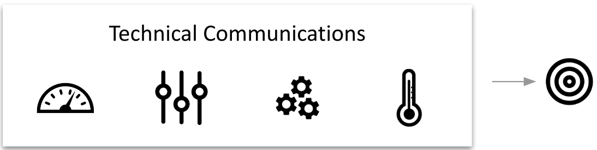
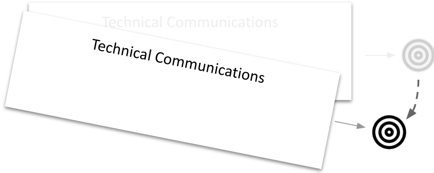
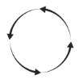

Technical communications is a **system** for conveying complex information from subject matter experts to consumers (e.g. prospects, customers, partners, employees, and others) to achieve goals aligned with aspects of an organization's mission statement.

This page describes characteristics, inputs, outputs, parts, and processes of an effective technical communications system.

# Characteristics

An effective technical communications system is purposeful, optimizing, agile, and cooperative:

* **Purposeful**. The system points to a goal that aligns with aspects of the organization's mission statement: 
    

* **Optimizing**. The parts and processes adjust to provide maximum net value with respect to the goal:
    

* **Agile**. The system refocuses and reoptimizes as goals change.
    

* **Cooperative**. Within the organization, technical communications is a subsystem with clear boundaries and interfaces:
    

# Inputs

# Outputs

# Parts

An effective technical communications system consists of the following parts:

|Name|Icon|Description|
|-|-|-|
|SMEs||sss|
|SME Info||sss|
|Team||sss|
|Process||sss|
|Consumer Content||sss|
|Consumers||sss|

# Processes

# References

* [What is Technical Communications?](https://techwhirl.com/what-is-technical-communications/)