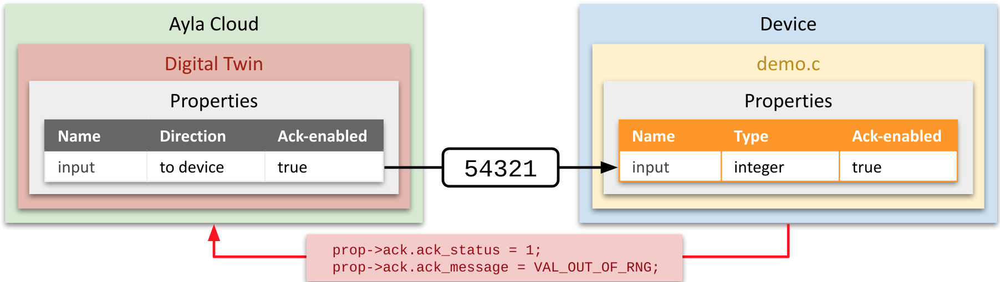

When the Ayla Cloud sends a property-value update to an edge application, if the property is ack-enabled, and if the edge application rejects the new value, then the application is required to explain the issue to the Ayla Cloud by responding with an acknowledgement that includes `status` and `message` values. Consider the following diagram:



The diagram shows the Ayla Cloud attempting to set a device's `input` property to an out-of-range value, and the device responding with an `ack` indicating that the value was not set, and explaining the issue.

The Ayla Host Library's `ledevb` reference application demonstrates how an edge application should handle ack-enabled properties on error. (See `Ayla-host-lib-2.1/example/app/ledevb/demo.c`.) Here is a simplified version of the `prop_table` structure containing only the `input` property:

```
static struct prop prop_table[] = {
  ...
	{ "input", ATLV_INT, set_input, prop_send_generic, &input, sizeof(input)},
  ...
};
```

When the Ayla Cloud sends an `input` property value update, the application invokes `set_input`. Here is a simplified version of `set_input`:

```
static void set_input(struct prop *prop, void *arg, void *valp, size_t len)
{
  s32 i = *(s32 *)valp;

  if (len != sizeof(s32)) {
    prop->ack.ack_status = 1;
    prop->ack.ack_message = VAL_BAD_LEN;
    return;
  } else if (i > 0x7fff || i < -0x8000) {
    prop->ack.ack_status = 1;
    prop->ack.ack_message = VAL_OUT_OF_RNG;
    return;
  }
  input = i;
}
```

The function validates the new value, and responds with an `ack` on error.

Note that users can use the Ayla Developer Portal to set the `ack_enabled` attribute of a property to `true` for a `private` template.