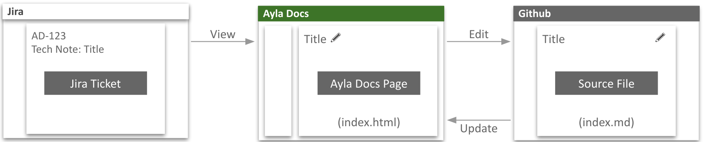
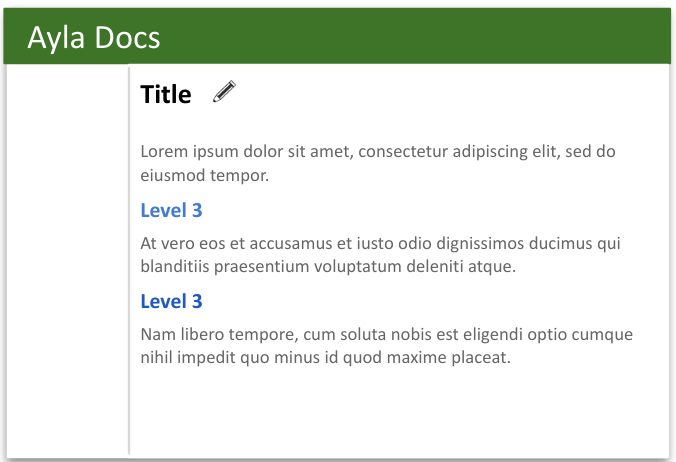
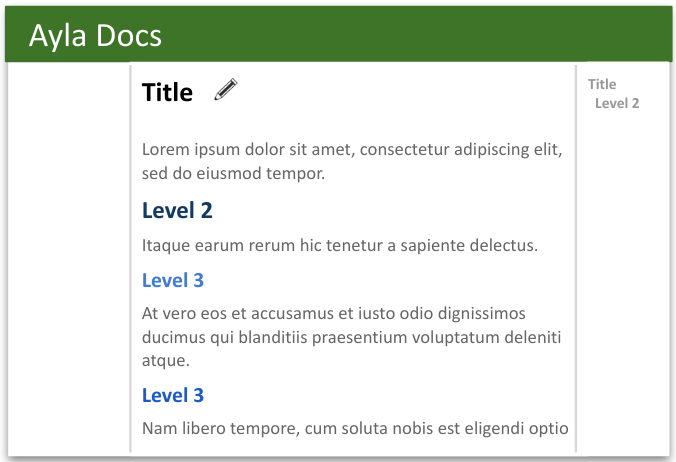
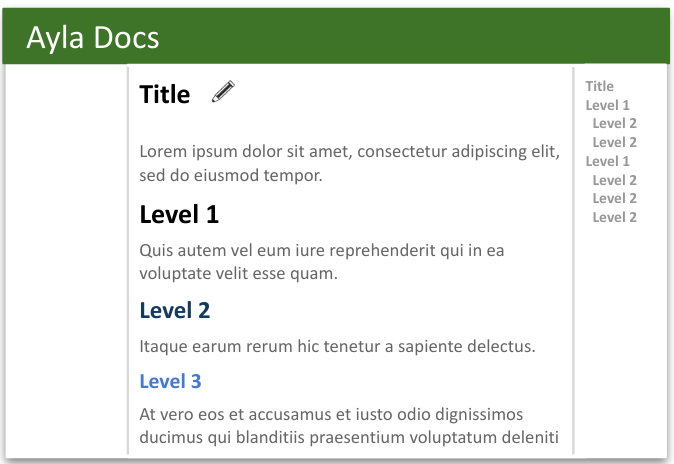

<aside id="pagebar" class="d-xl-block collapse">
  <ul>
    <li>
      <a href="#core-title">Write a Tech Note</a>
    </li>
    <li>
      <a href="#workflow">Workflow</a>
    </li>
    <li>
      <a href="#writing-tips">Writing tips</a>
    </li>
    <li>
      <a href="#markdown-tips">Markdown tips</a>
      <ul>
        <li><a href="#images">Images</a></li>
        <li><a href="#complex-lists">Complex lists</a></li>
      </ul>
    </li>
  </ul>
</aside>

A Tech Note is an Ayla Docs page focused on a technical topic of current interest to a prospect, customer, or partner. Tech Notes are published on the [Tech Notes](/tech-notes) page. Any Ayla employee can write a Tech Note. From the author's perspective, a Tech Note consists of a Jira Ticket, a Docs File, and a Source File:



# Workflow

1. The author creates a [Jira Ticket](https://aylanetworks.atlassian.net/jira/software/projects/AD/boards/135) requesting a new, blank Tech Note.
1. The Ayla Docs team creates a Docs File and a Source File, links the Jira Ticket to the Docs File, and emails the author.
1. The author navigates from the email to the Jira Ticket to the Docs File to the Source File.
1. The author begins writing the Tech Note using [Github Markdown](https://guides.github.com/features/mastering-markdown/). 
1. The author, via the Jira Ticket, requests (periodically) that the Ayla Docs team update the Docs File.
1. The author finishes writing the Tech Note.
1. The author, via the Jira Ticket, requests that the Ayla Docs team publish the Tech Note.
1. The Ayla Docs team edits the Tech Note, communicating with the author as necessary via the Jira Ticket.
1. The Ayla Docs team publishes the Tech Note by adding a link to the [Tech Notes](/tech-notes) page.

# Writing tips

1. Write concise, accurate content.
1. Minimize or avoid text decorations such as italics, bold, quotation marks, and underlines.
1. Use Level 3 headings (`### Level 3`) to group content. In many cases, this will suffice.
    <div></div>
1. If necessary, use Level 2 headings (`## Level 2`) to group Level 3 headings and content. This will produce a Page TOC. 
    <div></div>
1. If necessary, use Level 1 headings (`# Level 1`) to group Level 2 headings and content. This will also produce a Page TOC.
    <div></div>

# Markdown tips

In general, see [Mastering Markdown](https://guides.github.com/features/mastering-markdown/) for help with markdown.

## Images

To add an image to your Tech Note, do the following:

1. Upload the image file to your Tech Note Github directory (in the same directory with your `index.md` file).
1. Use an `` tag to include the image in your Tech Note. Always set width and height. Max width is `800px`. Use an [Aspect Ratio Calculator](https://andrew.hedges.name/experiments/aspect_ratio/) for calculations.

### Example

This is the markdown version:

```

```

This is the html version:


## Complex lists

It is possible to include code snippets and images in lists. Below is an example. Code snippets and images must be indented with four spaces. An image must be wrapped in a `<div>` tag.

### Example

This is the markdown version:

<pre><code>1. At vero eos et accusamus et iusto ...
    ```
    $(function() {
      $("select.ayla-regions").change(function() {
        writeRegionUrls()
        displayAccounts()
      })
    })
    ```
    Temporibus autem quibusdam et ...
    &lt;div&gt;&lt;img src="img-600.png" width="300" height="180"&gt;&lt;/div&gt;
1. Excepteur sint occaecat cupidatat ...
1. Lorem ipsum dolor sit amet ...
</code></pre>

This is the html version:

1. At vero eos et accusamus et iusto ...
    ```
    $(function() {
      $("select.ayla-regions").change(function() {
        writeRegionUrls()
        displayAccounts()
      })
    })
    ```
    Temporibus autem quibusdam et ...
    <div></div>
1. Excepteur sint occaecat cupidatat ...
1. Lorem ipsum dolor sit amet ...
