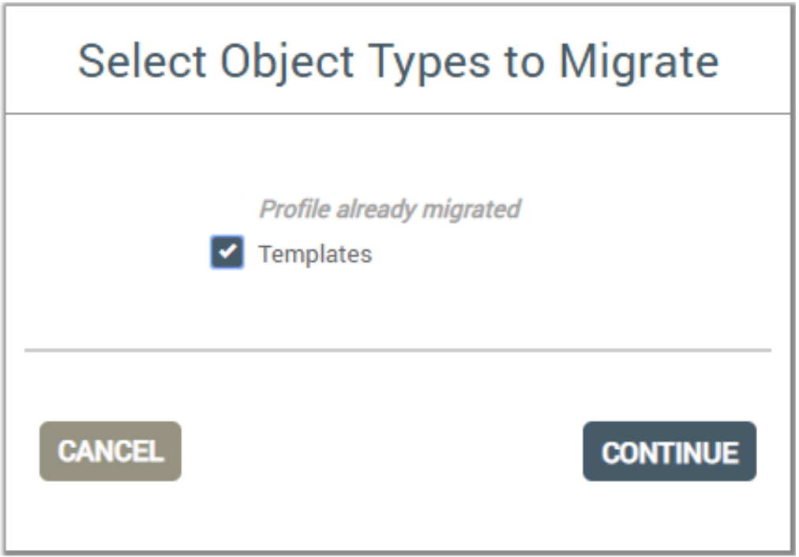

By Trinh Phan on May 19, 2020

This tech note helps Ayla Network OEMs migrate templates from development services to field services.

1. Sign into the Ayla Dashboard of the destination (field) service, using an `OEM:Admin` user account.

1. Click `OEM Migration` in the left column.

1. Select the service (e.g. `US Dev`) where the template currently resides, enter the credentials of your source admin account, and click `Start Migration`.

1. Click `New Migration`.

1. Check `Templates`, and click `Continue`.

1. Check the template you want to migrate, and select `Next Object Type`.

1. Click `Validate`.

1. Enter the credentials of your destination admin account, and click `LOG IN`.

1. Once Validation completes, select `GO TO MIGRATION`.

1. Select `MIGRATE`.

1. Enter the credentials of your destination admin account, and click `LOG IN`.

1. Once Migration completes, Select `DONE`.

    The template should appear in the Ayla Dashboard of the field service with a new ID.
