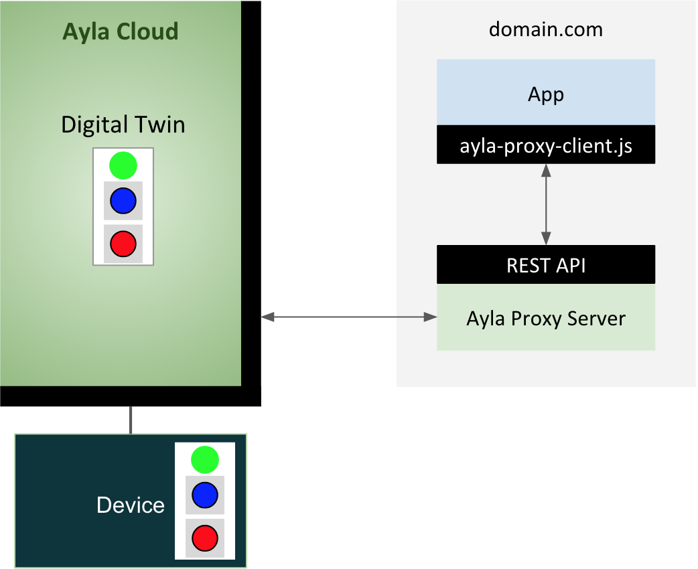

Deployed in your domain, the Ayla Proxy Server accesses Ayla services on behalf of apps running in your domain that are prevented by [CORS](https://en.wikipedia.org/wiki/Cross-origin_resource_sharing) from accessing the Ayla REST API directly.

